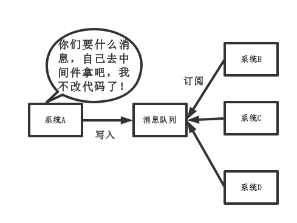
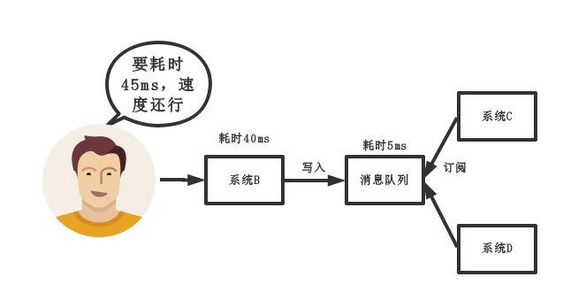
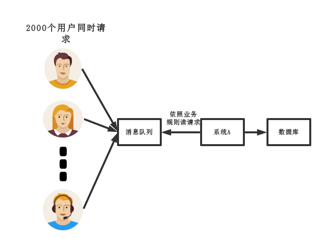
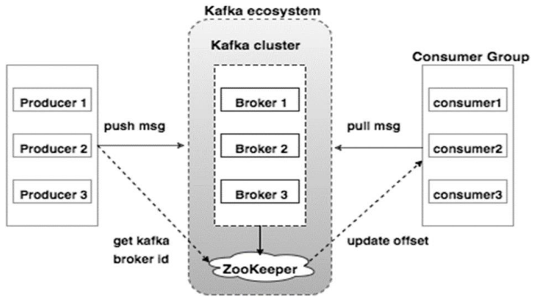

## 1.kafka概述

### 1.1 kakfa是什么

kafka是一个开源的分布式消息系统，依赖于zookeeper,使用scala语言编写，在流式计算中主要用来缓存数据

### 1.2kakfa内部实现原理

kafka主要包括2种模式

1.消费者主动从队列当中拉去消息（点对点）

2.生产者广播主动推送消息（发布订阅）

### 1.3 为什么需要消息队列（面试题）

- 解耦：A系统吧消息发送到消息队列当中，其他的系统从消息队列中消费

- 异步：非关键业务异步方式运行，加快响应速度

- 削峰：将大量的并发写入到消息队列中，过了高峰期将堆积的消息全部消费掉

### 1.4kafka架构

- Producer ：消息生产者，发消息的客户端。
- Consumer ：消息消费者，取消息的客户端
- Topic ：可以理解为一个队列。一个topic包括多个Partition
- Consumer Group （CG）：消费者组。一个topic可以有多个CG。
- Broker ：一台kafka服务器就是一个broker。一个集群由多个broker组成。
- Partition：**一个topic包括多个Partition，每一个parttion是一个有序的队列**。partition中每一条消息被有序分配一个offset,kafka保证每一个partition中的消息顺序消费。
- Offset：kafka的存储文件都是按照offset.kafka来命名，用offset做名字的好处是方便查找。**kafka消费过消息后，需要提交offset,表明自己被消费过了**