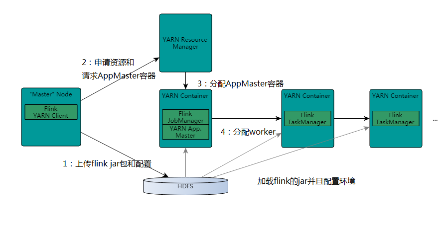

### 1Flink基础入门

#### 01.Flink基本原理介绍		
```java
Apache Flink 是一个开源的分布式，高性能，高可用，准确的流处理框架。
主要由 Java 代码实现。
支持实时流(stream)处理和批(batch)处理，批数据只是流数据的一个极限特例。
Flink原生支持了迭代计算、内存管理和程序优化。

```
#### 02.Flink与Storm与SparkStream的关系		
```java
1：需要关注流数据是否需要进行状态管理
2：At-least-once或者Exectly-once消息投递模式是否有特殊要求
3：对于小型独立的项目，并且需要低延迟的场景，建议使用storm
4：如果你的项目已经使用了spark，并且秒级别的实时处理可以满足需求的话，建议使用sparkStreaming
5：要求消息投递语义为 Exactly Once 的场景；数据量较大，要求高吞吐低延迟的场景；需要进行状态管理或窗口统计的场景，建议使用flink

```
#### 03.Flink案例需求分析		
```xml
<dependency>  
  <groupId>org.apache.flink</groupId>  
  <artifactId>flink-java</artifactId>  
  <version>1.6.1</version>   
</dependency>  
<dependency>  
  <groupId>org.apache.flink</groupId>  
  <artifactId>flink-streaming-java_2.11</artifactId>  
  <version>1.6.1</version>  
  <scope>provided</scope>  
</dependency> 

<dependency>  
  <groupId>org.apache.flink</groupId>  
  <artifactId>flink-scala_2.11</artifactId>  
  <version>1.6.1</version>  
</dependency>  
<dependency>  
  <groupId>org.apache.flink</groupId>  
  <artifactId>flink-streaming-scala_2.11</artifactId>  
  <version>1.6.1</version>  
</dependency> 
```
#### 04.滑动窗口单词计数-java代码实现		
```java
/**
 * 滑动窗口计算
 *
 * 通过socket模拟产生单词数据
 * flink对数据进行统计计算
 *
 * 需要实现每隔1秒对最近2秒内的数据进行汇总计算
 *
 */
public class SocketWindowWordCountJava {

    public static void main(String[] args) throws Exception{
        //获取需要的端口号
        int port;
        try {
            ParameterTool parameterTool = ParameterTool.fromArgs(args);
            port = parameterTool.getInt("port");
        }catch (Exception e){
            System.err.println("No port set. use default port 9000--java");
            port = 9000;
        }

        //获取flink的运行环境
        StreamExecutionEnvironment env = StreamExecutionEnvironment.getExecutionEnvironment();

        String hostname = "hadoop100";
        String delimiter = "\n";
        //连接socket获取输入的数据
        DataStreamSource<String> text = env.socketTextStream(hostname, port, delimiter);

        // a a c

        // a 1
        // a 1
        // c 1
        DataStream<WordWithCount> windowCounts = text.flatMap(new FlatMapFunction<String, WordWithCount>() {
            public void flatMap(String value, Collector<WordWithCount> out) throws Exception {
                String[] splits = value.split("\\s");
                for (String word : splits) {
                    out.collect(new WordWithCount(word, 1L));
                }
            }
        }).keyBy("word")
                .timeWindow(Time.seconds(2), Time.seconds(1))//指定时间窗口大小为2秒，指定时间间隔为1秒
                .sum("count");//在这里使用sum或者reduce都可以
                /*.reduce(new ReduceFunction<WordWithCount>() {
                                    public WordWithCount reduce(WordWithCount a, WordWithCount b) throws Exception {

                                        return new WordWithCount(a.word,a.count+b.count);
                                    }
                                })*/
        //把数据打印到控制台并且设置并行度
        windowCounts.print().setParallelism(1);

        //这一行代码一定要实现，否则程序不执行
        env.execute("Socket window count");

    }

    public static class WordWithCount{
        public String word;
        public long count;
        public  WordWithCount(){}
        public WordWithCount(String word,long count){
            this.word = word;
            this.count = count;
        }
        @Override
        public String toString() {
            return "WordWithCount{" +
                    "word='" + word + '\'' +
                    ", count=" + count +
                    '}';
        }
    }


}
```
#### 05.滑动窗口单词计数-scala代码实现		
```scala
//wordcount 同上
object SocketWindowWordCountScala {

  def main(args: Array[String]): Unit = {

    //获取socket端口号
    val port: Int = try {
      ParameterTool.fromArgs(args).getInt("port")
    }catch {
      case e: Exception => {
        System.err.println("No port set. use default port 9000--scala")
      }
        9000
    }


    //获取运行环境
    val env: StreamExecutionEnvironment = StreamExecutionEnvironment.getExecutionEnvironment

    //链接socket获取输入数据
    val text = env.socketTextStream("hadoop100",port,'\n')


    //解析数据(把数据打平)，分组，窗口计算，并且聚合求sum

    //注意：必须要添加这一行隐式转行，否则下面的flatmap方法执行会报错
    import org.apache.flink.api.scala._

    val windowCounts = text.flatMap(line => line.split("\\s"))//打平，把每一行单词都切开
      .map(w => WordWithCount(w,1))//把单词转成word , 1这种形式
      .keyBy("word")//分组
      .timeWindow(Time.seconds(2),Time.seconds(1))//指定窗口大小，指定间隔时间
      .sum("count");// sum或者reduce都可以
      //.reduce((a,b)=>WordWithCount(a.word,a.count+b.count))

    //打印到控制台
    windowCounts.print().setParallelism(1);

    //执行任务
    env.execute("Socket window count");


  }

  case class WordWithCount(word: String,count: Long)

}

```
#### 06.batch批处理之java代码实现		
```java
public class BatchWordCountJava {

    public static void main(String[] args) throws Exception{
        String inputPath = "D:\\data\\file";
        String outPath = "D:\\data\\result";

        //获取运行环境
        ExecutionEnvironment env = ExecutionEnvironment.getExecutionEnvironment();
        //获取文件中的内容
        DataSource<String> text = env.readTextFile(inputPath);

        DataSet<Tuple2<String, Integer>> counts = text.flatMap(new Tokenizer()).groupBy(0).sum(1);
        counts.writeAsCsv(outPath,"\n"," ").setParallelism(1);
        env.execute("batch word count");

    }


    public static class Tokenizer implements FlatMapFunction<String,Tuple2<String,Integer>>{
        public void flatMap(String value, Collector<Tuple2<String, Integer>> out) throws Exception {
            String[] tokens = value.toLowerCase().split("\\W+");
            for (String token: tokens) {
                if(token.length()>0){
                    out.collect(new Tuple2<String, Integer>(token,1));
                }
            }
        }
    }
}
```
#### 07.batch批处理之scala代码实现		
```java
object BatchWordCountScala {

  def main(args: Array[String]): Unit = {

    val inputPath = "D:\\data\\file"
    val outPut = "D:\\data\\result2"


    val env = ExecutionEnvironment.getExecutionEnvironment
    val text = env.readTextFile(inputPath)

    //引入隐式转换
    import org.apache.flink.api.scala._

    val counts = text.flatMap(_.toLowerCase.split("\\W+"))
      .filter(_.nonEmpty)
      .map((_,1))
      .groupBy(0)
      .sum(1)
    counts.writeAsCsv(outPut,"\n"," ").setParallelism(1)
    env.execute("batch word count")
  }

}
```
#### 08.Flink streaming和Batch代码层面的使用		

```java
流处理Streaming
StreamExecutionEnvironment
DataStreaming
批处理Batch
ExecutionEnvironment
DataSet

```
#### 09.Flink standalone集群安装部署		
```java
//详情见安装文档
```
#### 10.Flink和yarn的两种实现方式		
```java

```
#### 11.Flink 和yarn内部实现		
```java
Flink on Yarn
ResourceManager
NodeManager
AppMater(jobmanager和它运行在一个Container中)
Container(taskmanager运行在上面)
使用on-yarn的好处
提高集群机器的利用率
一套集群，可以执行MR任务，spark任务，flink任务等...

```


#### 12.Flink standalone集群HA配置		

```java

```
#### 13.如何解决集群启动失败的问题		
```java
//查看flink安装目录下面的log文件夹下面的日志
//序号最大的就是最新的日志
```
#### 14.Flink和yarn集群HA配置		
```java

```
#### 15.Flink scala shell代码调试		
```java

```
