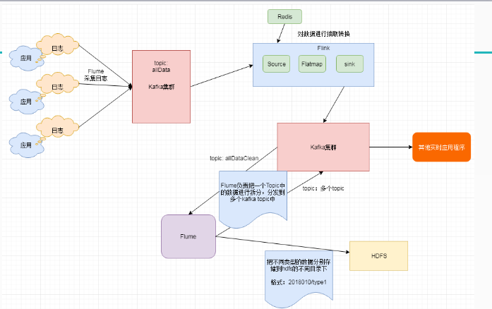

#### 42.实战需求分析(数据清洗[实时ETL])	

​	

```xml
    <dependencyManagement>
        <dependencies>
            <dependency>
                <groupId>org.apache.flink</groupId>
                <artifactId>flink-java</artifactId>
                <version>1.6.1</version>
                <!-- provided在这表示此依赖只在代码编译的时候使用，运行和打包的时候不使用 -->
                <!--<scope>provided</scope>-->
            </dependency>
            <dependency>
                <groupId>org.apache.flink</groupId>
                <artifactId>flink-streaming-java_2.11</artifactId>
                <version>1.6.1</version>
                <!--<scope>provided</scope>-->
            </dependency>
            <dependency>
                <groupId>org.apache.flink</groupId>
                <artifactId>flink-scala_2.11</artifactId>
                <version>1.6.1</version>
                <!--<scope>provided</scope>-->
            </dependency>
            <dependency>
                <groupId>org.apache.flink</groupId>
                <artifactId>flink-streaming-scala_2.11</artifactId>
                <version>1.6.1</version>
                <!--<scope>provided</scope>-->
            </dependency>

            <dependency>
                <groupId>org.apache.bahir</groupId>
                <artifactId>flink-connector-redis_2.11</artifactId>
                <version>1.0</version>
            </dependency>

            <dependency>
                <groupId>org.apache.flink</groupId>
                <artifactId>flink-statebackend-rocksdb_2.11</artifactId>
                <version>1.6.1</version>
            </dependency>

            <dependency>
                <groupId>org.apache.flink</groupId>
                <artifactId>flink-connector-kafka-0.11_2.11</artifactId>
                <version>1.6.1</version>
            </dependency>

            <dependency>
                <groupId>org.apache.kafka</groupId>
                <artifactId>kafka-clients</artifactId>
                <version>0.11.0.3</version>
            </dependency>
            <!-- 日志相关依赖 -->
            <dependency>
                <groupId>org.slf4j</groupId>
                <artifactId>slf4j-api</artifactId>
                <version>1.7.25</version>
            </dependency>

            <dependency>
                <groupId>org.slf4j</groupId>
                <artifactId>slf4j-log4j12</artifactId>
                <version>1.7.25</version>
            </dependency>
            <!-- redis依赖 -->
            <dependency>
                <groupId>redis.clients</groupId>
                <artifactId>jedis</artifactId>
                <version>2.9.0</version>
            </dependency>
            <!-- json依赖 -->
            <dependency>
                <groupId>com.alibaba</groupId>
                <artifactId>fastjson</artifactId>
                <version>1.2.44</version>
            </dependency>

            <!--es依赖-->
            <dependency>
                <groupId>org.apache.flink</groupId>
                <artifactId>flink-connector-elasticsearch6_2.11</artifactId>
                <version>1.6.1</version>
            </dependency>

        </dependencies>

    </dependencyManagement>

    <build>
        <plugins>
            <!-- 编译插件 -->
            <plugin>
                <groupId>org.apache.maven.plugins</groupId>
                <artifactId>maven-compiler-plugin</artifactId>
                <version>3.6.0</version>
                <configuration>
                    <source>1.8</source>
                    <target>1.8</target>
                    <encoding>UTF-8</encoding>
                </configuration>
            </plugin>
            <!-- scala编译插件 -->
            <plugin>
                <groupId>net.alchim31.maven</groupId>
                <artifactId>scala-maven-plugin</artifactId>
                <version>3.1.6</version>
                <configuration>
                    <scalaCompatVersion>2.11</scalaCompatVersion>
                    <scalaVersion>2.11.12</scalaVersion>
                    <encoding>UTF-8</encoding>
                </configuration>
                <executions>
                    <execution>
                        <id>compile-scala</id>
                        <phase>compile</phase>
                        <goals>
                            <goal>add-source</goal>
                            <goal>compile</goal>
                        </goals>
                    </execution>
                    <execution>
                        <id>test-compile-scala</id>
                        <phase>test-compile</phase>
                        <goals>
                            <goal>add-source</goal>
                            <goal>testCompile</goal>
                        </goals>
                    </execution>
                </executions>
            </plugin>
            <!-- 打jar包插件(会包含所有依赖) -->
            <plugin>
                <groupId>org.apache.maven.plugins</groupId>
                <artifactId>maven-assembly-plugin</artifactId>
                <version>2.6</version>
                <configuration>
                    <descriptorRefs>
                        <descriptorRef>jar-with-dependencies</descriptorRef>
                    </descriptorRefs>
                    <archive>
                        <manifest>
                            <!-- 可以设置jar包的入口类(可选) -->
                            <mainClass></mainClass>
                        </manifest>
                    </archive>
                </configuration>
                <executions>
                    <execution>
                        <id>make-assembly</id>
                        <phase>package</phase>
                        <goals>
                            <goal>single</goal>
                        </goals>
                    </execution>
                </executions>
            </plugin>
        </plugins>
    </build>

</project>
```
#### 43.数据清洗[实时ETL]-java代码实现-1		
```java
/**
 *
 * 创建kafka topic的命令
 * bin/kafka-topics.sh  --create --topic allData --zookeeper localhost:2181 --partitions 5 --replication-factor 1
 * bin/kafka-topics.sh  --create --topic allDataClean --zookeeper localhost:2181 --partitions 5 --replication-factor 1
 *
 *
 * 数据清洗需求
 *
 * 组装代码
 *
 * Created by xuwei.tech on 2018/11/7.
 */
public class DataClean {

    public static void main(String[] args) throws Exception{

        StreamExecutionEnvironment env = StreamExecutionEnvironment.getExecutionEnvironment();

        //修改并行度
        env.setParallelism(5);

        //checkpoint配置
        env.enableCheckpointing(60000);
        env.getCheckpointConfig().setCheckpointingMode(CheckpointingMode.EXACTLY_ONCE);
        env.getCheckpointConfig().setMinPauseBetweenCheckpoints(30000);
        env.getCheckpointConfig().setCheckpointTimeout(10000);
        env.getCheckpointConfig().setMaxConcurrentCheckpoints(1);
        env.getCheckpointConfig().enableExternalizedCheckpoints(CheckpointConfig.ExternalizedCheckpointCleanup.RETAIN_ON_CANCELLATION);

        //设置statebackend

        //env.setStateBackend(new RocksDBStateBackend("hdfs://hadoop100:9000/flink/checkpoints",true));


        //指定kafkasource
        String topic = "allData";
        Properties prop = new Properties();
        prop.setProperty("bootstrap.servers","hadoop110:9092");
        prop.setProperty("group.id","con1");
        FlinkKafkaConsumer011<String> myConsumer = new FlinkKafkaConsumer011<String>(topic, new SimpleStringSchema(), prop);

        //获取kafka中的数据
        //{"dt":"2018-01-01 11:11:11","countryCode":"US","data":[{"type":"s1","score":0.3,"level":"A"},{"type":"s2","score":0.1,"level":"B"}]}
        DataStreamSource<String> data = env.addSource(myConsumer);

        //最新的国家码和大区的映射关系
        DataStream<HashMap<String, String>> mapData = env.addSource(new MyRedisSource()).broadcast();//可以吧数据发送到后面算子的所有并行实例中

        DataStream<String> resData = data.connect(mapData).flatMap(new CoFlatMapFunction<String, HashMap<String, String>, String>() {
            //存储国家和大区的映射关系
            private HashMap<String, String> allMap = new HashMap<String, String>();

            //flatmap1处理的是kafka中的数据
            public void flatMap1(String value, Collector<String> out) throws Exception {
                JSONObject jsonObject = JSONObject.parseObject(value);
                String dt = jsonObject.getString("dt");
                String countryCode = jsonObject.getString("countryCode");
                //获取大区
                String area = allMap.get(countryCode);

                JSONArray jsonArray = jsonObject.getJSONArray("data");
                for (int i = 0; i < jsonArray.size(); i++) {
                    JSONObject jsonObject1 = jsonArray.getJSONObject(i);
                    System.out.println("area:----"+area+"--------------");
                    jsonObject1.put("area", area);
                    jsonObject1.put("dt", dt);
                    out.collect(jsonObject1.toJSONString());
                }
            }

            //flatmap2处理的是redis返回的map类型的数据
            public void flatMap2(HashMap<String, String> value, Collector<String> out) throws Exception {
                this.allMap = value;
            }
        });

        String outTopic = "allDataClean";
        Properties outprop = new Properties();
        outprop.setProperty("bootstrap.servers","hadoop110:9092");
        //第一种解决方案，设置FlinkKafkaProducer011里面的事务超时时间
        //设置事务超时时间
        //prop.setProperty("transaction.timeout.ms",60000*15+"");

        //第二种解决方案，设置kafka的最大事务超时时间

        FlinkKafkaProducer011<String> myProducer = new FlinkKafkaProducer011<String>(outTopic, new KeyedSerializationSchemaWrapper<String>(new SimpleStringSchema()), outprop, FlinkKafkaProducer011.Semantic.EXACTLY_ONCE);
        resData.addSink(myProducer);


        env.execute("DataClean");

    }


}

```
#### 44.数据清洗[实时ETL]-java代码实现-2		
```java
/**
 *
 * redis中进行数据初始化
 *
 * hset areas AREA_US US
 * hset areas AREA_CT TW,HK
 * hset areas AREA_AR PK,KW,SA
 * hset areas AREA_IN IN
 *
 * 在redis中保存的有国家和大区的关系
 *
 * 需要把大区和国家的对应关系组装成java的hashmap
 *
 * Created by xuwei.tech on 2018/11/7.
 */
public class MyRedisSource implements SourceFunction<HashMap<String,String>> {
    private Logger logger = LoggerFactory.getLogger(MyRedisSource.class);

    private final long SLEEP_MILLION = 60000;

    private boolean isRunning = true;
    private Jedis jedis = null;

    public void run(SourceContext<HashMap<String, String>> ctx) throws Exception {

        this.jedis = new Jedis("hadoop110", 6379);
        //存储所有国家和大区的对应关系
        HashMap<String, String> keyValueMap = new HashMap<String, String>();
        while (isRunning){
            try{
                keyValueMap.clear();
                Map<String, String> areas = jedis.hgetAll("areas");
                for (Map.Entry<String,String> entry: areas.entrySet()) {
                    String key = entry.getKey();
                    String value = entry.getValue();
                    String[] splits = value.split(",");
                    for (String split: splits) {
                        keyValueMap.put(split,key);
                    }
                }
                if(keyValueMap.size()>0){
                    ctx.collect(keyValueMap);
                }else{
                    logger.warn("从redis中获取的数据为空！！！");
                }
                Thread.sleep(SLEEP_MILLION);
            }catch (JedisConnectionException e){
                logger.error("redis链接异常，重新获取链接",e.getCause());
                jedis = new Jedis("hadoop110", 6379);
            }catch (Exception e){
                logger.error("source 数据源异常",e.getCause());
            }

        }

    }

    public void cancel() {
        isRunning = false;
        if(jedis!=null){
            jedis.close();
        }
    }
}

```
#### 45.数据清洗[实时ETL]-java代码提交集群运行		
```java
public class kafkaProducer {

    public static void main(String[] args) throws Exception{
        Properties prop = new Properties();
        //指定kafka broker地址
        prop.put("bootstrap.servers", "hadoop110:9092");
        //指定key value的序列化方式
        prop.put("key.serializer", StringSerializer.class.getName());
        prop.put("value.serializer", StringSerializer.class.getName());
        //指定topic名称
        String topic = "allData";

        //创建producer链接
        KafkaProducer<String, String> producer = new KafkaProducer<String,String>(prop);

        //{"dt":"2018-01-01 10:11:11","countryCode":"US","data":[{"type":"s1","score":0.3,"level":"A"},{"type":"s2","score":0.2,"level":"B"}]}

        //生产消息
        while(true){
            String message = "{\"dt\":\""+getCurrentTime()+"\",\"countryCode\":\""+getCountryCode()+"\",\"data\":[{\"type\":\""+getRandomType()+"\",\"score\":"+getRandomScore()+",\"level\":\""+getRandomLevel()+"\"},{\"type\":\""+getRandomType()+"\",\"score\":"+getRandomScore()+",\"level\":\""+getRandomLevel()+"\"}]}";
            System.out.println(message);
            producer.send(new ProducerRecord<String, String>(topic,message));
            Thread.sleep(2000);
        }
        //关闭链接
        //producer.close();
    }

    public static String getCurrentTime(){
        SimpleDateFormat sdf = new SimpleDateFormat("YYYY-MM-dd HH:mm:ss");
        return sdf.format(new Date());
    }

    public static String getCountryCode(){
        String[] types = {"US","TW","HK","PK","KW","SA","IN"};
        Random random = new Random();
        int i = random.nextInt(types.length);
        return types[i];
    }


    public static String getRandomType(){
        String[] types = {"s1","s2","s3","s4","s5"};
        Random random = new Random();
        int i = random.nextInt(types.length);
        return types[i];
    }

    public static double getRandomScore(){
        double[] types = {0.3,0.2,0.1,0.5,0.8};
        Random random = new Random();
        int i = random.nextInt(types.length);
        return types[i];
    }

    public static String getRandomLevel(){
        String[] types = {"A","A+","B","C","D"};
        Random random = new Random();
        int i = random.nextInt(types.length);
        return types[i];
    }


}
```
#### 46.数据清洗[实时ETL]-把任务提交命令封装成脚本		
```java
object DataCleanScala {

  def main(args: Array[String]): Unit = {
    val env = StreamExecutionEnvironment.getExecutionEnvironment

    //修改并行度
    env.setParallelism(5)

    //checkpoint配置
    env.enableCheckpointing(60000)
    env.getCheckpointConfig.setCheckpointingMode(CheckpointingMode.EXACTLY_ONCE)
    env.getCheckpointConfig.setMinPauseBetweenCheckpoints(30000)
    env.getCheckpointConfig.setCheckpointTimeout(10000)
    env.getCheckpointConfig.setMaxConcurrentCheckpoints(1)
    env.getCheckpointConfig.enableExternalizedCheckpoints(CheckpointConfig.ExternalizedCheckpointCleanup.RETAIN_ON_CANCELLATION)

    //设置statebackend

    //env.setStateBackend(new RocksDBStateBackend("hdfs://hadoop100:9000/flink/checkpoints",true))


    //隐式转换
    import org.apache.flink.api.scala._
    val topic = "allData"
    val prop = new Properties()
    prop.setProperty("bootstrap.servers","hadoop110:9092")
    prop.setProperty("group.id","consumer2")

    val myConsumer = new FlinkKafkaConsumer011[String]("hello",new SimpleStringSchema(),prop)
    //获取kafka中的数据
    val data = env.addSource(myConsumer)

    //最新的国家码和大区的映射关系
    val mapData = env.addSource(new MyRedisSourceScala).broadcast //可以吧数据发送到后面算子的所有并行实例中

    val resData = data.connect(mapData).flatMap(new CoFlatMapFunction[String, mutable.Map[String, String], String] {

      //存储国家和大区的映射关系
      var allMap = mutable.Map[String,String]()

      override def flatMap1(value: String, out: Collector[String]): Unit = {

        val jsonObject = JSON.parseObject(value)
        val dt = jsonObject.getString("dt")
        val countryCode = jsonObject.getString("countryCode")
        //获取大区
        val area = allMap.get(countryCode)

        val jsonArray = jsonObject.getJSONArray("data")
        for (i <- 0 to jsonArray.size()-1) {
          val jsonObject1 = jsonArray.getJSONObject(i)
          jsonObject1.put("area", area)
          jsonObject1.put("dt", dt)
          out.collect(jsonObject1.toString)
        }
      }

      override def flatMap2(value: mutable.Map[String, String], out: Collector[String]): Unit = {
        this.allMap = value
      }
    })


    val outTopic = "allDataClean"
    val outprop = new Properties()
    outprop.setProperty("bootstrap.servers","hadoop110:9092")
    //第一种解决方案，设置FlinkKafkaProducer011里面的事务超时时间
    //设置事务超时时间
    //prop.setProperty("transaction.timeout.ms",60000*15+"")

    //第二种解决方案，设置kafka的最大事务超时时间

    val myProducer = new FlinkKafkaProducer011[String](outTopic, new KeyedSerializationSchemaWrapper[String](new SimpleStringSchema), outprop, FlinkKafkaProducer011.Semantic.EXACTLY_ONCE)
    resData.addSink(myProducer)


    env.execute("DataCleanScala")


  }

}

```
#### 47.数据清洗[实时ETL]-scala代码实现		
```java
class MyRedisSourceScala extends SourceFunction[mutable.Map[String,String]]{

  val logger = LoggerFactory.getLogger("MyRedisSourceScala")

  val SLEEP_MILLION = 60000

  var isRunning = true
  var jedis: Jedis = _

  override def run(ctx: SourceContext[mutable.Map[String, String]]) = {
    this.jedis = new Jedis("hadoop110", 6379)
    //隐式转换，把java的hashmap转为scala的map
    import scala.collection.JavaConversions.mapAsScalaMap

    //存储所有国家和大区的对应关系
    var keyValueMap = mutable.Map[String,String]()
    while (isRunning){
      try{
        keyValueMap.clear()
        keyValueMap = jedis.hgetAll("areas")

        for( key <- keyValueMap.keys.toList){
          val value = keyValueMap.get(key).get
          val splits = value.split(",")
          for(split <- splits){
            keyValueMap += (key -> split)
          }
        }

        if(keyValueMap.nonEmpty){
          ctx.collect(keyValueMap)

        }else{
          logger.warn("从redis中获取的数据为空！！！")
        }
        Thread.sleep(SLEEP_MILLION);
      }catch {
        case e: JedisConnectionException => {
          logger.error("redis链接异常，重新获取链接", e.getCause)
          jedis = new Jedis("hadoop110", 6379)
        }
        case e: Exception => {
          logger.error("source 数据源异常", e.getCause)
        }
      }
    }

  }

  override def cancel() = {
    isRunning = false
    if(jedis!=null){
      jedis.close()
    }
  }
}


```