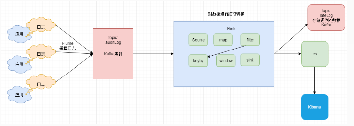

#### 48.实战需求分析(数据报表)		



```xml
<dependencyManagement>
        <dependencies>
            <dependency>
                <groupId>org.apache.flink</groupId>
                <artifactId>flink-java</artifactId>
                <version>1.6.1</version>
                <!-- provided在这表示此依赖只在代码编译的时候使用，运行和打包的时候不使用 -->
                <!--<scope>provided</scope>-->
            </dependency>
            <dependency>
                <groupId>org.apache.flink</groupId>
                <artifactId>flink-streaming-java_2.11</artifactId>
                <version>1.6.1</version>
                <!--<scope>provided</scope>-->
            </dependency>
            <dependency>
                <groupId>org.apache.flink</groupId>
                <artifactId>flink-scala_2.11</artifactId>
                <version>1.6.1</version>
                <!--<scope>provided</scope>-->
            </dependency>
            <dependency>
                <groupId>org.apache.flink</groupId>
                <artifactId>flink-streaming-scala_2.11</artifactId>
                <version>1.6.1</version>
                <!--<scope>provided</scope>-->
            </dependency>

            <dependency>
                <groupId>org.apache.bahir</groupId>
                <artifactId>flink-connector-redis_2.11</artifactId>
                <version>1.0</version>
            </dependency>

            <dependency>
                <groupId>org.apache.flink</groupId>
                <artifactId>flink-statebackend-rocksdb_2.11</artifactId>
                <version>1.6.1</version>
            </dependency>

            <dependency>
                <groupId>org.apache.flink</groupId>
                <artifactId>flink-connector-kafka-0.11_2.11</artifactId>
                <version>1.6.1</version>
            </dependency>

            <dependency>
                <groupId>org.apache.kafka</groupId>
                <artifactId>kafka-clients</artifactId>
                <version>0.11.0.3</version>
            </dependency>
            <!-- 日志相关依赖 -->
            <dependency>
                <groupId>org.slf4j</groupId>
                <artifactId>slf4j-api</artifactId>
                <version>1.7.25</version>
            </dependency>

            <dependency>
                <groupId>org.slf4j</groupId>
                <artifactId>slf4j-log4j12</artifactId>
                <version>1.7.25</version>
            </dependency>
            <!-- redis依赖 -->
            <dependency>
                <groupId>redis.clients</groupId>
                <artifactId>jedis</artifactId>
                <version>2.9.0</version>
            </dependency>
            <!-- json依赖 -->
            <dependency>
                <groupId>com.alibaba</groupId>
                <artifactId>fastjson</artifactId>
                <version>1.2.44</version>
            </dependency>

            <!--es依赖-->
            <dependency>
                <groupId>org.apache.flink</groupId>
                <artifactId>flink-connector-elasticsearch6_2.11</artifactId>
                <version>1.6.1</version>
            </dependency>

        </dependencies>

    </dependencyManagement>

    <build>
        <plugins>
            <!-- 编译插件 -->
            <plugin>
                <groupId>org.apache.maven.plugins</groupId>
                <artifactId>maven-compiler-plugin</artifactId>
                <version>3.6.0</version>
                <configuration>
                    <source>1.8</source>
                    <target>1.8</target>
                    <encoding>UTF-8</encoding>
                </configuration>
            </plugin>
            <!-- scala编译插件 -->
            <plugin>
                <groupId>net.alchim31.maven</groupId>
                <artifactId>scala-maven-plugin</artifactId>
                <version>3.1.6</version>
                <configuration>
                    <scalaCompatVersion>2.11</scalaCompatVersion>
                    <scalaVersion>2.11.12</scalaVersion>
                    <encoding>UTF-8</encoding>
                </configuration>
                <executions>
                    <execution>
                        <id>compile-scala</id>
                        <phase>compile</phase>
                        <goals>
                            <goal>add-source</goal>
                            <goal>compile</goal>
                        </goals>
                    </execution>
                    <execution>
                        <id>test-compile-scala</id>
                        <phase>test-compile</phase>
                        <goals>
                            <goal>add-source</goal>
                            <goal>testCompile</goal>
                        </goals>
                    </execution>
                </executions>
            </plugin>
            <!-- 打jar包插件(会包含所有依赖) -->
            <plugin>
                <groupId>org.apache.maven.plugins</groupId>
                <artifactId>maven-assembly-plugin</artifactId>
                <version>2.6</version>
                <configuration>
                    <descriptorRefs>
                        <descriptorRef>jar-with-dependencies</descriptorRef>
                    </descriptorRefs>
                    <archive>
                        <manifest>
                            <!-- 可以设置jar包的入口类(可选) -->
                            <mainClass></mainClass>
                        </manifest>
                    </archive>
                </configuration>
                <executions>
                    <execution>
                        <id>make-assembly</id>
                        <phase>package</phase>
                        <goals>
                            <goal>single</goal>
                        </goals>
                    </execution>
                </executions>
            </plugin>
        </plugins>
    </build>
```
#### 49.数据报表-java代码实现-1		
```java
public class DataReport {
    private static Logger logger = LoggerFactory.getLogger(DataReport.class);

    public static void main(String[] args) throws Exception{


        StreamExecutionEnvironment env = StreamExecutionEnvironment.getExecutionEnvironment();

        //设置并行度
        env.setParallelism(5);

        //设置使用eventtime
        env.setStreamTimeCharacteristic(TimeCharacteristic.EventTime);

        //checkpoint配置
        env.enableCheckpointing(60000);
        env.getCheckpointConfig().setCheckpointingMode(CheckpointingMode.EXACTLY_ONCE);
        env.getCheckpointConfig().setMinPauseBetweenCheckpoints(30000);
        env.getCheckpointConfig().setCheckpointTimeout(10000);
        env.getCheckpointConfig().setMaxConcurrentCheckpoints(1);
        env.getCheckpointConfig().enableExternalizedCheckpoints(CheckpointConfig.ExternalizedCheckpointCleanup.RETAIN_ON_CANCELLATION);
        //设置statebackend

        //env.setStateBackend(new RocksDBStateBackend("hdfs://hadoop100:9000/flink/checkpoints",true));

        /**
         * 配置kafkaSource
         */
        String topic = "auditLog";
        Properties prop = new Properties();
        prop.setProperty("bootstrap.servers","hadoop110:9092");
        prop.setProperty("group.id","con1");

        FlinkKafkaConsumer011<String> myConsumer = new FlinkKafkaConsumer011<>(topic, new SimpleStringSchema(), prop);


        /**
         * 获取到kafka中的数据
         *
         * 审核数据格式
         * // {"dt":"审核时间[年月日 时分秒]","type":"审核类型","username":"审核人员姓名","area":"大区"}
         *
         */
        DataStreamSource<String> data = env.addSource(myConsumer);


        /**
         * 对数据进行清洗
         */
        DataStream<Tuple3<Long, String, String>> mapData = data.map(new MapFunction<String, Tuple3<Long, String, String>>() {
            @Override
            public Tuple3<Long, String, String> map(String line) throws Exception {
                JSONObject jsonObject = JSON.parseObject(line);

                String dt = jsonObject.getString("dt");
                long time = 0;
                try {
                    SimpleDateFormat sdf = new SimpleDateFormat("yyyy-MM-dd HH:mm:ss");
                    Date parse = sdf.parse(dt);
                    time = parse.getTime();
                } catch (ParseException e) {
                    //也可以把这个日志存储到其他介质中
                    logger.error("时间解析异常，dt:" + dt, e.getCause());
                }

                String type = jsonObject.getString("type");
                String area = jsonObject.getString("area");

                return new Tuple3<>(time, type, area);
            }
        });

        /**
         * 过滤掉异常数据
         */
        DataStream<Tuple3<Long, String, String>> filterData = mapData.filter(new FilterFunction<Tuple3<Long, String, String>>() {
            @Override
            public boolean filter(Tuple3<Long, String, String> value) throws Exception {
                boolean flag = true;
                if (value.f0 == 0) {
                    flag = false;
                }
                return flag;
            }
        });

        //保存迟到太久的数据
        OutputTag<Tuple3<Long, String, String>> outputTag = new OutputTag<Tuple3<Long, String, String>>("late-data"){};

        /**
         * 窗口统计操作
         */
        SingleOutputStreamOperator<Tuple4<String, String, String, Long>> resultData = filterData.assignTimestampsAndWatermarks(new MyWatermark())
                .keyBy(1, 2)
                .window(TumblingEventTimeWindows.of(Time.seconds(30)))
                .allowedLateness(Time.seconds(30))//允许迟到30s
                .sideOutputLateData(outputTag)//记录迟到太久的数据
                .apply(new MyAggFunction());


        //获取迟到太久的数据
        DataStream<Tuple3<Long, String, String>> sideOutput = resultData.getSideOutput(outputTag);

        //把迟到的数据存储到kafka中
        String outTopic = "lateLog";
        Properties outprop = new Properties();
        outprop.setProperty("bootstrap.servers","hadoop110:9092");
        outprop.setProperty("transaction.timeout.ms",60000*15+"");

        FlinkKafkaProducer011<String> myProducer = new FlinkKafkaProducer011<String>(outTopic, new KeyedSerializationSchemaWrapper<String>(new SimpleStringSchema()), outprop, FlinkKafkaProducer011.Semantic.EXACTLY_ONCE);

        sideOutput.map(new MapFunction<Tuple3<Long,String,String>, String>() {
            @Override
            public String map(Tuple3<Long, String, String> value) throws Exception {
                return value.f0+"\t"+value.f1+"\t"+value.f2;
            }
        }).addSink(myProducer);


        /**
         * 把计算的结果存储到es中
         */
        List<HttpHost> httpHosts = new ArrayList<>();
        httpHosts.add(new HttpHost("hadoop100", 9200, "http"));

        ElasticsearchSink.Builder<Tuple4<String, String, String, Long>> esSinkBuilder = new ElasticsearchSink.Builder<Tuple4<String, String, String, Long>>(
                httpHosts,
                new ElasticsearchSinkFunction<Tuple4<String, String, String, Long>>() {
                    public IndexRequest createIndexRequest(Tuple4<String, String, String, Long> element) {
                        Map<String, Object> json = new HashMap<>();
                        json.put("time",element.f0);
                        json.put("type",element.f1);
                        json.put("area",element.f2);
                        json.put("count",element.f3);

                        //使用time+type+area 保证id唯一
                        String id = element.f0.replace(" ","_")+"-"+element.f1+"-"+element.f2;

                        return Requests.indexRequest()
                                .index("auditindex")
                                .type("audittype")
                                .id(id)
                                .source(json);
                    }

                    @Override
                    public void process(Tuple4<String, String, String, Long> element, RuntimeContext ctx, RequestIndexer indexer) {
                        indexer.add(createIndexRequest(element));
                    }
                }
        );
        //设置批量写数据的缓冲区大小，实际工作中的时间这个值需要调大一些
        esSinkBuilder.setBulkFlushMaxActions(1);
        resultData.addSink(esSinkBuilder.build());


        env.execute("DataReport");


    }
}
public class MyAggFunction implements WindowFunction<Tuple3<Long, String, String>, Tuple4<String, String, String, Long>, Tuple, TimeWindow>{
    @Override
    public void apply(Tuple tuple, TimeWindow window, Iterable<Tuple3<Long, String, String>> input, Collector<Tuple4<String, String, String, Long>> out) throws Exception {
        //获取分组字段信息
        String type = tuple.getField(0).toString();
        String area = tuple.getField(1).toString();

        Iterator<Tuple3<Long, String, String>> it = input.iterator();

        //存储时间，为了获取最后一条数据的时间
        ArrayList<Long> arrayList = new ArrayList<>();

        long count = 0;
        while (it.hasNext()) {
            Tuple3<Long, String, String> next = it.next();
            arrayList.add(next.f0);
            count++;
        }

        System.err.println(Thread.currentThread().getId()+",window触发了，数据条数："+count);

        //排序
        Collections.sort(arrayList);

        SimpleDateFormat sdf = new SimpleDateFormat("yyyy-MM-dd HH:mm:ss");

        String time = sdf.format(new Date(arrayList.get(arrayList.size() - 1)));

        //组装结果
        Tuple4<String, String, String, Long> res = new Tuple4<>(time, type, area, count);

        out.collect(res);
    }


}
```
#### 50.数据报表-java代码实现-2		
```java
public class MyWatermark implements AssignerWithPeriodicWatermarks<Tuple3<Long, String, String>> {

    Long currentMaxTimestamp = 0L;
    final Long maxOutOfOrderness = 10000L;// 最大允许的乱序时间是10s

    @Nullable
    @Override
    public Watermark getCurrentWatermark() {
        return new Watermark(currentMaxTimestamp-maxOutOfOrderness);
    }


    @Override
    public long extractTimestamp(Tuple3<Long, String, String> element, long previousElementTimestamp) {
        Long timestamp = element.f0;
        currentMaxTimestamp = Math.max(timestamp,currentMaxTimestamp);
        return timestamp;
    }
}

public class kafkaProducerDataReport {

    public static void main(String[] args) throws Exception{
        Properties prop = new Properties();
        //指定kafka broker地址
        prop.put("bootstrap.servers", "hadoop110:9092");
        //指定key value的序列化方式
        prop.put("key.serializer", StringSerializer.class.getName());
        prop.put("value.serializer", StringSerializer.class.getName());
        //指定topic名称
        String topic = "auditLog";

        //创建producer链接
        KafkaProducer<String, String> producer = new KafkaProducer<String,String>(prop);

        //{"dt":"2018-01-01 10:11:22","type":"shelf","username":"shenhe1","area":"AREA_US"}

        //生产消息
        while(true){
            String message = "{\"dt\":\""+getCurrentTime()+"\",\"type\":\""+getRandomType()+"\",\"username\":\""+getRandomUsername()+"\",\"area\":\""+getRandomArea()+"\"}";
            System.out.println(message);
            producer.send(new ProducerRecord<String, String>(topic,message));
            Thread.sleep(1000);
        }
        //关闭链接
        //producer.close();
    }

    public static String getCurrentTime(){
        SimpleDateFormat sdf = new SimpleDateFormat("YYYY-MM-dd HH:mm:ss");
        return sdf.format(new Date());
    }

    public static String getRandomArea(){
        String[] types = {"AREA_US","AREA_CT","AREA_AR","AREA_IN","AREA_ID"};
        Random random = new Random();
        int i = random.nextInt(types.length);
        return types[i];
    }


    public static String getRandomType(){
        String[] types = {"shelf","unshelf","black","chlid_shelf","child_unshelf"};
        Random random = new Random();
        int i = random.nextInt(types.length);
        return types[i];
    }


    public static String getRandomUsername(){
        String[] types = {"shenhe1","shenhe2","shenhe3","shenhe4","shenhe5"};
        Random random = new Random();
        int i = random.nextInt(types.length);
        return types[i];
    }


}

```
#### 51.数据报表-es和kibana的安装		
```sh
# 注意，如果索引建的有问题，则先删除再重新创建索引
curl -XDELETE 'localhost:9200/auditindex'

# 创建索引
curl -XPUT 'http://hadoop100:9200/auditindex?pretty'


# 创建type的mapping信息
curl -H "Content-Type: application/json" -XPOST 'http://hadoop100:9200/auditindex/audittype/_mapping?pretty' -d '
{
"audittype":{
	"properties":{
		"area":{"type":"keyword"},
		"type":{"type":"keyword"},
		"count":{"type":"long"},
		"time":{"type":"date","format": "yyyy-MM-dd HH:mm:ss"}
		}
    }
}
'

```
#### 52.数据报表-运行任务		
```java

```
#### 53.数据报表-执行脚本封装		
```java

```
#### 54.数据报表-scala代码实现	
```scala

object DataReportScala {
  val logger = LoggerFactory.getLogger("DataReportScala")

  def main(args: Array[String]): Unit = {
    val env = StreamExecutionEnvironment.getExecutionEnvironment

    //修改并行度
    env.setParallelism(5)
    env.setStreamTimeCharacteristic(TimeCharacteristic.EventTime)

    //checkpoint配置
    env.enableCheckpointing(60000)
    env.getCheckpointConfig.setCheckpointingMode(CheckpointingMode.EXACTLY_ONCE)
    env.getCheckpointConfig.setMinPauseBetweenCheckpoints(30000)
    env.getCheckpointConfig.setCheckpointTimeout(10000)
    env.getCheckpointConfig.setMaxConcurrentCheckpoints(1)
    env.getCheckpointConfig.enableExternalizedCheckpoints(CheckpointConfig.ExternalizedCheckpointCleanup.RETAIN_ON_CANCELLATION)

    //设置statebackend

    //env.setStateBackend(new RocksDBStateBackend("hdfs://hadoop100:9000/flink/checkpoints",true))

    //隐式转换
    import org.apache.flink.api.scala._
    val topic = "auditLog"
    val prop = new Properties()
    prop.setProperty("bootstrap.servers", "hadoop110:9092")
    prop.setProperty("group.id", "con2")

    val myConsumer = new FlinkKafkaConsumer011[String](topic, new SimpleStringSchema(), prop)
    //获取kafka中的数据
    val data = env.addSource(myConsumer)

    //对数据进行清洗
    val mapData = data.map(line => {
      val jsonObject = JSON.parseObject(line)

      val dt = jsonObject.getString("dt")
      var time = 0L
      try {
        val sdf = new SimpleDateFormat("yyyy-MM-dd HH:mm:ss")
        val parse = sdf.parse(dt)
        time = parse.getTime
      } catch {
        case e: ParseException => {
          logger.error("时间解析异常，dt:" + dt, e.getCause)
        }
      }

      val type1 = jsonObject.getString("type")
      val area = jsonObject.getString("area")

      (time, type1, area)
    })

    //过滤掉异常数据
    val filterData = mapData.filter(_._1 > 0)

    //保存迟到太久的数据
    // 注意：针对java代码需要引入org.apache.flink.util.OutputTag
    //针对scala代码 需要引入org.apache.flink.streaming.api.scala.OutputTag
    val outputTag = new OutputTag[Tuple3[Long, String, String]]("late-data") {}

    val resultData = filterData.assignTimestampsAndWatermarks(new AssignerWithPeriodicWatermarks[(Long, String, String)] {
      var currentMaxTimestamp = 0L
      var maxOutOfOrderness = 10000L // 最大允许的乱序时间是10s

      override def getCurrentWatermark = new Watermark(currentMaxTimestamp - maxOutOfOrderness)

      override def extractTimestamp(element: (Long, String, String), previousElementTimestamp: Long) = {
        val timestamp = element._1
        currentMaxTimestamp = Math.max(timestamp, currentMaxTimestamp)
        timestamp
      }
    }).keyBy(1, 2)
      .window(TumblingEventTimeWindows.of(Time.seconds(30)))
      .allowedLateness(Time.seconds(30)) //允许迟到30s
      .sideOutputLateData(outputTag)
      .apply(new WindowFunction[Tuple3[Long, String, String], Tuple4[String, String, String, Long], Tuple, TimeWindow] {
        override def apply(key: Tuple, window: TimeWindow, input: Iterable[(Long, String, String)], out: Collector[Tuple4[String, String, String, Long]]) = {
          //获取分组字段信息
          val type1 = key.getField(0).toString
          val area = key.getField(1).toString
          val it = input.iterator
          //存储时间，为了获取最后一条数据的时间
          val arrBuf = ArrayBuffer[Long]()
          var count = 0
          while (it.hasNext) {
            val next = it.next
            arrBuf.append(next._1)
            count += 1
          }
          println(Thread.currentThread.getId + ",window触发了，数据条数：" + count)
          //排序
          val arr = arrBuf.toArray
          Sorting.quickSort(arr)

          val sdf = new SimpleDateFormat("yyyy-MM-dd HH:mm:ss")
          val time = sdf.format(new Date(arr.last))
          //组装结果
          val res = new Tuple4[String, String, String, Long](time, type1, area, count)
          out.collect(res)
        }
      })

    //获取迟到太久的数据
    val sideOutput = resultData.getSideOutput[Tuple3[Long, String, String]](outputTag)

    //把迟到的数据存储到kafka中
    val outTopic = "lateLog"
    val outprop = new Properties()
    outprop.setProperty("bootstrap.servers", "hadoop110:9092")
    outprop.setProperty("transaction.timeout.ms", 60000 * 15 + "")

    val myProducer = new FlinkKafkaProducer011[String](outTopic, new KeyedSerializationSchemaWrapper[String](new SimpleStringSchema()), outprop, FlinkKafkaProducer011.Semantic.EXACTLY_ONCE)

    sideOutput.map(tup => tup._1 + "\t" + tup._2 + "\t" + tup._3).addSink(myProducer)


    //把计算的结果存储到es中
    val httpHosts = new java.util.ArrayList[HttpHost]
    httpHosts.add(new HttpHost("hadoop100", 9200, "http"))


    val esSinkBuilder = new org.apache.flink.streaming.connectors.elasticsearch6.ElasticsearchSink.Builder[Tuple4[String, String, String, Long]](
      httpHosts,
      new ElasticsearchSinkFunction[Tuple4[String, String, String, Long]] {
        def createIndexRequest(element: Tuple4[String, String, String, Long]): IndexRequest = {
          val json = new java.util.HashMap[String, Any]
          json.put("time", element.f0)
          json.put("type", element.f1)
          json.put("area", element.f2)
          json.put("count", element.f3)

          val id = element.f0.replace(" ", "_") + "-" + element.f1 + "-" + element.f2

          return Requests.indexRequest()
            .index("auditindex")
            .`type`("audittype")
            .id(id)
            .source(json)
        }

        override def process(element: Tuple4[String, String, String, Long], runtimeContext: RuntimeContext, requestIndexer: RequestIndexer) = {
          requestIndexer.add(createIndexRequest(element))
        }
      }
    )

    esSinkBuilder.setBulkFlushMaxActions(1)

    resultData.addSink(esSinkBuilder.build())

    env.execute("DataReportScala")

  }

}

```
