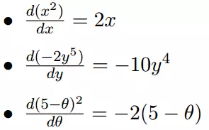
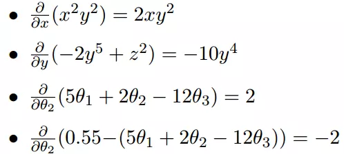
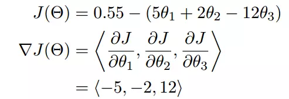
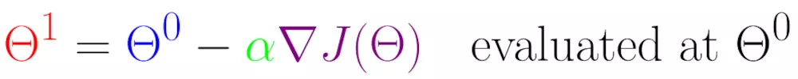
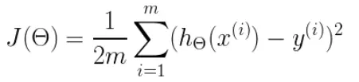
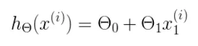
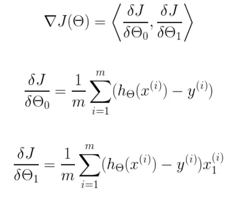

#### 43用户画像之梯度下降法大白话讲解
**微分**

看待微分的意义，可以有不同的角度，最常用的两种是：
函数图像中，某点的切线的斜率
函数的变化率几个微分的例子：



**多微分**
当一个函数有多个变量的时候，就有了多变量的微分，即分别对每个变量进行求微分




**梯度**

梯度实际上就是多变量微分的一般化




在单变量的函数中，梯度其实就是函数的微分，代表着函数在某个给定点的切线的斜率
在多变量函数中，梯度是一个向量，向量有方向，梯度的方向就指出了函数在给定点的上升最快的方向

**梯度下降算法的数学解释**

J是关于Θ的一个函数，我们当前所处的位置为Θ0点，要从这个点走到J的最小值点，也就是山底。首先我们先确定前进的方向，也就是梯度的反向，然后走一段距离的步长，也就是α，走完这个段步长，就到达了Θ1这个点！




α在梯度下降算法中被称作为学习率或者步长

```java

```
#### 44用户画像之结合数据微分以及数学公式讲解梯度下降法

**梯度下降算法的实现**

首先，我们需要定义一个代价函数，在此我们选用均方误差代价函数



m是数据集中点的个数
½是一个常量，这样是为了在求梯度的时候，二次方乘下来就和这里的½抵消了，自然就没有多余的常数系数，方便后续的计算，同时对结果不会有影响
y 是数据集中每个点的真实y坐标的值
h 是我们的预测函数，根据每一个输入x，根据Θ 计算得到预测的y值，即



我们可以根据代价函数看到，代价函数中的变量有两个，所以是一个多变量的梯度下降问题，求解出代价函数的梯度，也就是分别对两个变量进行微分




```java
/**
 * @Description: [该类主要用于保存特征信息]
 * @parameter data: [主要保存特征矩阵]
 */
public class Matrix {
    public ArrayList<ArrayList<String>> data;


    public Matrix() {
        data = new ArrayList<ArrayList<String>>();

    }
}

/**
 * 
 * @Description: [该类主要用于保存特征信息以及标签值]
 * @parameter labels: [主要保存标签值]
 */
public class CreateDataSet extends Matrix {
    public ArrayList<String> labels;
	
	public CreateDataSet() {
		super();
		labels = new ArrayList<String>();
	}
}
/**梯度算法实现类*/
public class Logistic {
 
	public static void main(String[] args) {
        colicTest();
	}
 
	/**
	 */
	public static void LogisticTest() {
		// TODO Auto-generated method stub
		CreateDataSet dataSet = new CreateDataSet();
		dataSet = readFile("testSet.txt");
		ArrayList<Double> weights = new ArrayList<Double>();
		weights = gradAscent1(dataSet, dataSet.labels, 150);
		for (int i = 0; i < 3; i++) {
			System.out.println(weights.get(i));
		}
		System.out.println();
	}
 
	/**
	 * @param inX
	 * @param weights
	 * @return
	 */
	public static String classifyVector(ArrayList<String> inX, ArrayList<Double> weights) {
		ArrayList<Double> sum = new ArrayList<Double>();
		sum.clear();
		sum.add(0.0);
		for (int i = 0; i < inX.size(); i++) {
			sum.set(0, sum.get(0) + Double.parseDouble(inX.get(i)) * weights.get(i));
		}
		if (sigmoid(sum).get(0) > 0.5)
			return "1";
		else
			return "0";
 
	}
 
	/**
	 */
	public static void colicTest() {
		CreateDataSet trainingSet = new CreateDataSet();
		CreateDataSet testSet = new CreateDataSet();
		trainingSet = readFile("testTraining.txt");// 23 445 34 1  45 56 67 0
		testSet = readFile("Test.txt");// 23 445 34 1  45 56 67 0
		ArrayList<Double> weights = new ArrayList<Double>();
		weights = gradAscent1(trainingSet, trainingSet.labels, 500);
		int errorCount = 0;
		for (int i = 0; i < testSet.data.size(); i++) {
			if (!classifyVector(testSet.data.get(i), weights).equals(testSet.labels.get(i))) {
				errorCount++;
			}
			System.out.println(classifyVector(testSet.data.get(i), weights) + "," + testSet.labels.get(i));
		}
		System.out.println(1.0 * errorCount / testSet.data.size());
 
	}
 
	/**
	 * @param inX
	 * @return
	 * @Description: [sigmod函数]
	 */
	public static ArrayList<Double> sigmoid(ArrayList<Double> inX) {
		ArrayList<Double> inXExp = new ArrayList<Double>();
		for (int i = 0; i < inX.size(); i++) {
			inXExp.add(1.0 / (1 + Math.exp(-inX.get(i))));
		}
		return inXExp;
	}
 
	/**
	 * @param dataSet
	 * @param classLabels
	 * @param numberIter
	 * @return
	 */
	public static ArrayList<Double> gradAscent1(Matrix dataSet, ArrayList<String> classLabels, int numberIter) {
		int m = dataSet.data.size();
		int n = dataSet.data.get(0).size();
		double alpha = 0.0;
		int randIndex = 0;
		ArrayList<Double> weights = new ArrayList<Double>();
		ArrayList<Double> weightstmp = new ArrayList<Double>();
		ArrayList<Double> h = new ArrayList<Double>();
		ArrayList<Integer> dataIndex = new ArrayList<Integer>();
		ArrayList<Double> dataMatrixMulweights = new ArrayList<Double>();
		for (int i = 0; i < n; i++) {
			weights.add(1.0);
			weightstmp.add(1.0);
		}
		dataMatrixMulweights.add(0.0);
		double error = 0.0;
		for (int j = 0; j < numberIter; j++) {
			// 产生0到99的数组
			for (int p = 0; p < m; p++) {
				dataIndex.add(p);
			}
			// 进行每一次的训练
 
			for (int i = 0; i < m; i++) {
				alpha = 4 / (1.0 + i + j) + 0.0001;
				randIndex = (int) (Math.random() * dataIndex.size());
				dataIndex.remove(randIndex);
				double temp = 0.0;
				for (int k = 0; k < n; k++) {
					temp = temp + Double.parseDouble(dataSet.data.get(randIndex).get(k)) * weights.get(k);
				}
				dataMatrixMulweights.set(0, temp);
				h = sigmoid(dataMatrixMulweights);
				error = Double.parseDouble(classLabels.get(randIndex)) - h.get(0);
				double tempweight = 0.0;
				for (int p = 0; p < n; p++) {
					tempweight = alpha * Double.parseDouble(dataSet.data.get(randIndex).get(p)) * error;
					weights.set(p, weights.get(p) + tempweight);
				}
			}
 
		}
		return weights;
	}
 
	/**
	 * @param dataSet
	 * @param classLabels
	 * @return
	 */
	public static ArrayList<Double> gradAscent0(Matrix dataSet, ArrayList<String> classLabels) {
		int m = dataSet.data.size();
		int n = dataSet.data.get(0).size();
		ArrayList<Double> weights = new ArrayList<Double>();
		ArrayList<Double> weightstmp = new ArrayList<Double>();
		ArrayList<Double> h = new ArrayList<Double>();
		double error = 0.0;
		ArrayList<Double> dataMatrixMulweights = new ArrayList<Double>();
		double alpha = 0.01;
		for (int i = 0; i < n; i++) {
			weights.add(1.0);
			weightstmp.add(1.0);
		}
		h.add(0.0);
		double temp = 0.0;
		dataMatrixMulweights.add(0.0);
		for (int i = 0; i < m; i++) {
			temp = 0.0;
			for (int k = 0; k < n; k++) {
				temp = temp + Double.parseDouble(dataSet.data.get(i).get(k)) * weights.get(k);
			}
			dataMatrixMulweights.set(0, temp);
			h = sigmoid(dataMatrixMulweights);
			error = Double.parseDouble(classLabels.get(i)) - h.get(0);
			double tempweight = 0.0;
			for (int p = 0; p < n; p++) {
				tempweight = alpha * Double.parseDouble(dataSet.data.get(i).get(p)) * error;
				weights.set(p, weights.get(p) + tempweight);
			}
		}
		return weights;
	}
 
	/**
	 * @param dataSet
	 * @param classLabels
	 * @return
	 */
	public static ArrayList<Double> gradAscent(Matrix dataSet, ArrayList<String> classLabels) {
		int m = dataSet.data.size();
		int n = dataSet.data.get(0).size();
		ArrayList<Double> weights = new ArrayList<Double>();
		ArrayList<Double> weightstmp = new ArrayList<Double>();
		ArrayList<Double> h = new ArrayList<Double>();
		ArrayList<Double> error = new ArrayList<Double>();
		ArrayList<Double> dataMatrixMulweights = new ArrayList<Double>();
		double alpha = 0.001;
		int maxCycles = 500;
		for (int i = 0; i < n; i++) {
			weights.add(1.0);
			weightstmp.add(1.0);
		}
		for (int i = 0; i < m; i++) {
			h.add(0.0);
			error.add(0.0);
			dataMatrixMulweights.add(0.0);
		}
		double temp;
		for (int i = 0; i < maxCycles; i++) {
			for (int j = 0; j < m; j++) {
				temp = 0.0;
				for (int k = 0; k < n; k++) {
					temp = temp + Double.parseDouble(dataSet.data.get(j).get(k)) * weights.get(k);
				}
				dataMatrixMulweights.set(j, temp);
			}
			h = sigmoid(dataMatrixMulweights);
			for (int q = 0; q < m; q++) {
				error.set(q, Double.parseDouble(classLabels.get(q)) - h.get(q));
			}
			double tempweight = 0.0;
			for (int p = 0; p < n; p++) {
				tempweight = 0.0;
				for (int q = 0; q < m; q++) {
					tempweight = tempweight + alpha * Double.parseDouble(dataSet.data.get(q).get(p)) * error.get(q);
				}
				weights.set(p, weights.get(p) + tempweight);
			}
		}
		return weights;
	}

	public Logistic() {
		super();
	}

	/**
	 * @param fileName
	 *            读入的文件名
	 * @return
	 */
	public static CreateDataSet readFile(String fileName) {
		File file = new File(fileName);
		BufferedReader reader = null;
		CreateDataSet dataSet = new CreateDataSet();
		try {
			reader = new BufferedReader(new FileReader(file));
			String tempString = null;
			// 一次读入一行，直到读入null为文件结束
			while ((tempString = reader.readLine()) != null) {
				// 显示行号
				String[] strArr = tempString.split("\t");
				ArrayList<String> as = new ArrayList<String>();
				as.add("1");
				for (int i = 0; i < strArr.length - 1; i++) {
					as.add(strArr[i]);
				}
				dataSet.data.add(as);
				dataSet.labels.add(strArr[strArr.length - 1]);
			}
			reader.close();
		} catch (IOException e) {
			e.printStackTrace();
		} finally {
			if (reader != null) {
				try {
					reader.close();
				} catch (IOException e1) {
				}
			}
		}
		return dataSet;
	}
 
}
```
#### 45用户画像之java实现逻辑回归算法
```java
public class LogicInfo {
    private String variable1;
    private String variable2;
    private String variable3;
    private String labase;
    private String groupbyfield;
}

public class LogicMap implements MapFunction<String, LogicInfo>{
    @Override
    public LogicInfo map(String s) throws Exception {
        if(StringUtils.isBlank(s)){
            return null;
        }
        Random random = new Random();
        String [] temps = s.split(",");
        String variable1 = temps[0];
        String variable2 = temps[1];
        String variable3 = temps[2];
        String labase = temps[3];
        LogicInfo logicInfo = new LogicInfo();
        logicInfo.setVariable1(variable1);
        logicInfo.setVariable2(variable2);
        logicInfo.setVariable3(variable3);
        logicInfo.setLabase(labase);
        logicInfo.setGroupbyfield("logic=="+random.nextInt(10));
        return logicInfo;
    }
}

```
#### 46用户画像之flink实现分布式逻辑回归算法代码编写1
```java
public class LogicReduce implements GroupReduceFunction<LogicInfo,ArrayList<Double>> {
    @Override
    public void reduce(Iterable<LogicInfo> iterable, Collector<ArrayList<Double>> collector) throws Exception {
        Iterator<LogicInfo> iterator = iterable.iterator();
        CreateDataSet trainingSet = new CreateDataSet();
        while(iterator.hasNext()){
            LogicInfo logicInfo = iterator.next();
            String variable1 = logicInfo.getVariable1();
            String variable2 = logicInfo.getVariable2();
            String variable3 = logicInfo.getVariable3();
            String label = logicInfo.getLabase();


            ArrayList<String> as = new ArrayList<String>();
            as.add(variable1);
            as.add(variable2);
            as.add(variable3);

            trainingSet.data.add(as);
            trainingSet.labels.add(label);
        }
        ArrayList<Double> weights = new ArrayList<Double>();
        weights = Logistic.gradAscent1(trainingSet, trainingSet.labels, 500);
        collector.collect(weights);
    }
}
```
#### 47用户画像之flink实现分布式逻辑回归算法代码编写2
```java
public class LogicTask {
    public static void main(String[] args) {
        final ParameterTool params = ParameterTool.fromArgs(args);

        // set up the execution environment
        final ExecutionEnvironment env = ExecutionEnvironment.getExecutionEnvironment();

        // make parameters available in the web interface
        env.getConfig().setGlobalJobParameters(params);

        // get input data
        DataSet<String> text = env.readTextFile(params.get("input"));

        DataSet<LogicInfo> mapresult = text.map(new LogicMap());
        DataSet<ArrayList<Double>> reduceresutl = mapresult.groupBy("groupbyfield").reduceGroup(new LogicReduce());
        try {
            List<ArrayList<Double>> reusltlist = reduceresutl.collect();
            int groupsize  = reusltlist.size();
            Map<Integer,Double> summap = new TreeMap<Integer,Double>(new Comparator<Integer>() {
                @Override
                public int compare(Integer o1, Integer o2) {
                    return o1.compareTo(o2);
                }
            });
            for(ArrayList<Double> array:reusltlist){

                for(int i=0;i<array.size();i++){
                    double pre = summap.get(i)==null?0d:summap.get(i);
                    summap.put(i,pre+array.get(i));
                }
            }
            ArrayList<Double> finalweight = new ArrayList<Double>();
            Set<Map.Entry<Integer,Double>> set = summap.entrySet();
            for(Map.Entry<Integer,Double> mapentry :set){
                Integer key = mapentry.getKey();
                Double sumvalue = mapentry.getValue();
                double finalvalue = sumvalue/groupsize;
                finalweight.add(finalvalue);
            }
            env.execute("LogicTask analy");
        } catch (Exception e) {
            e.printStackTrace();
        }
    }
}
```
#### 48用户画像之flink逻辑回归预测性别代码编写1
```java
public class SexPreInfo {
    /**
     * 用户id 订单次数 订单频次 浏览男装
     * 浏览小孩 浏览老人 浏览女士 订单平均金额 浏览商品频次 标签
     */
    private int userid;
    private long ordernum;//订单的总数
    private long orderfre;//隔多少天下单
    private int manclothes;//浏览男装次数
    private int womenclothes;//浏览女装的次数
    private int childclothes;//浏览小孩衣服的次数
    private int oldmanclothes;//浏览老人的衣服的次数
    private double avramount;//订单平均金额
    private int producttimes;//每天浏览商品数
    private int label;//男，女

    private String groupfield;//分组
}


```
#### 49用户画像之flink逻辑回归预测性别代码编写2
```java
public class SexPreMap implements MapFunction<String, SexPreInfo> {
    @Override
    public SexPreInfo map(String s) throws Exception {
        String[] temps = s.split("\t");
        Random random = new Random();
        //清洗以及归一化
        int userid = Integer.valueOf(temps[0]);
        long ordernum = Long.valueOf(temps[1]);//订单的总数
        long orderfre = Long.valueOf(temps[4]);//隔多少天下单
        int manclothes =Integer.valueOf(temps[5]);//浏览男装次数
        int womenclothes = Integer.valueOf(temps[6]);//浏览女装的次数
        int childclothes = Integer.valueOf(temps[7]);//浏览小孩衣服的次数
        int oldmanclothes = Integer.valueOf(temps[8]);//浏览老人的衣服的次数
        double avramount = Double.valueOf(temps[9]);//订单平均金额
         int producttimes = Integer.valueOf(temps[10]);//每天浏览商品数
       int label = Integer.valueOf(temps[11]);//0男，1女
        String fieldgroup = "sexpre=="+random.nextInt(10);
        SexPreInfo sexPreInfo = new SexPreInfo();
        sexPreInfo.setUserid(userid);
        sexPreInfo.setOrdernum(ordernum);
        sexPreInfo.setOrderfre(orderfre);
        sexPreInfo.setManclothes(manclothes);
        sexPreInfo.setWomenclothes(womenclothes);
        sexPreInfo.setChildclothes(childclothes);
        sexPreInfo.setOldmanclothes(oldmanclothes);
        sexPreInfo.setAvramount(avramount);
        sexPreInfo.setProducttimes(producttimes);
        sexPreInfo.setLabel(label);
        sexPreInfo.setGroupfield(fieldgroup);
        return sexPreInfo;
    }
}
public class SexPresaveMap implements MapFunction<String, SexPreInfo> {
    private ArrayList<Double> weights = null;
    public SexPresaveMap(ArrayList<Double> weights){
            this.weights = weights;
    }
    @Override
    public SexPreInfo map(String s) throws Exception {
        String[] temps = s.split("\t");
        Random random = new Random();
        //清洗以及归一化
        int userid = Integer.valueOf(temps[0]);
        long ordernum = Long.valueOf(temps[1]);//订单的总数
        long orderfre = Long.valueOf(temps[4]);//隔多少天下单
        int manclothes =Integer.valueOf(temps[5]);//浏览男装次数
        int womenclothes = Integer.valueOf(temps[6]);//浏览女装的次数
        int childclothes = Integer.valueOf(temps[7]);//浏览小孩衣服的次数
        int oldmanclothes = Integer.valueOf(temps[8]);//浏览老人的衣服的次数
        double avramount = Double.valueOf(temps[9]);//订单平均金额
         int producttimes = Integer.valueOf(temps[10]);//每天浏览商品数

        ArrayList<String> as = new ArrayList<String>();
        as.add(ordernum+"");
        as.add(orderfre+"");
        as.add(manclothes+"");

        as.add(womenclothes+"");
        as.add(childclothes+"");
        as.add(oldmanclothes+"");

        as.add(avramount+"");
        as.add(producttimes+"");

        String sexflag = Logistic.classifyVector(as, weights);
        String sexstring = sexflag=="0"?"女":"男";

        String tablename = "userflaginfo";
        String rowkey = userid+"";
        String famliyname = "baseinfo";
        String colum = "sex";//运营商
        HbaseUtils.putdata(tablename,rowkey,famliyname,colum,sexstring);

        return null;
    }
}
```
#### 50用户画像之flink逻辑回归预测性别代码编写3
```java
public class SexpreReduce implements GroupReduceFunction<SexPreInfo,ArrayList<Double>> {
    @Override
    public void reduce(Iterable<SexPreInfo> iterable, Collector<ArrayList<Double>> collector) throws Exception {
        Iterator<SexPreInfo> iterator = iterable.iterator();
        CreateDataSet trainingSet = new CreateDataSet();
        while(iterator.hasNext()){
            SexPreInfo sexPreInfo = iterator.next();
            int userid = sexPreInfo.getUserid();
            long ordernum = sexPreInfo.getOrdernum();//订单的总数
            long orderfre = sexPreInfo.getOrderfre();//隔多少天下单
            int manclothes = sexPreInfo.getManclothes();//浏览男装次数
            int womenclothes = sexPreInfo.getWomenclothes();//浏览女装的次数
            int childclothes = sexPreInfo.getChildclothes();//浏览小孩衣服的次数
            int oldmanclothes = sexPreInfo.getOldmanclothes();//浏览老人的衣服的次数
            double avramount = sexPreInfo.getAvramount();//订单平均金额
            int producttimes = sexPreInfo.getProducttimes();//每天浏览商品数
            int label = sexPreInfo.getLabel();//0男，1女


            ArrayList<String> as = new ArrayList<String>();
            as.add(ordernum+"");
            as.add(orderfre+"");
            as.add(manclothes+"");

            as.add(womenclothes+"");
            as.add(childclothes+"");
            as.add(oldmanclothes+"");

            as.add(avramount+"");
            as.add(producttimes+"");

            trainingSet.data.add(as);
            trainingSet.labels.add(label+"");
        }
        ArrayList<Double> weights = new ArrayList<Double>();
        weights = Logistic.gradAscent1(trainingSet, trainingSet.labels, 500);
        collector.collect(weights);
    }
}
public class SexPreTask {
    public static void main(String[] args) {
        final ParameterTool params = ParameterTool.fromArgs(args);

        // set up the execution environment
        final ExecutionEnvironment env = ExecutionEnvironment.getExecutionEnvironment();

        // make parameters available in the web interface
        env.getConfig().setGlobalJobParameters(params);

        // get input data
        DataSet<String> text = env.readTextFile(params.get("input"));

        DataSet<SexPreInfo> mapresult = text.map(new SexPreMap());
        DataSet<ArrayList<Double>> reduceresutl = mapresult.groupBy("groupfield").reduceGroup(new SexpreReduce());
        try {
            List<ArrayList<Double>> reusltlist = reduceresutl.collect();
            int groupsize  = reusltlist.size();
            Map<Integer,Double> summap = new TreeMap<Integer,Double>(new Comparator<Integer>() {
                @Override
                public int compare(Integer o1, Integer o2) {
                    return o1.compareTo(o2);
                }
            });
            for(ArrayList<Double> array:reusltlist){

                for(int i=0;i<array.size();i++){
                    double pre = summap.get(i)==null?0d:summap.get(i);
                    summap.put(i,pre+array.get(i));
                }
            }
            ArrayList<Double> finalweight = new ArrayList<Double>();
            Set<Map.Entry<Integer,Double>> set = summap.entrySet();
            for(Map.Entry<Integer,Double> mapentry :set){
                Integer key = mapentry.getKey();
                Double sumvalue = mapentry.getValue();
                double finalvalue = sumvalue/groupsize;
                finalweight.add(finalvalue);
            }

            DataSet<String> text2 = env.readTextFile(params.get("input2"));
            text2.map(new SexPresaveMap(finalweight));

            env.execute("sexPreTask analy");
        } catch (Exception e) {
            e.printStackTrace();
        }
    }
}
```
#### 51用户画像之kmeans之原理讲解

# kmeans算法

  kmeans算法又名k均值算法。其**算法思想**大致为：先从样本集中随机选取 kk 个样本作为**簇中心**，并计算所有样本与这 kk 个“簇中心”的距离，对于每一个样本，将其划分到与其**距离最近**的“簇中心”所在的簇中，对于新的簇计算各个簇的新的“簇中心”。
  根据以上描述，我们大致可以猜测到实现kmeans算法的主要三点：
  （1）簇个数 kk 的选择
  （2）各个样本点到“簇中心”的**距离**
  （3）根据新划分的簇，更新“簇中心”

```java

```
#### 52用户画像之java实现kmeans代码编写
```java
public class Point {
    private float[] localArray;
    private int id;
    private int clusterId;  // 标识属于哪个类中心。
    private float dist;     // 标识和所属类中心的距离。
    private Point clusterPoint;//中心点信息
}

public class Cluster {
    private int id;// 标识
    private Point center;// 中心
    private List<Point> members = new ArrayList<Point>();// 成员
}

public class DistanceCompute {
    /**
     * 求欧式距离
     */
    public double getEuclideanDis(Point p1, Point p2) {
        double count_dis = 0;
        float[] p1_local_array = p1.getlocalArray();
        float[] p2_local_array = p2.getlocalArray();
 
        if (p1_local_array.length != p2_local_array.length) {
            throw new IllegalArgumentException("length of array must be equal!");
        }
 
        for (int i = 0; i < p1_local_array.length; i++) {
            count_dis += Math.pow(p1_local_array[i] - p2_local_array[i], 2);
        }
 
        return Math.sqrt(count_dis);
    }
}

public class Main {
 
    public static void main(String[] args) {
        ArrayList<float[]> dataSet = new ArrayList<float[]>();
 
        dataSet.add(new float[] { 1, 2, 3 });
        dataSet.add(new float[] { 3, 3, 3 });
        dataSet.add(new float[] { 3, 4, 4});
        dataSet.add(new float[] { 5, 6, 5});
        dataSet.add(new float[] { 8, 9, 6});
        dataSet.add(new float[] { 4, 5, 4});
        dataSet.add(new float[] { 6, 4, 2});
        dataSet.add(new float[] { 3, 9, 7});
        dataSet.add(new float[] { 5, 9, 8});
        dataSet.add(new float[] { 4, 2, 10});
        dataSet.add(new float[] { 1, 9, 12});
        dataSet.add(new float[] { 7, 8, 112});
        dataSet.add(new float[] { 7, 8, 4});
 
        KMeansRun kRun =new KMeansRun(3, dataSet);
 
        Set<Cluster> clusterSet = kRun.run();
        System.out.println("单次迭代运行次数："+kRun.getIterTimes());
        for (Cluster cluster : clusterSet) {
            System.out.println(cluster);
        }
    }
}
```
#### 53用户画像之flink实现分布式kmeans代码编写
```java
public class KMeansMap implements MapFunction<String, KMeans>{
    @Override
    public KMeans map(String s) throws Exception {
        if(StringUtils.isBlank(s)){
            return null;
        }
        //2,3,4
        Random random = new Random();
        String [] temps = s.split(",");
        String variable1 = temps[0];
        String variable2 = temps[1];
        String variable3 = temps[2];
        KMeans kMeans = new KMeans();
        kMeans.setVariable1(variable1);
        kMeans.setVariable2(variable2);
        kMeans.setVariable3(variable3);
        kMeans.setGroupbyfield("logic=="+random.nextInt(10));
        return kMeans;
    }
}

public class KMeansFinalMap implements MapFunction<String, Point>{

    private List<Point> centers = new ArrayList<Point>();
    private DistanceCompute disC = new DistanceCompute();

    public KMeansFinalMap(List<Point> centers){
            this.centers = centers;
    }
    @Override
    public Point map(String s) throws Exception {
        if(StringUtils.isBlank(s)){
            return null;
        }
        //2,3,4
        Random random = new Random();
        String [] temps = s.split(",");
        String variable1 = temps[0];
        String variable2 = temps[1];
        String variable3 = temps[2];
        Point self = new Point(1,new float[]{Float.valueOf(variable1),Float.valueOf(variable2),Float.valueOf(variable3)});
        float min_dis = Integer.MAX_VALUE;
        for (Point point : centers) {
            float tmp_dis = (float) Math.min(disC.getEuclideanDis(self, point), min_dis);
            if (tmp_dis != min_dis) {
                min_dis = tmp_dis;
                self.setClusterId(point.getId());
                self.setDist(min_dis);
                self.setClusterPoint(point);
            }
        }

        return self;
    }
}
```
#### 54用户画像之flink实现分布式kmeans代码编写2
```java
public class KMeansTask {
    public static void main(String[] args) {
        final ParameterTool params = ParameterTool.fromArgs(args);

        // set up the execution environment
        final ExecutionEnvironment env = ExecutionEnvironment.getExecutionEnvironment();

        // make parameters available in the web interface
        env.getConfig().setGlobalJobParameters(params);

        // get input data
        DataSet<String> text = env.readTextFile(params.get("input"));

        DataSet<KMeans> mapresult = text.map(new KMeansMap());
        DataSet<ArrayList<Point>> reduceresutl = mapresult.groupBy("groupbyfield").reduceGroup(new KMeansReduce());
        try {
            List<ArrayList<Point>> reusltlist = reduceresutl.collect();
            ArrayList<float[]> dataSet = new ArrayList<float[]>();
            for(ArrayList<Point> array:reusltlist){
                for(Point point:array){
                    dataSet.add(point.getlocalArray());
                }
            }
            KMeansRun kRun =new KMeansRun(6, dataSet);

            Set<Cluster> clusterSet = kRun.run();
            List<Point> finalClutercenter = new ArrayList<Point>();
            int count= 100;
            for(Cluster cluster:clusterSet){
                Point point = cluster.getCenter();
                point.setId(count++);
                finalClutercenter.add(point);
            }
            DataSet<Point> flinalMap = text.map(new KMeansFinalMap(finalClutercenter));
            flinalMap.writeAsText(params.get("out"));
            env.execute("LogicTask analy");
        } catch (Exception e) {
            e.printStackTrace();
        }
    }
}
```
#### 55用户画像之flink实现分布式kmeans代码编写3
```java
public class KMeansReduce implements GroupReduceFunction<KMeans,ArrayList<Point>> {
    @Override
    public void reduce(Iterable<KMeans> iterable, Collector<ArrayList<Point>> collector) throws Exception {
        Iterator<KMeans> iterator = iterable.iterator();
        ArrayList<float[]> dataSet = new ArrayList<float[]>();
        while(iterator.hasNext()){
            KMeans kMeans = iterator.next();
            float[] f = new float[]{Float.valueOf(kMeans.getVariable1()),Float.valueOf(kMeans.getVariable2()),Float.valueOf(kMeans.getVariable3())};
            dataSet.add(f);
        }
        KMeansRun kRun =new KMeansRun(6, dataSet);

        Set<Cluster> clusterSet = kRun.run();
        ArrayList<Point> arrayList = new ArrayList<Point>();
        for(Cluster cluster:clusterSet){
            arrayList.add(cluster.getCenter());
        }
        collector.collect(arrayList);
    }
}
```
#### 56用户画像之flink实现分布式kmeans代码编写4
```java

```
#### 57用户画像之flink分布式kmeans实现用户分群代码编写1
```java

```
#### 58用户画像之flink分布式kmeans实现用户分群代码编写2
```java

```
#### 59用户画像之flink分布式kmeans实现用户分群代码编写3
```java

```
#### 60用户画像之flink分布式kmeans实现用户分群代码编写4
```java

```
#### 61用户画像之flink分布式kmeans实现用户分群代码编写5
```java

```
#### 62用户画像之潮男族潮女族标签代码编写1
```java

```
#### 63用户画像之潮男组潮女族标签代码编写2
```java

```
#### 64用户画像之潮男族潮女族标签代码编写3
```java

```
#### 65用户画像之潮男族潮女族标签代码编写4
```java

```
#### 66用户画像之消费水平标签代码编写1
```java

```
#### 67用户画像之消费水平标签代码编写2
```java

```
#### 68用户画像之消费水平标签代码编写3
```java

```
#### 69用户画像之vuejs+nodejs构建前端项目讲解
```java

```
#### 70用户画像之vuejs+highcharts构建图表代码编写
```java

```
#### 71用户画像之vuejs+hightcharts构建图表效果演示
```java

```
#### 72用户画像之接口查询服务构建
```java

```
#### 73用户画像之年代接口代码编写
```java

```
#### 74用户画像之前端查询服务构建
```java

```
#### 75用户画像之基于springcloud+Feign服务调用代码编写
```java

```
#### 76用户画像之基于springcloud+Feign服务调用代码编写2
```java

```
#### 77用户画像之vuejs整合前端查询接口代码编写
```java

```
#### 78用户画像之vuejs整合前段查询接口之跨域问题解决
```java

```
#### 79用户画像之前端查询接口进一步封装代码编写
```java

```
#### 80用户画像之接口重构代码编写
```java

```
#### 81用户画像之前端查询接口重用改造代码编写
```java

```
#### 82用户画像vuejs完善剩余图表代码编写1
```java

```
#### 83用户画像之vuejs完善剩余图表代码编写2
```java

```
#### 84用户画像之vuejs完善剩余图表代码编写3
```java

```
#### 85用户画像之vuejs配置路由代码编写
```java

```
#### 86用户画像之接口服务前端查询服务以及前端展示服务联调以及效果展示.zip
```java

```
#### 87用户画像之TF-IDF通俗讲解
```java

```
#### 88用户画像之分词工具ik讲解以及代码编写.zip
```java

```
#### 89用户画像之java实现TF-IDF代码编写1
```java

```
#### 90用户画像之java实现TF-IDF代码编写2
```java

```
#### 91用户画像之flink实现分布式TF-IDF代码编写1
```java

```
#### 92用户画像之flink实现分布式TF-IDF代码编写2、
```java

```
#### 93用户画像之fink分布式TF-IDF实现用户年度、月度，季度商品关键词代码编写1
```java

```
#### 94用户画像之fink分布式TF-IDF实现用户年度、月度，季度商品关键词代码编写2
```java

```
#### 95用户画像之fink分布式TF-IDF实现用户年度、月度，季度商品关键词代码编写3
```java

```
#### 96用户画像之fink分布式TF-IDF实现用户年度、月度，季度商品关键词代码编写4
```java

```
#### 97用户画像之标签接口之败家指数接口代码编写
```java

```
#### 98用户画像之全部标签接口代码编写
```java

```
#### 99用户画像之前端标签查询服务代码编写
```java

```
#### 100用户画像之vue.js标签显示代码编写1
```java

```
#### 101用户画像之vue.js标签显示代码编写2以及效果演示
```java

```
