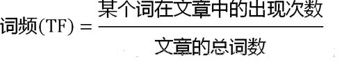

#### 43用户画像之梯度下降法大白话讲解
**微分**

看待微分的意义，可以有不同的角度，最常用的两种是：
函数图像中，某点的切线的斜率
函数的变化率几个微分的例子：


**多微分**
当一个函数有多个变量的时候，就有了多变量的微分，即分别对每个变量进行求微分


**梯度**

梯度实际上就是多变量微分的一般化


在单变量的函数中，梯度其实就是函数的微分，代表着函数在某个给定点的切线的斜率
在多变量函数中，梯度是一个向量，向量有方向，梯度的方向就指出了函数在给定点的上升最快的方向

**梯度下降算法的数学解释**

J是关于Θ的一个函数，我们当前所处的位置为Θ0点，要从这个点走到J的最小值点，也就是山底。首先我们先确定前进的方向，也就是梯度的反向，然后走一段距离的步长，也就是α，走完这个段步长，就到达了Θ1这个点！


α在梯度下降算法中被称作为学习率或者步长

```java

```
#### 44用户画像之结合数据微分以及数学公式讲解梯度下降法

**梯度下降算法的实现**

首先，我们需要定义一个代价函数，在此我们选用均方误差代价函数


m是数据集中点的个数
½是一个常量，这样是为了在求梯度的时候，二次方乘下来就和这里的½抵消了，自然就没有多余的常数系数，方便后续的计算，同时对结果不会有影响
y 是数据集中每个点的真实y坐标的值
h 是我们的预测函数，根据每一个输入x，根据Θ 计算得到预测的y值，即


我们可以根据代价函数看到，代价函数中的变量有两个，所以是一个多变量的梯度下降问题，求解出代价函数的梯度，也就是分别对两个变量进行微分


```java
/**
 * @Description: [该类主要用于保存特征信息]
 * @parameter data: [主要保存特征矩阵]
 */
public class Matrix {
    public ArrayList<ArrayList<String>> data;


    public Matrix() {
        data = new ArrayList<ArrayList<String>>();

    }
}

/**
 * 
 * @Description: [该类主要用于保存特征信息以及标签值]
 * @parameter labels: [主要保存标签值]
 */
public class CreateDataSet extends Matrix {
    public ArrayList<String> labels;
	
	public CreateDataSet() {
		super();
		labels = new ArrayList<String>();
	}
}
/**梯度算法实现类*/
public class Logistic {
 
	public static void main(String[] args) {
        colicTest();
	}
 
	/**
	 */
	public static void LogisticTest() {
		// TODO Auto-generated method stub
		CreateDataSet dataSet = new CreateDataSet();
		dataSet = readFile("testSet.txt");
		ArrayList<Double> weights = new ArrayList<Double>();
		weights = gradAscent1(dataSet, dataSet.labels, 150);
		for (int i = 0; i < 3; i++) {
			System.out.println(weights.get(i));
		}
		System.out.println();
	}
 
	/**
	 * @param inX
	 * @param weights
	 * @return
	 */
	public static String classifyVector(ArrayList<String> inX, ArrayList<Double> weights) {
		ArrayList<Double> sum = new ArrayList<Double>();
		sum.clear();
		sum.add(0.0);
		for (int i = 0; i < inX.size(); i++) {
			sum.set(0, sum.get(0) + Double.parseDouble(inX.get(i)) * weights.get(i));
		}
		if (sigmoid(sum).get(0) > 0.5)
			return "1";
		else
			return "0";
 
	}
 
	/**
	 */
	public static void colicTest() {
		CreateDataSet trainingSet = new CreateDataSet();
		CreateDataSet testSet = new CreateDataSet();
		trainingSet = readFile("testTraining.txt");// 23 445 34 1  45 56 67 0
		testSet = readFile("Test.txt");// 23 445 34 1  45 56 67 0
		ArrayList<Double> weights = new ArrayList<Double>();
		weights = gradAscent1(trainingSet, trainingSet.labels, 500);
		int errorCount = 0;
		for (int i = 0; i < testSet.data.size(); i++) {
			if (!classifyVector(testSet.data.get(i), weights).equals(testSet.labels.get(i))) {
				errorCount++;
			}
			System.out.println(classifyVector(testSet.data.get(i), weights) + "," + testSet.labels.get(i));
		}
		System.out.println(1.0 * errorCount / testSet.data.size());
 
	}
 
	/**
	 * @param inX
	 * @return
	 * @Description: [sigmod函数]
	 */
	public static ArrayList<Double> sigmoid(ArrayList<Double> inX) {
		ArrayList<Double> inXExp = new ArrayList<Double>();
		for (int i = 0; i < inX.size(); i++) {
			inXExp.add(1.0 / (1 + Math.exp(-inX.get(i))));
		}
		return inXExp;
	}
 
	/**
	 * @param dataSet
	 * @param classLabels
	 * @param numberIter
	 * @return
	 */
	public static ArrayList<Double> gradAscent1(Matrix dataSet, ArrayList<String> classLabels, int numberIter) {
		int m = dataSet.data.size();
		int n = dataSet.data.get(0).size();
		double alpha = 0.0;
		int randIndex = 0;
		ArrayList<Double> weights = new ArrayList<Double>();
		ArrayList<Double> weightstmp = new ArrayList<Double>();
		ArrayList<Double> h = new ArrayList<Double>();
		ArrayList<Integer> dataIndex = new ArrayList<Integer>();
		ArrayList<Double> dataMatrixMulweights = new ArrayList<Double>();
		for (int i = 0; i < n; i++) {
			weights.add(1.0);
			weightstmp.add(1.0);
		}
		dataMatrixMulweights.add(0.0);
		double error = 0.0;
		for (int j = 0; j < numberIter; j++) {
			// 产生0到99的数组
			for (int p = 0; p < m; p++) {
				dataIndex.add(p);
			}
			// 进行每一次的训练
 
			for (int i = 0; i < m; i++) {
				alpha = 4 / (1.0 + i + j) + 0.0001;
				randIndex = (int) (Math.random() * dataIndex.size());
				dataIndex.remove(randIndex);
				double temp = 0.0;
				for (int k = 0; k < n; k++) {
					temp = temp + Double.parseDouble(dataSet.data.get(randIndex).get(k)) * weights.get(k);
				}
				dataMatrixMulweights.set(0, temp);
				h = sigmoid(dataMatrixMulweights);
				error = Double.parseDouble(classLabels.get(randIndex)) - h.get(0);
				double tempweight = 0.0;
				for (int p = 0; p < n; p++) {
					tempweight = alpha * Double.parseDouble(dataSet.data.get(randIndex).get(p)) * error;
					weights.set(p, weights.get(p) + tempweight);
				}
			}
 
		}
		return weights;
	}
 
	/**
	 * @param dataSet
	 * @param classLabels
	 * @return
	 */
	public static ArrayList<Double> gradAscent0(Matrix dataSet, ArrayList<String> classLabels) {
		int m = dataSet.data.size();
		int n = dataSet.data.get(0).size();
		ArrayList<Double> weights = new ArrayList<Double>();
		ArrayList<Double> weightstmp = new ArrayList<Double>();
		ArrayList<Double> h = new ArrayList<Double>();
		double error = 0.0;
		ArrayList<Double> dataMatrixMulweights = new ArrayList<Double>();
		double alpha = 0.01;
		for (int i = 0; i < n; i++) {
			weights.add(1.0);
			weightstmp.add(1.0);
		}
		h.add(0.0);
		double temp = 0.0;
		dataMatrixMulweights.add(0.0);
		for (int i = 0; i < m; i++) {
			temp = 0.0;
			for (int k = 0; k < n; k++) {
				temp = temp + Double.parseDouble(dataSet.data.get(i).get(k)) * weights.get(k);
			}
			dataMatrixMulweights.set(0, temp);
			h = sigmoid(dataMatrixMulweights);
			error = Double.parseDouble(classLabels.get(i)) - h.get(0);
			double tempweight = 0.0;
			for (int p = 0; p < n; p++) {
				tempweight = alpha * Double.parseDouble(dataSet.data.get(i).get(p)) * error;
				weights.set(p, weights.get(p) + tempweight);
			}
		}
		return weights;
	}
 
	/**
	 * @param dataSet
	 * @param classLabels
	 * @return
	 */
	public static ArrayList<Double> gradAscent(Matrix dataSet, ArrayList<String> classLabels) {
		int m = dataSet.data.size();
		int n = dataSet.data.get(0).size();
		ArrayList<Double> weights = new ArrayList<Double>();
		ArrayList<Double> weightstmp = new ArrayList<Double>();
		ArrayList<Double> h = new ArrayList<Double>();
		ArrayList<Double> error = new ArrayList<Double>();
		ArrayList<Double> dataMatrixMulweights = new ArrayList<Double>();
		double alpha = 0.001;
		int maxCycles = 500;
		for (int i = 0; i < n; i++) {
			weights.add(1.0);
			weightstmp.add(1.0);
		}
		for (int i = 0; i < m; i++) {
			h.add(0.0);
			error.add(0.0);
			dataMatrixMulweights.add(0.0);
		}
		double temp;
		for (int i = 0; i < maxCycles; i++) {
			for (int j = 0; j < m; j++) {
				temp = 0.0;
				for (int k = 0; k < n; k++) {
					temp = temp + Double.parseDouble(dataSet.data.get(j).get(k)) * weights.get(k);
				}
				dataMatrixMulweights.set(j, temp);
			}
			h = sigmoid(dataMatrixMulweights);
			for (int q = 0; q < m; q++) {
				error.set(q, Double.parseDouble(classLabels.get(q)) - h.get(q));
			}
			double tempweight = 0.0;
			for (int p = 0; p < n; p++) {
				tempweight = 0.0;
				for (int q = 0; q < m; q++) {
					tempweight = tempweight + alpha * Double.parseDouble(dataSet.data.get(q).get(p)) * error.get(q);
				}
				weights.set(p, weights.get(p) + tempweight);
			}
		}
		return weights;
	}

	public Logistic() {
		super();
	}

	/**
	 * @param fileName
	 *            读入的文件名
	 * @return
	 */
	public static CreateDataSet readFile(String fileName) {
		File file = new File(fileName);
		BufferedReader reader = null;
		CreateDataSet dataSet = new CreateDataSet();
		try {
			reader = new BufferedReader(new FileReader(file));
			String tempString = null;
			// 一次读入一行，直到读入null为文件结束
			while ((tempString = reader.readLine()) != null) {
				// 显示行号
				String[] strArr = tempString.split("\t");
				ArrayList<String> as = new ArrayList<String>();
				as.add("1");
				for (int i = 0; i < strArr.length - 1; i++) {
					as.add(strArr[i]);
				}
				dataSet.data.add(as);
				dataSet.labels.add(strArr[strArr.length - 1]);
			}
			reader.close();
		} catch (IOException e) {
			e.printStackTrace();
		} finally {
			if (reader != null) {
				try {
					reader.close();
				} catch (IOException e1) {
				}
			}
		}
		return dataSet;
	}
 
}
```
#### 45用户画像之java实现逻辑回归算法
```java
public class LogicInfo {
    private String variable1;
    private String variable2;
    private String variable3;
    private String labase;
    private String groupbyfield;
}

public class LogicMap implements MapFunction<String, LogicInfo>{
    @Override
    public LogicInfo map(String s) throws Exception {
        if(StringUtils.isBlank(s)){
            return null;
        }
        Random random = new Random();
        String [] temps = s.split(",");
        String variable1 = temps[0];
        String variable2 = temps[1];
        String variable3 = temps[2];
        String labase = temps[3];
        LogicInfo logicInfo = new LogicInfo();
        logicInfo.setVariable1(variable1);
        logicInfo.setVariable2(variable2);
        logicInfo.setVariable3(variable3);
        logicInfo.setLabase(labase);
        logicInfo.setGroupbyfield("logic=="+random.nextInt(10));
        return logicInfo;
    }
}

```
#### 46用户画像之flink实现分布式逻辑回归算法代码编写1
```java
public class LogicReduce implements GroupReduceFunction<LogicInfo,ArrayList<Double>> {
    @Override
    public void reduce(Iterable<LogicInfo> iterable, Collector<ArrayList<Double>> collector) throws Exception {
        Iterator<LogicInfo> iterator = iterable.iterator();
        CreateDataSet trainingSet = new CreateDataSet();
        while(iterator.hasNext()){
            LogicInfo logicInfo = iterator.next();
            String variable1 = logicInfo.getVariable1();
            String variable2 = logicInfo.getVariable2();
            String variable3 = logicInfo.getVariable3();
            String label = logicInfo.getLabase();


            ArrayList<String> as = new ArrayList<String>();
            as.add(variable1);
            as.add(variable2);
            as.add(variable3);

            trainingSet.data.add(as);
            trainingSet.labels.add(label);
        }
        ArrayList<Double> weights = new ArrayList<Double>();
        weights = Logistic.gradAscent1(trainingSet, trainingSet.labels, 500);
        collector.collect(weights);
    }
}
```
#### 47用户画像之flink实现分布式逻辑回归算法代码编写2
```java
public class LogicTask {
    public static void main(String[] args) {
        final ParameterTool params = ParameterTool.fromArgs(args);

        // set up the execution environment
        final ExecutionEnvironment env = ExecutionEnvironment.getExecutionEnvironment();

        // make parameters available in the web interface
        env.getConfig().setGlobalJobParameters(params);

        // get input data
        DataSet<String> text = env.readTextFile(params.get("input"));

        DataSet<LogicInfo> mapresult = text.map(new LogicMap());
        DataSet<ArrayList<Double>> reduceresutl = mapresult.groupBy("groupbyfield").reduceGroup(new LogicReduce());
        try {
            List<ArrayList<Double>> reusltlist = reduceresutl.collect();
            int groupsize  = reusltlist.size();
            Map<Integer,Double> summap = new TreeMap<Integer,Double>(new Comparator<Integer>() {
                @Override
                public int compare(Integer o1, Integer o2) {
                    return o1.compareTo(o2);
                }
            });
            for(ArrayList<Double> array:reusltlist){

                for(int i=0;i<array.size();i++){
                    double pre = summap.get(i)==null?0d:summap.get(i);
                    summap.put(i,pre+array.get(i));
                }
            }
            ArrayList<Double> finalweight = new ArrayList<Double>();
            Set<Map.Entry<Integer,Double>> set = summap.entrySet();
            for(Map.Entry<Integer,Double> mapentry :set){
                Integer key = mapentry.getKey();
                Double sumvalue = mapentry.getValue();
                double finalvalue = sumvalue/groupsize;
                finalweight.add(finalvalue);
            }
            env.execute("LogicTask analy");
        } catch (Exception e) {
            e.printStackTrace();
        }
    }
}
```
#### 48用户画像之flink逻辑回归预测性别代码编写1
```java
public class SexPreInfo {
    /**
     * 用户id 订单次数 订单频次 浏览男装
     * 浏览小孩 浏览老人 浏览女士 订单平均金额 浏览商品频次 标签
     */
    private int userid;
    private long ordernum;//订单的总数
    private long orderfre;//隔多少天下单
    private int manclothes;//浏览男装次数
    private int womenclothes;//浏览女装的次数
    private int childclothes;//浏览小孩衣服的次数
    private int oldmanclothes;//浏览老人的衣服的次数
    private double avramount;//订单平均金额
    private int producttimes;//每天浏览商品数
    private int label;//男，女

    private String groupfield;//分组
}


```
#### 49用户画像之flink逻辑回归预测性别代码编写2
```java
public class SexPreMap implements MapFunction<String, SexPreInfo> {
    @Override
    public SexPreInfo map(String s) throws Exception {
        String[] temps = s.split("\t");
        Random random = new Random();
        //清洗以及归一化
        int userid = Integer.valueOf(temps[0]);
        long ordernum = Long.valueOf(temps[1]);//订单的总数
        long orderfre = Long.valueOf(temps[4]);//隔多少天下单
        int manclothes =Integer.valueOf(temps[5]);//浏览男装次数
        int womenclothes = Integer.valueOf(temps[6]);//浏览女装的次数
        int childclothes = Integer.valueOf(temps[7]);//浏览小孩衣服的次数
        int oldmanclothes = Integer.valueOf(temps[8]);//浏览老人的衣服的次数
        double avramount = Double.valueOf(temps[9]);//订单平均金额
         int producttimes = Integer.valueOf(temps[10]);//每天浏览商品数
       int label = Integer.valueOf(temps[11]);//0男，1女
        String fieldgroup = "sexpre=="+random.nextInt(10);
        SexPreInfo sexPreInfo = new SexPreInfo();
        sexPreInfo.setUserid(userid);
        sexPreInfo.setOrdernum(ordernum);
        sexPreInfo.setOrderfre(orderfre);
        sexPreInfo.setManclothes(manclothes);
        sexPreInfo.setWomenclothes(womenclothes);
        sexPreInfo.setChildclothes(childclothes);
        sexPreInfo.setOldmanclothes(oldmanclothes);
        sexPreInfo.setAvramount(avramount);
        sexPreInfo.setProducttimes(producttimes);
        sexPreInfo.setLabel(label);
        sexPreInfo.setGroupfield(fieldgroup);
        return sexPreInfo;
    }
}
public class SexPresaveMap implements MapFunction<String, SexPreInfo> {
    private ArrayList<Double> weights = null;
    public SexPresaveMap(ArrayList<Double> weights){
            this.weights = weights;
    }
    @Override
    public SexPreInfo map(String s) throws Exception {
        String[] temps = s.split("\t");
        Random random = new Random();
        //清洗以及归一化
        int userid = Integer.valueOf(temps[0]);
        long ordernum = Long.valueOf(temps[1]);//订单的总数
        long orderfre = Long.valueOf(temps[4]);//隔多少天下单
        int manclothes =Integer.valueOf(temps[5]);//浏览男装次数
        int womenclothes = Integer.valueOf(temps[6]);//浏览女装的次数
        int childclothes = Integer.valueOf(temps[7]);//浏览小孩衣服的次数
        int oldmanclothes = Integer.valueOf(temps[8]);//浏览老人的衣服的次数
        double avramount = Double.valueOf(temps[9]);//订单平均金额
         int producttimes = Integer.valueOf(temps[10]);//每天浏览商品数

        ArrayList<String> as = new ArrayList<String>();
        as.add(ordernum+"");
        as.add(orderfre+"");
        as.add(manclothes+"");

        as.add(womenclothes+"");
        as.add(childclothes+"");
        as.add(oldmanclothes+"");

        as.add(avramount+"");
        as.add(producttimes+"");

        String sexflag = Logistic.classifyVector(as, weights);
        String sexstring = sexflag=="0"?"女":"男";

        String tablename = "userflaginfo";
        String rowkey = userid+"";
        String famliyname = "baseinfo";
        String colum = "sex";//运营商
        HbaseUtils.putdata(tablename,rowkey,famliyname,colum,sexstring);

        return null;
    }
}
```
#### 50用户画像之flink逻辑回归预测性别代码编写3
```java
public class SexpreReduce implements GroupReduceFunction<SexPreInfo,ArrayList<Double>> {
    @Override
    public void reduce(Iterable<SexPreInfo> iterable, Collector<ArrayList<Double>> collector) throws Exception {
        Iterator<SexPreInfo> iterator = iterable.iterator();
        CreateDataSet trainingSet = new CreateDataSet();
        while(iterator.hasNext()){
            SexPreInfo sexPreInfo = iterator.next();
            int userid = sexPreInfo.getUserid();
            long ordernum = sexPreInfo.getOrdernum();//订单的总数
            long orderfre = sexPreInfo.getOrderfre();//隔多少天下单
            int manclothes = sexPreInfo.getManclothes();//浏览男装次数
            int womenclothes = sexPreInfo.getWomenclothes();//浏览女装的次数
            int childclothes = sexPreInfo.getChildclothes();//浏览小孩衣服的次数
            int oldmanclothes = sexPreInfo.getOldmanclothes();//浏览老人的衣服的次数
            double avramount = sexPreInfo.getAvramount();//订单平均金额
            int producttimes = sexPreInfo.getProducttimes();//每天浏览商品数
            int label = sexPreInfo.getLabel();//0男，1女


            ArrayList<String> as = new ArrayList<String>();
            as.add(ordernum+"");
            as.add(orderfre+"");
            as.add(manclothes+"");

            as.add(womenclothes+"");
            as.add(childclothes+"");
            as.add(oldmanclothes+"");

            as.add(avramount+"");
            as.add(producttimes+"");

            trainingSet.data.add(as);
            trainingSet.labels.add(label+"");
        }
        ArrayList<Double> weights = new ArrayList<Double>();
        weights = Logistic.gradAscent1(trainingSet, trainingSet.labels, 500);
        collector.collect(weights);
    }
}
public class SexPreTask {
    public static void main(String[] args) {
        final ParameterTool params = ParameterTool.fromArgs(args);

        // set up the execution environment
        final ExecutionEnvironment env = ExecutionEnvironment.getExecutionEnvironment();

        // make parameters available in the web interface
        env.getConfig().setGlobalJobParameters(params);

        // get input data
        DataSet<String> text = env.readTextFile(params.get("input"));

        DataSet<SexPreInfo> mapresult = text.map(new SexPreMap());
        DataSet<ArrayList<Double>> reduceresutl = mapresult.groupBy("groupfield").reduceGroup(new SexpreReduce());
        try {
            List<ArrayList<Double>> reusltlist = reduceresutl.collect();
            int groupsize  = reusltlist.size();
            Map<Integer,Double> summap = new TreeMap<Integer,Double>(new Comparator<Integer>() {
                @Override
                public int compare(Integer o1, Integer o2) {
                    return o1.compareTo(o2);
                }
            });
            for(ArrayList<Double> array:reusltlist){

                for(int i=0;i<array.size();i++){
                    double pre = summap.get(i)==null?0d:summap.get(i);
                    summap.put(i,pre+array.get(i));
                }
            }
            ArrayList<Double> finalweight = new ArrayList<Double>();
            Set<Map.Entry<Integer,Double>> set = summap.entrySet();
            for(Map.Entry<Integer,Double> mapentry :set){
                Integer key = mapentry.getKey();
                Double sumvalue = mapentry.getValue();
                double finalvalue = sumvalue/groupsize;
                finalweight.add(finalvalue);
            }

            DataSet<String> text2 = env.readTextFile(params.get("input2"));
            text2.map(new SexPresaveMap(finalweight));

            env.execute("sexPreTask analy");
        } catch (Exception e) {
            e.printStackTrace();
        }
    }
}
```
#### 51用户画像之kmeans之原理讲解

# kmeans算法

  kmeans算法又名k均值算法。其**算法思想**大致为：先从样本集中随机选取 kk 个样本作为**簇中心**，并计算所有样本与这 kk 个“簇中心”的距离，对于每一个样本，将其划分到与其**距离最近**的“簇中心”所在的簇中，对于新的簇计算各个簇的新的“簇中心”。
  根据以上描述，我们大致可以猜测到实现kmeans算法的主要三点：
  （1）簇个数 kk 的选择
  （2）各个样本点到“簇中心”的**距离**
  （3）根据新划分的簇，更新“簇中心”

```java

```
#### 52用户画像之java实现kmeans代码编写
```java
public class Point {
    private float[] localArray;
    private int id;
    private int clusterId;  // 标识属于哪个类中心。
    private float dist;     // 标识和所属类中心的距离。
    private Point clusterPoint;//中心点信息
}

public class Cluster {
    private int id;// 标识
    private Point center;// 中心
    private List<Point> members = new ArrayList<Point>();// 成员
}

public class DistanceCompute {
    /**
     * 求欧式距离
     */
    public double getEuclideanDis(Point p1, Point p2) {
        double count_dis = 0;
        float[] p1_local_array = p1.getlocalArray();
        float[] p2_local_array = p2.getlocalArray();
 
        if (p1_local_array.length != p2_local_array.length) {
            throw new IllegalArgumentException("length of array must be equal!");
        }
 
        for (int i = 0; i < p1_local_array.length; i++) {
            count_dis += Math.pow(p1_local_array[i] - p2_local_array[i], 2);
        }
 
        return Math.sqrt(count_dis);
    }
}

public class Main {
 
    public static void main(String[] args) {
        ArrayList<float[]> dataSet = new ArrayList<float[]>();
 
        dataSet.add(new float[] { 1, 2, 3 });
        dataSet.add(new float[] { 3, 3, 3 });
        dataSet.add(new float[] { 3, 4, 4});
        dataSet.add(new float[] { 5, 6, 5});
        dataSet.add(new float[] { 8, 9, 6});
        dataSet.add(new float[] { 4, 5, 4});
        dataSet.add(new float[] { 6, 4, 2});
        dataSet.add(new float[] { 3, 9, 7});
        dataSet.add(new float[] { 5, 9, 8});
        dataSet.add(new float[] { 4, 2, 10});
        dataSet.add(new float[] { 1, 9, 12});
        dataSet.add(new float[] { 7, 8, 112});
        dataSet.add(new float[] { 7, 8, 4});
 
        KMeansRun kRun =new KMeansRun(3, dataSet);
 
        Set<Cluster> clusterSet = kRun.run();
        System.out.println("单次迭代运行次数："+kRun.getIterTimes());
        for (Cluster cluster : clusterSet) {
            System.out.println(cluster);
        }
    }
}
```
#### 53用户画像之flink实现分布式kmeans代码编写
```java
public class KMeansMap implements MapFunction<String, KMeans>{
    @Override
    public KMeans map(String s) throws Exception {
        if(StringUtils.isBlank(s)){
            return null;
        }
        //2,3,4
        Random random = new Random();
        String [] temps = s.split(",");
        String variable1 = temps[0];
        String variable2 = temps[1];
        String variable3 = temps[2];
        KMeans kMeans = new KMeans();
        kMeans.setVariable1(variable1);
        kMeans.setVariable2(variable2);
        kMeans.setVariable3(variable3);
        kMeans.setGroupbyfield("logic=="+random.nextInt(10));
        return kMeans;
    }
}

public class KMeansFinalMap implements MapFunction<String, Point>{

    private List<Point> centers = new ArrayList<Point>();
    private DistanceCompute disC = new DistanceCompute();

    public KMeansFinalMap(List<Point> centers){
            this.centers = centers;
    }
    @Override
    public Point map(String s) throws Exception {
        if(StringUtils.isBlank(s)){
            return null;
        }
        //2,3,4
        Random random = new Random();
        String [] temps = s.split(",");
        String variable1 = temps[0];
        String variable2 = temps[1];
        String variable3 = temps[2];
        Point self = new Point(1,new float[]{Float.valueOf(variable1),Float.valueOf(variable2),Float.valueOf(variable3)});
        float min_dis = Integer.MAX_VALUE;
        for (Point point : centers) {
            float tmp_dis = (float) Math.min(disC.getEuclideanDis(self, point), min_dis);
            if (tmp_dis != min_dis) {
                min_dis = tmp_dis;
                self.setClusterId(point.getId());
                self.setDist(min_dis);
                self.setClusterPoint(point);
            }
        }

        return self;
    }
}
```
#### 54用户画像之flink实现分布式kmeans代码编写2
```java
public class KMeansTask {
    public static void main(String[] args) {
        final ParameterTool params = ParameterTool.fromArgs(args);

        // set up the execution environment
        final ExecutionEnvironment env = ExecutionEnvironment.getExecutionEnvironment();

        // make parameters available in the web interface
        env.getConfig().setGlobalJobParameters(params);

        // get input data
        DataSet<String> text = env.readTextFile(params.get("input"));

        DataSet<KMeans> mapresult = text.map(new KMeansMap());
        DataSet<ArrayList<Point>> reduceresutl = mapresult.groupBy("groupbyfield").reduceGroup(new KMeansReduce());
        try {
            List<ArrayList<Point>> reusltlist = reduceresutl.collect();
            ArrayList<float[]> dataSet = new ArrayList<float[]>();
            for(ArrayList<Point> array:reusltlist){
                for(Point point:array){
                    dataSet.add(point.getlocalArray());
                }
            }
            KMeansRun kRun =new KMeansRun(6, dataSet);

            Set<Cluster> clusterSet = kRun.run();
            List<Point> finalClutercenter = new ArrayList<Point>();
            int count= 100;
            for(Cluster cluster:clusterSet){
                Point point = cluster.getCenter();
                point.setId(count++);
                finalClutercenter.add(point);
            }
            DataSet<Point> flinalMap = text.map(new KMeansFinalMap(finalClutercenter));
            flinalMap.writeAsText(params.get("out"));
            env.execute("LogicTask analy");
        } catch (Exception e) {
            e.printStackTrace();
        }
    }
}
```
#### 55用户画像之flink实现分布式kmeans代码编写3
```java
public class KMeansReduce implements GroupReduceFunction<KMeans,ArrayList<Point>> {
    @Override
    public void reduce(Iterable<KMeans> iterable, Collector<ArrayList<Point>> collector) throws Exception {
        Iterator<KMeans> iterator = iterable.iterator();
        ArrayList<float[]> dataSet = new ArrayList<float[]>();
        while(iterator.hasNext()){
            KMeans kMeans = iterator.next();
            float[] f = new float[]{Float.valueOf(kMeans.getVariable1()),Float.valueOf(kMeans.getVariable2()),Float.valueOf(kMeans.getVariable3())};
            dataSet.add(f);
        }
        KMeansRun kRun =new KMeansRun(6, dataSet);

        Set<Cluster> clusterSet = kRun.run();
        ArrayList<Point> arrayList = new ArrayList<Point>();
        for(Cluster cluster:clusterSet){
            arrayList.add(cluster.getCenter());
        }
        collector.collect(arrayList);
    }
}
```
#### 56用户画像之flink实现分布式kmeans代码编写4
```java
public class KMeansRun {  
    private int kNum;                             //簇的个数
    private int iterNum = 10;                     //迭代次数
 
    private int iterMaxTimes = 100000;            //单次迭代最大运行次数
    private int iterRunTimes = 0;                 //单次迭代实际运行次数
    private float disDiff = (float) 0.01;         //单次迭代终止条件，两次运行中类中心的距离差
 
    private List<float[]> original_data =null;    //用于存放，原始数据集  
    private static List<Point> pointList = null;  //用于存放，原始数据集所构建的点集
    private DistanceCompute disC = new DistanceCompute();
    private int len = 0;                          //用于记录每个数据点的维度
 
    public KMeansRun(int k, List<float[]> original_data) {
        this.kNum = k;
        this.original_data = original_data;
        this.len = original_data.get(0).length; 
        //检查规范
        check();
        //初始化点集。
        init();
    }
 
    /**
     * 检查规范
     */
    private void check() {
        if (kNum == 0){
            throw new IllegalArgumentException("k must be the number > 0");  
        }
        if (original_data == null){
            throw new IllegalArgumentException("program can't get real data");
        }
    } 
 
    /** 
     * 初始化数据集，把数组转化为Point类型。
     */
    private void init() {
        pointList = new ArrayList<Point>();
        for (int i = 0, j = original_data.size(); i < j; i++){
            pointList.add(new Point(i, original_data.get(i)));
        }
    }
 
    /** 
     * 随机选取中心点，构建成中心类。
     */  
    private Set<Cluster> chooseCenterCluster() {
        Set<Cluster> clusterSet = new HashSet<Cluster>();
        Random random = new Random();
        for (int id = 0; id < kNum; ) {
            Point point = pointList.get(random.nextInt(pointList.size()));
            // 用于标记是否已经选择过该数据。
            boolean flag =true;
            for (Cluster cluster : clusterSet) {
                if (cluster.getCenter().equals(point)) {
                    flag = false;
                }
            }
            // 如果随机选取的点没有被选中过，则生成一个cluster
            if (flag) {
                Cluster cluster =new Cluster(id, point);
                clusterSet.add(cluster);
                id++;
            }
        }
        return clusterSet;  
    }
 
    /**
     * 为每个点分配一个类！
     */
    public void cluster(Set<Cluster> clusterSet){
        // 计算每个点到K个中心的距离，并且为每个点标记类别号
        for (Point point : pointList) {
            float min_dis = Integer.MAX_VALUE;
            for (Cluster cluster : clusterSet) {
                float tmp_dis = (float) Math.min(disC.getEuclideanDis(point, cluster.getCenter()), min_dis);
                if (tmp_dis != min_dis) {
                    min_dis = tmp_dis;
                    point.setClusterId(cluster.getId());
                    point.setDist(min_dis);
                }
            }
        }
        // 新清除原来所有的类中成员。把所有的点，分别加入每个类别
        for (Cluster cluster : clusterSet) {
            cluster.getMembers().clear();
            for (Point point : pointList) {
                if (point.getClusterid()==cluster.getId()) {
                    cluster.addPoint(point);
                }
            }
        }
    }
 
    /**
     * 计算每个类的中心位置！
     */
    public boolean calculateCenter(Set<Cluster> clusterSet) {
        boolean ifNeedIter = false; 
        for (Cluster cluster : clusterSet) {
            List<Point> point_list = cluster.getMembers();
            float[] sumAll =new float[len];
            // 所有点，对应各个维度进行求和
            for (int i = 0; i < len; i++) {
                for (int j = 0; j < point_list.size(); j++) {
                    sumAll[i] += point_list.get(j).getlocalArray()[i];
                }
            }
            // 计算平均值
            for (int i = 0; i < sumAll.length; i++) {
                sumAll[i] = (float) sumAll[i]/point_list.size();
            }
            // 计算两个新、旧中心的距离，如果任意一个类中心移动的距离大于dis_diff则继续迭代。
            if(disC.getEuclideanDis(cluster.getCenter(), new Point(sumAll)) > disDiff){
                ifNeedIter = true;
            }
            // 设置新的类中心位置
            cluster.setCenter(new Point(sumAll));
        }
        return ifNeedIter;
    }
 
    /**
     * 运行 k-means
     */
    public Set<Cluster> run() {
        Set<Cluster> clusterSet= chooseCenterCluster();
        boolean ifNeedIter = true; 
        while (ifNeedIter) {
            cluster(clusterSet);
            ifNeedIter = calculateCenter(clusterSet);
            iterRunTimes ++ ;
        }
        return clusterSet;
    }
 
    /**
     * 返回实际运行次数
     */
    public int getIterTimes() {
        return iterRunTimes;
    }
}

```
#### 57用户画像之flink分布式kmeans实现用户分群代码编写1
```java
public class UserGroupInfo {
    private String userid;
    private String createtime;
    private String amount ;
    private String paytype ;
    private String paytime;
    private String paystatus;//0、未支付 1、已支付 2、已退款
    private String couponamount;
    private String totalamount;
    private String refundamount;
    private Long count;//数量
    private String producttypeid;//消费类目
    private String groupfield;//分组
    private List<UserGroupInfo> list;//一个用户所有的消费信息

    private double avramout;//平均消费金额
    private double maxamout;//消费最大金额
    private int days;//消费频次
    private Long buytype1;//消费类目1数量
    private Long buytype2;//消费类目2数量
    private Long buytype3;//消费类目3数量
    private Long buytime1;//消费时间点1数量
    private Long buytime2;//消费时间点2数量
    private Long buytime3;//消费时间点3数量
    private Long buytime4;//消费时间点4数量
}
public class UserGroupMap implements MapFunction<String, UserGroupInfo> {

    @Override
    public UserGroupInfo map(String s) throws Exception {
        if(StringUtils.isBlank(s)){
            return null;
        }
        String[] orderinfos = s.split(",");
        String id= orderinfos[0];
        String productid = orderinfos[1];
        String producttypeid = orderinfos[2];
        String createtime = orderinfos[3];
        String amount = orderinfos[4];
        String paytype = orderinfos[5];
        String paytime = orderinfos[6];
        String paystatus = orderinfos[7];
        String couponamount = orderinfos[8];
        String totalamount = orderinfos[9];
        String refundamount = orderinfos[10];
        String num = orderinfos[11];
        String userid = orderinfos[12];

        UserGroupInfo userGroupInfo = new UserGroupInfo();
        userGroupInfo.setUserid(userid);
        userGroupInfo.setCreatetime(createtime);
        userGroupInfo.setAmount(amount);
        userGroupInfo.setPaytype(paytype);
        userGroupInfo.setPaytime(paytime);
        userGroupInfo.setPaystatus(paystatus);
        userGroupInfo.setCouponamount(couponamount);
        userGroupInfo.setTotalamount(totalamount);
        userGroupInfo.setRefundamount(refundamount);
        userGroupInfo.setCount(Long.valueOf(num));
        userGroupInfo.setProducttypeid(producttypeid);
        userGroupInfo.setGroupfield(userid+"==userGroupinfo");
        List<UserGroupInfo> list = new ArrayList<UserGroupInfo>();
        list.add(userGroupInfo);
        userGroupInfo.setList(list);
        return userGroupInfo;
    }
}
```
#### 58用户画像之flink分布式kmeans实现用户分群代码编写2
```java
public class UserGroupInfoReduce implements ReduceFunction<UserGroupInfo>{


    @Override
    public UserGroupInfo reduce(UserGroupInfo userGroupInfo1, UserGroupInfo userGroupInfo2) throws Exception {
        String userid = userGroupInfo1.getUserid();
        List<UserGroupInfo> list1 = userGroupInfo1.getList();
        List<UserGroupInfo> list2 = userGroupInfo2.getList();

        UserGroupInfo userGroupInfofinal = new UserGroupInfo();
        List<UserGroupInfo> finallist = new ArrayList<UserGroupInfo>();
        finallist.addAll(list1);
        finallist.addAll(list2);
        userGroupInfofinal.setList(finallist);
        return userGroupInfofinal;
    }
}

public class UserGroupTask {
    public static void main(String[] args) {
        final ParameterTool params = ParameterTool.fromArgs(args);

        // set up the execution environment
        final ExecutionEnvironment env = ExecutionEnvironment.getExecutionEnvironment();

        // make parameters available in the web interface
        env.getConfig().setGlobalJobParameters(params);

        // get input data
        DataSet<String> text = env.readTextFile(params.get("input"));

        DataSet<UserGroupInfo> mapresult = text.map(new UserGroupMap());
        DataSet<UserGroupInfo> reduceresutl = mapresult.groupBy("groupfield").reduce(new UserGroupInfoReduce());
        DataSet<UserGroupInfo> mapbyreduceresult = reduceresutl.map(new UserGroupMapbyreduce());
        DataSet<ArrayList<Point>> finalresult =  mapbyreduceresult.groupBy("groupfield").reduceGroup(new UserGroupbykmeansReduce());

        try {
            List<ArrayList<Point>> reusltlist = finalresult.collect();
            ArrayList<float[]> dataSet = new ArrayList<float[]>();
            for(ArrayList<Point> array:reusltlist){
                for(Point point:array){
                    dataSet.add(point.getlocalArray());
                }
            }
            KMeansRunbyusergroup kMeansRunbyusergroup =new KMeansRunbyusergroup(6, dataSet);

            Set<Cluster> clusterSet = kMeansRunbyusergroup.run();
            List<Point> finalClutercenter = new ArrayList<Point>();
            int count= 100;
            for(Cluster cluster:clusterSet){
                Point point = cluster.getCenter();
                point.setId(count++);
                finalClutercenter.add(point);
            }
            DataSet<Point> flinalMap = mapbyreduceresult.map(new KMeansFinalusergroupMap(finalClutercenter));
            env.execute("UserGroupTask analy");
        } catch (Exception e) {
            e.printStackTrace();
        }


    }


}

public class UserGroupMapbyreduce implements MapFunction<UserGroupInfo, UserGroupInfo> {
    @Override
    public UserGroupInfo map(UserGroupInfo userGroupInfo) throws Exception {

//消费类目，电子（电脑，手机，电视） 生活家居（衣服、生活用户，床上用品） 生鲜（油，米等等）
//消费时间点，上午（7-12），下午（12-7），晚上（7-12），凌晨（0-7）

        List<UserGroupInfo> list = userGroupInfo.getList();

        //排序 ---start
        Collections.sort(list, new Comparator<UserGroupInfo>() {
            @Override
            public int compare(UserGroupInfo o1, UserGroupInfo o2) {
                String timeo1 = o1.getCreatetime();
                String timeo2 = o2.getCreatetime();
                DateFormat dateFormat = new SimpleDateFormat("yyyyMMdd hhmmss");
                Date datenow = new Date();
                Date time1 = datenow;
                Date time2 = datenow;
                try {
                    time1 = dateFormat.parse(timeo1);
                    time2 = dateFormat.parse(timeo2);
                } catch (ParseException e) {
                    e.printStackTrace();
                }
                return time1.compareTo(time2);
            }
        });
        //排序 ---end

        double totalamount = 0l;//总金额
        double maxamout = Double.MIN_VALUE;//最大金额

        Map<Integer,Integer> frequencymap = new HashMap<Integer,Integer>();//消费频次
        UserGroupInfo userGroupInfobefore = null;

        Map<String,Long> productypemap = new HashMap<String,Long>();//商品类别map
        productypemap.put("1",0l);
        productypemap.put("2",0l);
        productypemap.put("3",0l);
        Map<Integer,Long> timeMap = new HashMap<Integer,Long>();//时间的map
        timeMap.put(1,0l);
        timeMap.put(2,0l);
        timeMap.put(3,0l);
        timeMap.put(4,0l);

        for(UserGroupInfo usergrinfo : list){
                double totalamoutdouble = Double.valueOf(usergrinfo.getTotalamount());
                totalamount += totalamoutdouble;
                if(totalamoutdouble > maxamout){
                    maxamout = totalamoutdouble;
                }

                if(userGroupInfobefore == null){
                    userGroupInfobefore = usergrinfo;
                    continue;
                }

                //计算购买的频率
                String beforetime = userGroupInfobefore.getCreatetime();
                String endstime = usergrinfo.getCreatetime();
                int days = DateUtils.getDaysBetweenbyStartAndend(beforetime,endstime,"yyyyMMdd hhmmss");
                int brefore = frequencymap.get(days)==null?0:frequencymap.get(days);
                frequencymap.put(days,brefore+1);

                //计算消费类目
                String productype = usergrinfo.getProducttypeid();
                String bitproductype = ReadProperties.getKey(productype,"productypedic.properties");
                Long pre = productypemap.get(productype)==null?0l:productypemap.get(productype);
                productypemap.put(productype,pre+1);

                //时间点，上午（7-12）1，下午（12-7）2，晚上（7-12）3，凌晨（0-7）4
                String time = usergrinfo.getCreatetime();
                String hours = DateUtils.gethoursbydate(time);
                Integer hoursInt = Integer.valueOf(hours);
                int timetype = -1;
                if(hoursInt >=7 && hoursInt < 12){
                    timetype = 1;
                }else if (hoursInt >=12 && hoursInt < 19){
                    timetype = 2;
                }else if (hoursInt >=19 && hoursInt < 24){
                    timetype = 3;
                }else if(hoursInt >=0 && hoursInt < 7){
                    timetype = 4;
                }
                Long timespre = timeMap.get(timetype)==null?0l:timeMap.get(timetype);
                timeMap.put(timetype,timespre);
        }

        int ordernums = list.size();
        double avramout = totalamount/ordernums;//平均消费金额
//        maxamout;//消费最大金额
        Set<Map.Entry<Integer,Integer>> set = frequencymap.entrySet();
        Integer totaldays = 0;
        for(Map.Entry<Integer,Integer> map:set){
            Integer days = map.getKey();
            Integer cou = map.getValue();
            totaldays += days*cou;
        }
        int days = totaldays/ordernums;//消费频次

        Random random = new Random();

        UserGroupInfo userGroupInfofinal = new UserGroupInfo();
        userGroupInfofinal.setUserid(userGroupInfo.getUserid());
        userGroupInfofinal.setAvramout(avramout);
        userGroupInfofinal.setMaxamout(maxamout);
        userGroupInfofinal.setDays(days);
        userGroupInfofinal.setBuytype1(productypemap.get("1"));
        userGroupInfofinal.setBuytype2(productypemap.get("2"));
        userGroupInfofinal.setBuytype3(productypemap.get("3"));
        userGroupInfofinal.setBuytime1(timeMap.get(1));
        userGroupInfofinal.setBuytime2(timeMap.get(2));
        userGroupInfofinal.setBuytime3(timeMap.get(3));
        userGroupInfofinal.setBuytime4(timeMap.get(4));
        userGroupInfofinal.setGroupfield("usergrouykmean"+random.nextInt(100));
        return userGroupInfofinal;
    }
}
```
#### 59用户画像之flink分布式kmeans实现用户分群代码编写3
```java
public class ReadProperties {
    public final static Config config = ConfigFactory.load("youfan.properties");
    public static String getKey(String key){
        return config.getString(key).trim();
    }
    public static String getKey(String key,String filename){
        Config config =  ConfigFactory.load(filename);
        return config.getString(key).trim();
    }
}
```
#### 60用户画像之flink分布式kmeans实现用户分群代码编写4
```java
public class UserGroupbykmeansReduce implements GroupReduceFunction<UserGroupInfo,ArrayList<Point>> {
    @Override
    public void reduce(Iterable<UserGroupInfo> iterable, Collector<ArrayList<Point>> collector) throws Exception {
        Iterator<UserGroupInfo> iterator = iterable.iterator();
        ArrayList<float[]> dataSet = new ArrayList<float[]>();
        while(iterator.hasNext()){
            UserGroupInfo userGroupInfo = iterator.next();
            float[] f = new float[]{Float.valueOf(userGroupInfo.getUserid()+""),Float.valueOf(userGroupInfo.getAvramout()+""),Float.valueOf(userGroupInfo.getMaxamout()+""),Float.valueOf(userGroupInfo.getDays()),
                    Float.valueOf(userGroupInfo.getBuytype1()),Float.valueOf(userGroupInfo.getBuytype2()),Float.valueOf(userGroupInfo.getBuytype3()),
                    Float.valueOf(userGroupInfo.getBuytime1()),Float.valueOf(userGroupInfo.getBuytime2()),Float.valueOf(userGroupInfo.getBuytime3()),
                    Float.valueOf(userGroupInfo.getBuytime4())};
            dataSet.add(f);
        }
        KMeansRunbyusergroup kMeansRunbyusergroup =new KMeansRunbyusergroup(6, dataSet);

        Set<Cluster> clusterSet = kMeansRunbyusergroup.run();
        ArrayList<Point> arrayList = new ArrayList<Point>();
        for(Cluster cluster:clusterSet){
            arrayList.add(cluster.getCenter());
        }
        collector.collect(arrayList);
    }
}

public class KMeansRunbyusergroup {
    private int kNum;                             //簇的个数
    private int iterNum = 10;                     //迭代次数

    private int iterMaxTimes = 100000;            //单次迭代最大运行次数
    private int iterRunTimes = 0;                 //单次迭代实际运行次数
    private float disDiff = (float) 0.01;         //单次迭代终止条件，两次运行中类中心的距离差

    private List<float[]> original_data =null;    //用于存放，原始数据集
    private static List<Point> pointList = null;  //用于存放，原始数据集所构建的点集
    private DistanceCompute disC = new DistanceCompute();
    private int len = 0;                          //用于记录每个数据点的维度

    public KMeansRunbyusergroup(int k, List<float[]> original_data) {
        this.kNum = k;
        this.original_data = original_data;
        this.len = original_data.get(0).length-1;
        //检查规范
        check();
        //初始化点集。
        init();
    }
 
    /**
     * 检查规范
     */
    private void check() {
        if (kNum == 0){
            throw new IllegalArgumentException("k must be the number > 0");  
        }
        if (original_data == null){
            throw new IllegalArgumentException("program can't get real data");
        }
    } 
 
    /** 
     * 初始化数据集，把数组转化为Point类型。
     */
    private void init() {
        pointList = new ArrayList<Point>();
        for (int i = 0, j = len; i < j; i++){
            pointList.add(new Point(Integer.valueOf(original_data.get(0)+""), original_data.get(i+1)));
        }
    }
 
    /** 
     * 随机选取中心点，构建成中心类。
     */  
    private Set<Cluster> chooseCenterCluster() {
        Set<Cluster> clusterSet = new HashSet<Cluster>();
        Random random = new Random();
        for (int id = 0; id < kNum; ) {
            Point point = pointList.get(random.nextInt(pointList.size()));
            // 用于标记是否已经选择过该数据。
            boolean flag =true;
            for (Cluster cluster : clusterSet) {
                if (cluster.getCenter().equals(point)) {
                    flag = false;
                }
            }
            // 如果随机选取的点没有被选中过，则生成一个cluster
            if (flag) {
                Cluster cluster =new Cluster(id, point);
                clusterSet.add(cluster);
                id++;
            }
        }
        return clusterSet;  
    }
 
    /**
     * 为每个点分配一个类！
     */
    public void cluster(Set<Cluster> clusterSet){
        // 计算每个点到K个中心的距离，并且为每个点标记类别号
        for (Point point : pointList) {
            float min_dis = Integer.MAX_VALUE;
            for (Cluster cluster : clusterSet) {
                float tmp_dis = (float) Math.min(disC.getEuclideanDis(point, cluster.getCenter()), min_dis);
                if (tmp_dis != min_dis) {
                    min_dis = tmp_dis;
                    point.setClusterId(cluster.getId());
                    point.setDist(min_dis);
                }
            }
        }
        // 新清除原来所有的类中成员。把所有的点，分别加入每个类别
        for (Cluster cluster : clusterSet) {
            cluster.getMembers().clear();
            for (Point point : pointList) {
                if (point.getClusterid()==cluster.getId()) {
                    cluster.addPoint(point);
                }
            }
        }
    }
 
    /**
     * 计算每个类的中心位置！
     */
    public boolean calculateCenter(Set<Cluster> clusterSet) {
        boolean ifNeedIter = false; 
        for (Cluster cluster : clusterSet) {
            List<Point> point_list = cluster.getMembers();
            float[] sumAll =new float[len];
            // 所有点，对应各个维度进行求和
            for (int i = 0; i < len; i++) {
                for (int j = 0; j < point_list.size(); j++) {
                    sumAll[i] += point_list.get(j).getlocalArray()[i];
                }
            }
            // 计算平均值
            for (int i = 0; i < sumAll.length; i++) {
                sumAll[i] = (float) sumAll[i]/point_list.size();
            }
            // 计算两个新、旧中心的距离，如果任意一个类中心移动的距离大于dis_diff则继续迭代。
            if(disC.getEuclideanDis(cluster.getCenter(), new Point(sumAll)) > disDiff){
                ifNeedIter = true;
            }
            // 设置新的类中心位置
            cluster.setCenter(new Point(sumAll));
        }
        return ifNeedIter;
    }
 
    /**
     * 运行 k-means
     */
    public Set<Cluster> run() {
        Set<Cluster> clusterSet= chooseCenterCluster();
        boolean ifNeedIter = true; 
        while (ifNeedIter) {
            cluster(clusterSet);
            ifNeedIter = calculateCenter(clusterSet);
            iterRunTimes ++ ;
        }
        return clusterSet;
    }
 
    /**
     * 返回实际运行次数
     */
    public int getIterTimes() {
        return iterRunTimes;
    }
}
```
#### 61用户画像之flink分布式kmeans实现用户分群代码编写5
```java
public class UserGroupMapbyreduce implements MapFunction<UserGroupEntity, UserGroupEntity> {
    @Override
    public UserGroupEntity map(UserGroupEntity userGroupInfo) throws Exception {

//消费类目，电子（电脑，手机，电视） 生活家居（衣服、生活用户，床上用品） 生鲜（油，米等等）
//消费时间点，上午（7-12），下午（12-7），晚上（7-12），凌晨（0-7）

        List<UserGroupEntity> list = userGroupInfo.getList();

        //排序 ---start
        Collections.sort(list, new Comparator<UserGroupEntity>() {
            @Override
            public int compare(UserGroupEntity o1, UserGroupEntity o2) {
                String timeo1 = o1.getCreatetime();
                String timeo2 = o2.getCreatetime();
                DateFormat dateFormat = new SimpleDateFormat("yyyyMMdd hhmmss");
                Date datenow = new Date();
                Date time1 = datenow;
                Date time2 = datenow;
                try {
                    time1 = dateFormat.parse(timeo1);
                    time2 = dateFormat.parse(timeo2);
                } catch (ParseException e) {
                    e.printStackTrace();
                }
                return time1.compareTo(time2);
            }
        });
        //排序 ---end

        double totalamount = 0L;//总金额
        double maxamout = Double.MIN_VALUE;//最大金额

        Map<Integer,Integer> frequencymap = new HashMap<Integer,Integer>();//消费频次
        UserGroupEntity userGroupInfobefore = null;

        Map<String,Long> productypemap = new HashMap<String,Long>();//商品类别map
        productypemap.put("1",0L);
        productypemap.put("2",0L);
        productypemap.put("3",0L);
        Map<Integer,Long> timeMap = new HashMap<Integer,Long>();//时间的map
        timeMap.put(1,0L);
        timeMap.put(2,0L);
        timeMap.put(3,0L);
        timeMap.put(4,0L);

        for(UserGroupEntity usergrinfo : list){
                double totalamoutdouble = Double.valueOf(usergrinfo.getTotalamount());
                totalamount += totalamoutdouble;
                if(totalamoutdouble > maxamout){
                    maxamout = totalamoutdouble;
                }

                if(userGroupInfobefore == null){
                    userGroupInfobefore = usergrinfo;
                    continue;
                }

                //计算购买的频率
                String beforetime = userGroupInfobefore.getCreatetime();
                String endstime = usergrinfo.getCreatetime();
                int days = DateUtils.getDaysBetweenbyStartAndend(beforetime,endstime,"yyyyMMdd hhmmss");
                int brefore = frequencymap.get(days)==null?0:frequencymap.get(days);
                frequencymap.put(days,brefore+1);

                //计算消费类目
                String productype = usergrinfo.getProducttypeid();
                String bitproductype = ReadProperties.getKey(productype,"productypedic.properties");
                Long pre = productypemap.get(productype)==null?0L:productypemap.get(productype);
                productypemap.put(productype,pre+1);

                //时间点，上午（7-12）1，下午（12-7）2，晚上（7-12）3，凌晨（0-7）4
                String time = usergrinfo.getCreatetime();
                String hours = DateUtils.gethoursbydate(time);
                Integer hoursInt = Integer.valueOf(hours);
                int timetype = -1;
                if(hoursInt >=7 && hoursInt < 12){
                    timetype = 1;
                }else if (hoursInt >=12 && hoursInt < 19){
                    timetype = 2;
                }else if (hoursInt >=19 && hoursInt < 24){
                    timetype = 3;
                }else if(hoursInt >=0 && hoursInt < 7){
                    timetype = 4;
                }
                Long timespre = timeMap.get(timetype)==null?0L:timeMap.get(timetype);
                timeMap.put(timetype,timespre);
        }

        int ordernums = list.size();
        double avramout = totalamount/ordernums;//平均消费金额
//        maxamout;//消费最大金额
        Set<Map.Entry<Integer,Integer>> set = frequencymap.entrySet();
        Integer totaldays = 0;
        for(Map.Entry<Integer,Integer> map:set){
            Integer days = map.getKey();
            Integer cou = map.getValue();
            totaldays += days*cou;
        }
        int days = totaldays/ordernums;//消费频次

        Random random = new Random();

        UserGroupEntity userGroupInfofinal = new UserGroupEntity();
        userGroupInfofinal.setUserid(userGroupInfo.getUserid());
        userGroupInfofinal.setAvramout(avramout);
        userGroupInfofinal.setMaxamout(maxamout);
        userGroupInfofinal.setDays(days);
        userGroupInfofinal.setBuytype1(productypemap.get("1"));
        userGroupInfofinal.setBuytype2(productypemap.get("2"));
        userGroupInfofinal.setBuytype3(productypemap.get("3"));
        userGroupInfofinal.setBuytime1(timeMap.get(1));
        userGroupInfofinal.setBuytime2(timeMap.get(2));
        userGroupInfofinal.setBuytime3(timeMap.get(3));
        userGroupInfofinal.setBuytime4(timeMap.get(4));
        userGroupInfofinal.setGroupfield("usergrouykmean"+random.nextInt(100));
        return userGroupInfofinal;
    }
}

```
#### 62用户画像之潮男族潮女族标签代码编写1
```java
public class ChaomanAndWomenInfo {
    private String chaotype;//1,潮男 ；2，潮女
    private String userid;//用户id
    private long count;
    private String groupbyfield;
}

public class ChaomanAndwomenMap implements FlatMapFunction<KafkaEvent,ChaomanAndWomenInfo>  {

    @Override
    public void flatMap(KafkaEvent kafkaEvent, Collector<ChaomanAndWomenInfo> collector) throws Exception {
            String data = kafkaEvent.getWord();
            ScanProductLog scanProductLog = JSONObject.parseObject(data,ScanProductLog.class);
            int userid = scanProductLog.getUserid();
            int productid = scanProductLog.getProductid();
            ChaomanAndWomenInfo chaomanAndWomenInfo = new ChaomanAndWomenInfo();
            chaomanAndWomenInfo.setUserid(userid+"");
            String chaotype = ReadProperties.getKey(productid+"","productChaoLiudic.properties");
            if(StringUtils.isNotBlank(chaotype)){
                chaomanAndWomenInfo.setChaotype(chaotype);
                chaomanAndWomenInfo.setCount(1L);
                chaomanAndWomenInfo.setGroupbyfield("chaomanAndWomen=="+userid);
                List<ChaomanAndWomenInfo> list = new ArrayList<ChaomanAndWomenInfo>();
                list.add(chaomanAndWomenInfo);
                collector.collect(chaomanAndWomenInfo);
            }

    }

}
```
#### 63用户画像之潮男组潮女族标签代码编写2
```java
public class ChaomanandwomenReduce implements ReduceFunction<ChaomanAndWomenInfo> {
    @Override
    public ChaomanAndWomenInfo reduce(ChaomanAndWomenInfo chaomanAndWomenInfo1, ChaomanAndWomenInfo chaomanAndWomenInfo2) throws Exception {
        String userid = chaomanAndWomenInfo1.getUserid();
        List<ChaomanAndWomenInfo> list1 = chaomanAndWomenInfo1.getList();

        List<ChaomanAndWomenInfo> list2 = chaomanAndWomenInfo2.getList();

        list1.addAll(list2);

        ChaomanAndWomenInfo chaomanAndWomenInfofinal = new ChaomanAndWomenInfo();
        chaomanAndWomenInfofinal.setUserid(userid);
        chaomanAndWomenInfofinal.setList(list1);

        return chaomanAndWomenInfofinal;
    }
}

public class ChaomanandwomenTask {
    public static void main(String[] args) {
        // parse input arguments
        args = new String[]{"--input-topic","scanProductLog","--bootstrap.servers","192.168.80.134:9092","--zookeeper.connect","192.168.80.134:2181","--group.id","youfan"};
        final ParameterTool parameterTool = ParameterTool.fromArgs(args);

//		if (parameterTool.getNumberOfParameters() < 5) {
//			System.out.println("Missing parameters!\n" +
//					"Usage: Kafka --input-topic <topic> --output-topic <topic> " +
//					"--bootstrap.servers <kafka brokers> " +
//					"--zookeeper.connect <zk quorum> --group.id <some id>");
//			return;
//		}

        StreamExecutionEnvironment env = StreamExecutionEnvironment.getExecutionEnvironment();
        env.getConfig().disableSysoutLogging();
        env.getConfig().setRestartStrategy(RestartStrategies.fixedDelayRestart(4, 10000));
        env.enableCheckpointing(5000); // create a checkpoint every 5 seconds
        env.getConfig().setGlobalJobParameters(parameterTool); // make parameters available in the web interface
        env.setStreamTimeCharacteristic(TimeCharacteristic.EventTime);

        DataStream<KafkaEvent> input = env
                .addSource(
                        new FlinkKafkaConsumer010<>(
                                parameterTool.getRequired("input-topic"),
                                new KafkaEventSchema(),
                                parameterTool.getProperties())
                                .assignTimestampsAndWatermarks(new CustomWatermarkExtractor()));
        DataStream<ChaomanAndWomenInfo> chaomanAndWomenMap = input.flatMap(new ChaomanAndwomenMap());

        DataStream<ChaomanAndWomenInfo> chaomanAndWomenReduce = chaomanAndWomenMap.keyBy("groupbyfield").timeWindowAll(Time.seconds(2)).reduce(new ChaomanandwomenReduce()).flatMap(new ChaomanAndwomenbyreduceMap());
        DataStream<ChaomanAndWomenInfo> chaomanAndWomenReducefinal = chaomanAndWomenReduce.keyBy("groupbyfield").reduce(new ChaomanwomenfinalReduce());
        chaomanAndWomenReducefinal.addSink(new ChaoManAndWomenSink());
        try {
            env.execute("ChaomanandwomenTask analy");
        } catch (Exception e) {
            e.printStackTrace();
        }
    }

    private static class CustomWatermarkExtractor implements AssignerWithPeriodicWatermarks<KafkaEvent> {

        private static final long serialVersionUID = -742759155861320823L;

        private long currentTimestamp = Long.MIN_VALUE;

        @Override
        public long extractTimestamp(KafkaEvent event, long previousElementTimestamp) {
            // the inputs are assumed to be of format (message,timestamp)
            this.currentTimestamp = event.getTimestamp();
            return event.getTimestamp();
        }

        @Nullable
        @Override
        public Watermark getCurrentWatermark() {
            return new Watermark(currentTimestamp == Long.MIN_VALUE ? Long.MIN_VALUE : currentTimestamp - 1);
        }
    }
}
```
#### 64用户画像之潮男族潮女族标签代码编写3
```java
public class ChaomanAndwomenbyreduceMap implements FlatMapFunction<ChaomanAndWomenInfo,ChaomanAndWomenInfo>  {

    @Override
    public void flatMap(ChaomanAndWomenInfo chaomanAndWomenInfo, Collector<ChaomanAndWomenInfo> collector) throws Exception {
        Map<String, Long> resultMap = new HashMap<String, Long>();
        String rowkey = "-1";
        if (rowkey.equals("-1")) {
            rowkey = chaomanAndWomenInfo.getUserid() + "";
        }
        String chaotype = chaomanAndWomenInfo.getChaotype();
        Long count = chaomanAndWomenInfo.getCount();
        long pre = resultMap.get(chaotype) == null ? 0L : resultMap.get(chaotype);
        resultMap.put(chaotype, pre + count);

        String tablename = "userflaginfo";

        String famliyname = "userbehavior";
        String colum = "chaomanandwomen";
        String data = HbaseUtils.getData(tablename, rowkey, famliyname, colum);
        if (StringUtils.isNotBlank(data)) {
            Map<String, Long> datamap = JSONObject.parseObject(data, Map.class);
            Set<String> keys = resultMap.keySet();
            for (String key : keys) {
                Long pre1 = datamap.get(key) == null ? 0L : datamap.get(key);
                resultMap.put(key, pre1 + resultMap.get(key));
            }
        }

        if (!resultMap.isEmpty()) {
            String chaomandanwomenmap = JSONObject.toJSONString(resultMap);
            HbaseUtils.putData(tablename, rowkey, famliyname, colum, chaomandanwomenmap);
            long chaoman = resultMap.get("1") == null ? 0L : resultMap.get("1");
            long chaowomen = resultMap.get("2") == null ? 0L : resultMap.get("2");
            String flag = "women";
            long finalcount = chaowomen;
            if (chaoman > chaowomen) {
                flag = "man";
                finalcount = chaoman;
            }
            if (finalcount > 2000) {
                colum = "chaotype";

                ChaomanAndWomenInfo chaomanAndWomenInfotemp = new ChaomanAndWomenInfo();
                chaomanAndWomenInfotemp.setChaotype(flag);
                chaomanAndWomenInfotemp.setCount(1L);
                chaomanAndWomenInfotemp.setGroupbyfield(flag + "==chaomanAndWomenInforeduce");
                String type = HbaseUtils.getData(tablename, rowkey, famliyname, colum);
                if (StringUtils.isNotBlank(type) && !type.equals(flag)) {
                    ChaomanAndWomenInfo chaomanAndWomenInfopre = new ChaomanAndWomenInfo();
                    chaomanAndWomenInfopre.setChaotype(type);
                    chaomanAndWomenInfopre.setCount(-1L);
                    chaomanAndWomenInfopre.setGroupbyfield(type + "==chaomanAndWomenInforeduce");
                    collector.collect(chaomanAndWomenInfopre);
                }

                HbaseUtils.putData(tablename, rowkey, famliyname, colum, flag);
                collector.collect(chaomanAndWomenInfotemp);
            }

        }
    }

}
public class ChaomanwomenfinalReduce implements ReduceFunction<ChaomanAndWomenInfo>{


    @Override
    public ChaomanAndWomenInfo reduce(ChaomanAndWomenInfo chaomanAndWomenInfo1, ChaomanAndWomenInfo chaomanAndWomenInfo2) throws Exception {
        String chaotype = chaomanAndWomenInfo1.getChaotype();

        long count1 = chaomanAndWomenInfo1.getCount();

        long count2 = chaomanAndWomenInfo2.getCount();

        ChaomanAndWomenInfo finalchao = new ChaomanAndWomenInfo();
        finalchao.setChaotype(chaotype);
        finalchao.setCount(count1+count2);


        return finalchao;
    }
}

```
#### 65用户画像之潮男族潮女族标签代码编写4
```java
public class ChaoManAndWomenSink implements SinkFunction<ChaomanAndWomenInfo> {
    @Override
    public void invoke(ChaomanAndWomenInfo value, Context context) throws Exception {
        String chaotype = value.getChaotype();
        long count = value.getCount();
        Document doc = MongoUtils.findOneBy("chaoManAndWomenstatics","youfanPortrait",chaotype);
        if(doc == null){
            doc = new Document();
            doc.put("info",chaotype);
            doc.put("count",count);
        }else{
            Long countpre = doc.getLong("count");
            Long total = countpre+count;
            doc.put("count",total);
        }
        MongoUtils.saveOrUpdateMongo("chaoManAndWomenstatics","youfanPortrait",doc);
    }
}

```
#### 66用户画像之消费水平标签代码编写1
```java
public class ConsumptionLevel {
    private String consumptiontype;//消费水平 高水平 中等水平 低水平
    private Long count;//数量
    private String groupfield;//分组字段
    private String userid;//用户id
    private String amounttotaol;//金额
}
public class CounsumptionLevelMap implements MapFunction<String,ConsumptionLevel>{
    @Override
    public ConsumptionLevel map(String s) throws Exception {
        if(StringUtils.isBlank(s)){
            return null;
        }
        String[] orderinfos = s.split(",");
        String id= orderinfos[0];
        String productid = orderinfos[1];
        String producttypeid = orderinfos[2];
        String createtime = orderinfos[3];
        String amount = orderinfos[4];
        String paytype = orderinfos[5];
        String paytime = orderinfos[6];
        String paystatus = orderinfos[7];
        String couponamount = orderinfos[8];
        String totalamount = orderinfos[9];
        String refundamount = orderinfos[10];
        String num = orderinfos[11];
        String userid = orderinfos[12];

        ConsumptionLevel consumptionLevel = new ConsumptionLevel();
        consumptionLevel.setUserid(userid);
        consumptionLevel.setAmounttotaol(totalamount);
        consumptionLevel.setGroupfield("=== consumptionLevel=="+userid);

        return consumptionLevel;
    }
}
```
#### 67用户画像之消费水平标签代码编写2
```java
public class ConsumptionLevelReduce implements GroupReduceFunction<ConsumptionLevel,ConsumptionLevel> {


    @Override
    public void reduce(Iterable<ConsumptionLevel> iterable, Collector<ConsumptionLevel> collector) throws Exception {
        Iterator<ConsumptionLevel> iterator = iterable.iterator();
        int sum=0;
        double totalamount = 0d;
        String userid = "-1";
        while(iterator.hasNext()){
            ConsumptionLevel comsumptionLevel = iterator.next();
            userid = comsumptionLevel.getUserid();
            String amounttotaol = comsumptionLevel.getAmounttotaol();
            double amoutndouble = Double.valueOf(amounttotaol);
            totalamount += amoutndouble;
            sum++;
        }
        double avramout = totalamount/sum;//高消费5000 中等消费 1000 低消费 小于1000
        String flag = "low";
        if(avramout >=1000 && avramout <5000){
                flag = "middle";
        }else if(avramout >= 5000){
            flag = "high";
        }

        String tablename = "userflaginfo";
        String rowkey = userid+"";
        String famliyname = "consumerinfo";
        String colum = "consumptionlevel";
        String data = HbaseUtils.getData(tablename,rowkey,famliyname,colum);
        if(StringUtils.isBlank(data)){
            ConsumptionLevel consumptionLevel = new ConsumptionLevel();
            consumptionLevel.setConsumptiontype(flag);
            consumptionLevel.setCount(1L);
            consumptionLevel.setGroupfield("==consumptionLevelfinal=="+flag);
            collector.collect(consumptionLevel);
        }else if(!data.equals(flag)){
            ConsumptionLevel consumptionLevel = new ConsumptionLevel();
            consumptionLevel.setConsumptiontype(data);
            consumptionLevel.setCount(-1L);
            consumptionLevel.setGroupfield("==consumptionLevelfinal=="+data);

            ConsumptionLevel consumptionLevel2 = new ConsumptionLevel();
            consumptionLevel2.setConsumptiontype(flag);
            consumptionLevel2.setCount(1L);
            consumptionLevel.setGroupfield("==consumptionLevelfinal=="+flag);
            collector.collect(consumptionLevel);
            collector.collect(consumptionLevel2);
        }

        HbaseUtils.putData(tablename,rowkey,famliyname,colum,flag);
    }
}

public class ConsumptionLevelTask {
    public static void main(String[] args) {
        final ParameterTool params = ParameterTool.fromArgs(args);

        // set up the execution environment
        final ExecutionEnvironment env = ExecutionEnvironment.getExecutionEnvironment();

        // make parameters available in the web interface
        env.getConfig().setGlobalJobParameters(params);

        // get input data
        DataSet<String> text = env.readTextFile(params.get("input"));

        DataSet<ConsumptionLevel> mapresult = text.map(new CounsumptionLevelMap());
        DataSet<ConsumptionLevel> reduceresult = mapresult.groupBy("groupfield").reduceGroup(new ConsumptionLevelReduce());
        DataSet<ConsumptionLevel> reduceresultfinal = reduceresult.groupBy("groupfield").reduce(new ConsumptionLeaveFinalReduce());
        try {
            List<ConsumptionLevel> reusltlist = reduceresultfinal.collect();
            for(ConsumptionLevel consumptionLevel:reusltlist){
                String consumptiontype = consumptionLevel.getConsumptiontype();
                Long count = consumptionLevel.getCount();

                Document doc = MongoUtils.findOneBy("consumptionlevelstatics","youfanPortrait",consumptiontype);
                if(doc == null){
                    doc = new Document();
                    doc.put("info",consumptiontype);
                    doc.put("count",count);
                }else{
                    Long countpre = doc.getLong("count");
                    Long total = countpre+count;
                    doc.put("count",total);
                }
                MongoUtils.saveOrUpdateMongo("consumptionlevelstatics","youfanPortrait",doc);
            }
            env.execute("ConsumptionLevelTask analy");
        } catch (Exception e) {
            e.printStackTrace();
        }

    }
}
```
#### 68用户画像之消费水平标签代码编写3
```java
public class ConsumptionLeaveFinalReduce implements ReduceFunction<ConsumptionLevel>{
    @Override
    public ConsumptionLevel reduce(ConsumptionLevel consumptionLevel1, ConsumptionLevel consumptionLevel2) throws Exception {
        String consumptiontype = consumptionLevel1.getConsumptiontype();
        Long count1 = consumptionLevel1.getCount();

        Long count2 = consumptionLevel2.getCount();

        ConsumptionLevel consumptionLevel = new ConsumptionLevel();
        consumptionLevel.setConsumptiontype(consumptiontype);
        consumptionLevel.setCount(count1+count2);
        return consumptionLevel;
    }
}
```

#### 87用户画像之TF-IDF通俗讲解

什么是TF-IDF

TF-IDF(Term Frequency-Inverse DocumentFrequency, 词频-逆文件频率)，一种用于资讯检索和资讯探勘的常用加权技术。


 TF-IDF是一种统计方法，用以评估一字词对于一个文件集或一个语料库中的其中一份文件的重要程度。字词的重要性随着它在文件中出现的次数成正比增加，但同时会随着它在语料库中出现的频率成反比下降。TF-IDF加权的各种形式常被搜寻引擎应用，作为文件与用户查询之间相关程度的度量或评级。

TF，是Term Frequency的缩写，就是某个关键字出现的频率，具体来讲，就是词库中的某个词在当前文章中出现的频率。那么我们可以写出它的计算公式：
　　

　　其中：
　　　　TF(i,j)：关键词j在文档i中的出现频率。
　　　　n(i,j)：关键词j在文档i中出现的次数。


IDF
　　IDF，英文全称：Inverse Document Frequency，即“反文档频率”。先看什么是文档频率，文档频率DF就是一个词在整个文库词典中出现的频率，就拿上一个例子来讲：一个文件集中有100篇文章，共有10篇文章包含“机器学习”这个词，那么它的文档频率就是10/100=0.1，反文档频率IDF就是这个值的倒数，即10。因此得出它的计算公式:


IDF(i)：词语i的反文档频率
　　|D|：语料库中的文件总数
　　|j:t(i)属于d(j)|出现词语i的文档总数
　　+1是为了防止分母变0。


计算TF



计算IDF


计算TF-IDF


```java

```
#### 88用户画像之分词工具ik讲解以及代码编写

新建libs文件夹 添加jar包 引入到pom.xml

```xml
	<dependency>
            <groupId>org.wltea</groupId>
            <artifactId>analyzer</artifactId>
            <version>1.0</version>
            <scope>system</scope>
            <systemPath>${project.basedir}/libs/IKAnalyzer2012FF_u1.jar</systemPath>
        </dependency>
```
IKAnalyzer.cfg.xml   *. dic是相关的词库

```xml
<?xml version="1.0" encoding="UTF-8"?>
<!DOCTYPE properties SYSTEM "http://java.sun.com/dtd/properties.dtd">  
<properties>  
	<comment>IK Analyzer 扩展配置</comment>
	<!--用户可以在这里配置自己的扩展字典 
	<entry key="ext_dict">ext.dic;</entry> 
	-->
	<entry key="ext_dict">ext.dic;sougou.dic</entry>
	<!--用户可以在这里配置自己的扩展停止词字典-->
	<entry key="ext_stopwords">stopword.dic;</entry> 
	
</properties>
```

```java
public class IkTest {
    public static void main(String[] args) {
        String test = "我喜欢spark";
        //创建分词对象
        Analyzer anal=new IKAnalyzer(true);
        StringReader reader=new StringReader(test);
        //分词
        TokenStream ts= null;
        try {
            ts = anal.tokenStream("", reader);
        } catch (IOException e) {
            e.printStackTrace();
        }
        CharTermAttribute term=ts.getAttribute(CharTermAttribute.class);
        //遍历分词数据
        try {
            while(ts.incrementToken()){
                String result = term.toString();
                System.out.println(result);
            }
        } catch (IOException e) {
            e.printStackTrace();
        }
        reader.close();
    }
}
```


#### 89用户画像之java实现TF-IDF代码编写1

```java
public class tfIdfAnaly {
    public static void main(String[] args) throws Exception {
        Map<String,Long> tfmap = new HashMap<String,Long>();
        Map<String,Map<String,Long>> documenttfmap = new HashMap<String,Map<String,Long>>();
        String filepath = "";
        File file = new File(filepath);

        BufferedReader bufferedReader = new BufferedReader(new FileReader(file));
        String temp = "";
        Set<String> wordset = new HashSet<String>();
        List<String> datalist = new ArrayList<String>();
        while((temp = bufferedReader.readLine())!= null){
            List<String> listword = IkUtil.getIkWord(temp);
            String docid = UUID.randomUUID().toString();
            datalist.add(temp);
            for(String inner : listword){
                tfmap = documenttfmap.get(docid)== null ?new HashMap<String,Long>():documenttfmap.get(docid);
                Long pre = tfmap.get(inner)==null?0L:tfmap.get(inner);
                tfmap.put(inner,pre+1);
                documenttfmap.put(docid,tfmap);
                wordset.add(inner);
            }
        }

        Map<String,Long> idfMap = new HashMap<String,Long>();
        for(String word :wordset){
            for(String tempdata:datalist){
                if(IkUtil.getIkWord(tempdata).contains(word)){
                    Long pre = idfMap.get(word)==null?0L:idfMap.get(word);
                    idfMap.put(word,pre+1);
                }
            }
        }

        int alldocumtnums = documenttfmap.keySet().size();
        Set<Map.Entry<String,Map<String,Long>>> set = documenttfmap.entrySet();
        for(Map.Entry<String,Map<String,Long>> entry:set){
            String documentid = entry.getKey();
            Map<String,Double> tfidfmap = new HashMap<String,Double>();
            Map<String,Long> tfmaptemp = entry.getValue();
            Collection<Long> collections = tfmaptemp.values();
            long sumtf = 0L;
            for(Long templong:collections){
                sumtf+=templong;
            }
            Set<Map.Entry<String,Long>> tfentry = tfmaptemp.entrySet();
            for(Map.Entry<String,Long> entrytf:tfentry){
                String word = entrytf.getKey();
                long count = entrytf.getValue();
                double tf = Double.valueOf(count)/ Double.valueOf(sumtf);
                double idf = Math.log(Double.valueOf(alldocumtnums)/Double.valueOf(idfMap.get(word)));
                double tfIdf =tf*idf;
                tfidfmap.put(word,tfIdf);
            }

            LinkedHashMap<String, Double> sortedMap =  MapUtils.sortMapByValue(tfidfmap);
            Set<Map.Entry<String,Double>> setfinal = sortedMap.entrySet();
            int count =1;
            for (Map.Entry<String,Double> entryfinal:setfinal){
                if(count > 3){
                    break;
                }
                System.out.println(entryfinal.getKey());
                count ++;
            }


        }

    }
}


public class IkUtil {
    private static Analyzer anal=new IKAnalyzer(true);
    public static List<String> getIkWord(String word){
        List<String> resultlist = new ArrayList<String>();
        StringReader reader=new StringReader(word);
        //分词
        TokenStream ts= null;
        try {
            ts = anal.tokenStream("", reader);
        } catch (IOException e) {
            e.printStackTrace();
        }
        CharTermAttribute term=ts.getAttribute(CharTermAttribute.class);
        //遍历分词数据
        try {
            while(ts.incrementToken()){
                String result = term.toString();
                resultlist.add(result);
            }
        } catch (IOException e) {
            e.printStackTrace();
        }
        reader.close();
        return resultlist;
    }
}
```
#### 90用户画像之java实现TF-IDF代码编写2
```java
//MapUtils添加比较器支持
static class MapValueComparator implements Comparator<Map.Entry<String, Double>> {

        @Override
        public int compare(Map.Entry<String, Double> me1, Map.Entry<String, Double> me2) {

            return me1.getValue().compareTo(me2.getValue());
        }
    }
//MapUtils添加比较方法
public static LinkedHashMap<String, Double> sortMapByValue(Map<String,Double> oriMap) {
        if (oriMap == null || oriMap.isEmpty()) {
            return null;
        }
        LinkedHashMap<String, Double> sortedMap = new LinkedHashMap<String, Double>();
        List<Map.Entry<String, Double>> entryList = new ArrayList<Map.Entry<String, Double>>(
                oriMap.entrySet());
        Collections.sort(entryList, new MapValueComparator());

        Iterator<Map.Entry<String, Double>> iter = entryList.iterator();
        Map.Entry<String, Double> tmpEntry = null;
        while (iter.hasNext()) {
            tmpEntry = iter.next();
            sortedMap.put(tmpEntry.getKey(), tmpEntry.getValue());
        }
        return sortedMap;
    }
```
#### 91用户画像之flink实现分布式TF-IDF代码编写1
```java
public class IdfEntity {
    private String documentid;
    private Map<String,Long> datamap;
    private Map<String,Double> tfmap;
    private Long totaldocumet;
    private List<String> finalword;
}

public class IdfMap implements MapFunction<String, IdfEntity> {

    @Override
    public IdfEntity map(String s) throws Exception {
        Map<String,Long> tfmap = new HashMap<String,Long>();
        List<String> listdata = IkUtil.getIkWord(s);
        Set<String> wordset = new HashSet<String>();
        for(String word:listdata){
            Long pre = tfmap.get(word)==null?0L:tfmap.get(word);
            tfmap.put(word,pre+1);
            wordset.add(word);
        }
        String docuemtnid = UUID.randomUUID().toString();
        IdfEntity idfEntity = new IdfEntity();
        idfEntity.setDocumentid(docuemtnid);
        idfEntity.setDatamap(tfmap);

        //计算总数
        long sum = 0L;
        Collection<Long> longset = tfmap.values();
        for(Long templong:longset){
                sum += templong;
        }

        Map<String,Double> tfmapfinal = new HashMap<String,Double>();
        Set<Map.Entry<String,Long>> entryset = tfmap.entrySet();
        for(Map.Entry<String,Long> entry:entryset){
                String word = entry.getKey();
                long count = entry.getValue();
                double tf = Double.valueOf(count)/Double.valueOf(sum);
                tfmapfinal.put(word,tf);
        }
        idfEntity.setTfmap(tfmapfinal);

        //create "tfidfdata,"baseinfo"
        for(String word:wordset){
            String tablename = "tfidfdata";
            String rowkey=word;
            String famliyname="baseinfo";
            String colum="idfcount";
            String data = HbaseUtils.getData(tablename,rowkey,famliyname,colum);
            Long pre = data==null?0L:Long.valueOf(data);
            Long total = pre+1;
            HbaseUtils.putData(tablename,rowkey,famliyname,colum,total+"");
        }
        return idfEntity;
    }
}

```
#### 92用户画像之flink实现分布式TF-IDF代码编写2、
```java
public class IdfReduce implements ReduceFunction<IdfEntity>{


    @Override
    public IdfEntity reduce(IdfEntity idfEntity1, IdfEntity idfEntity2) throws Exception {

        long count1 = idfEntity1.getTotaldocumet();
        long count2 = idfEntity2.getTotaldocumet();
        IdfEntity idfEntity = new IdfEntity();
        idfEntity.setTotaldocumet(count1 + count2);
        return idfEntity;
    }
}

public class IdfMapfinal implements MapFunction<IdfEntity, IdfEntity> {

    private long totaldoucments = 0L;
    private long words;
    public IdfMapfinal(long totaldoucments,long words){
        this.totaldoucments = totaldoucments;
        this.words =words;

    }    @Override
    public IdfEntity map(IdfEntity idfEntity) throws Exception {
        Map<String,Double> tfidfmap = new HashMap<String,Double>();
        String documentid = idfEntity.getDocumentid();
        Map<String,Double> tfmap = idfEntity.getTfmap();
        Set<Map.Entry<String,Double>> set = tfmap.entrySet();
        String tablename = "tfidfdata";
        String rowkey="word";
        String famliyname="baseinfo";
        String colum="idfcount";
        for(Map.Entry<String,Double> entry:set){
            String word = entry.getKey();
            Double value = entry.getValue();


            String data = HbaseUtils.getData(tablename,rowkey,famliyname,colum);
            long viewcount = Long.valueOf(data);
            Double idf = Math.log(totaldoucments/viewcount+1);
            Double tfidf = value*idf;
            tfidfmap.put(word,tfidf);
        }
        LinkedHashMap<String,Double> resultfinal = MapUtils.sortMapByValue(tfidfmap);
        Set<Map.Entry<String,Double>> entryset = resultfinal.entrySet();
        List<String> finalword = new ArrayList<String>();
        int count =1;
        for(Map.Entry<String,Double> mapentry:entryset){
            finalword.add(mapentry.getKey());
            count++;
            if(count>words){
                break;
            }
        }
        IdfEntity idfEntityfinal = new IdfEntity();
        idfEntityfinal.setDocumentid(documentid);
        idfEntityfinal.setFinalword(finalword);
        return idfEntityfinal;
    }
}

public class IdfTask {
    public static void main(String[] args) {
        final ParameterTool params = ParameterTool.fromArgs(args);

        // set up the execution environment
        final ExecutionEnvironment env = ExecutionEnvironment.getExecutionEnvironment();

        // make parameters available in the web interface
        env.getConfig().setGlobalJobParameters(params);

        // get input data
        DataSet<String> text = env.readTextFile(params.get("input"));

        DataSet<IdfEntity> mapresult = text.map(new IdfMap());
        DataSet<IdfEntity> reduceresult = mapresult.reduce(new IdfReduce());
        Long totaldoucment = 0L;
        try {
            totaldoucment = reduceresult.collect().get(0).getTotaldocumet();
            DataSet<IdfEntity> mapfinalresult = mapresult.map(new IdfMapfinal(totaldoucment,3));
            mapfinalresult.writeAsText("hdfs://youfan/test");//hdfs的路径
            env.execute("TFIDFTask analy");
        } catch (Exception e) {
            e.printStackTrace();
        }

    }
}
```
#### 93用户画像之fink分布式TF-IDF实现用户年度、月度，季度商品关键词代码编写1
```java
public class KeyWordEntity {
    private String userid;
    private Map<String,Long> datamap;
    private Map<String,Double> tfmap;
    private Long totaldocumet;
    private List<String> finalkeyword;
    private List<String> originalwords;
}


public class KeywordMap implements MapFunction<String, KeyWordEntity> {

    @Override
    public KeyWordEntity map(String s) throws Exception {
        String[] productwordarray = s.split(",");
        String userid = productwordarray[0];
        String wordarray = productwordarray[1];

        KeyWordEntity keyWordEntity = new KeyWordEntity();
        keyWordEntity.setUserid(userid);
        List<String> words = new ArrayList<String>();
        words.add(wordarray);
        keyWordEntity.setOriginalwords(words);
        return keyWordEntity;
    }
}

public class KeyWordMapfinal implements MapFunction<KeyWordEntity, KeyWordEntity> {

    private long totaldoucments = 0L;
    private long words;
    private String columnName;
    public KeyWordMapfinal(long totaldoucments, long words,String columnName){
        this.totaldoucments = totaldoucments;
        this.words =words;
        this.columnName = columnName;

    }    @Override
    public KeyWordEntity map(KeyWordEntity keyWordEntity) throws Exception {
        Map<String,Double> tfidfmap = new HashMap<String,Double>();
        String userid = keyWordEntity.getUserid();
        Map<String,Double> tfmap = keyWordEntity.getTfmap();
        Set<Map.Entry<String,Double>> set = tfmap.entrySet();
        String tablename = "keyworddata";
        String famliyname="baseinfo";
        String colum="idfcount";
        for(Map.Entry<String,Double> entry:set){
            String word = entry.getKey();
            Double value = entry.getValue();
            String data = HbaseUtils.getData(tablename,word,famliyname,colum);
            long viewcount = Long.valueOf(data);
            Double idf = Math.log(totaldoucments/viewcount+1);
            Double tfidf = value*idf;
            tfidfmap.put(word,tfidf);
        }
        LinkedHashMap<String,Double> resultfinal = MapUtils.sortMapByValue(tfidfmap);
        Set<Map.Entry<String,Double>> entryset = resultfinal.entrySet();
        List<String> finalword = new ArrayList<String>();
        int count =1;
        for(Map.Entry<String,Double> mapentry:entryset){
            finalword.add(mapentry.getKey());
            count++;
            if(count>words){
                break;
            }
        }
        KeyWordEntity keyWordEntityfinal = new KeyWordEntity();
        keyWordEntityfinal.setUserid(userid);
        keyWordEntityfinal.setFinalkeyword(finalword);

        String keywordstring= "";
        for(String keyword:finalword){
            keywordstring += keyword+",";
        }
        if (StringUtils.isNotBlank(keywordstring)){
            String tablename1 = "userkeywordlabel";
            String rowkey1=userid;
            String famliyname1="baseinfo";
            String colum1=columnName;
            HbaseUtils.putData(tablename1,rowkey1,famliyname1,colum1,keywordstring);
        }


        return keyWordEntityfinal;
    }
}

public class KeywordReduce implements ReduceFunction<KeyWordEntity>{


    @Override
    public KeyWordEntity reduce(KeyWordEntity keyWordEntity1, KeyWordEntity keyWordEntity2) throws Exception {
        String userid = keyWordEntity1.getUserid();
        List<String> words1 = keyWordEntity1.getOriginalwords();
        List<String> words2 = keyWordEntity2.getOriginalwords();

        List<String> finalwords = new ArrayList<String>();
        finalwords.addAll(words1);
        finalwords.addAll(words2);

        KeyWordEntity keyWordEntityfinal = new KeyWordEntity();
        keyWordEntityfinal.setOriginalwords(finalwords);
        keyWordEntityfinal.setUserid(userid);
        return keyWordEntityfinal;
    }
}
```
#### 94用户画像之fink分布式TF-IDF实现用户年度、月度，季度商品关键词代码编写2
```java
public class KeywordMap2 implements MapFunction<KeyWordEntity, KeyWordEntity> {

    @Override
    public KeyWordEntity map(KeyWordEntity keyWordEntity) throws Exception {
        List<String> words = keyWordEntity.getOriginalwords();
        Map<String,Long> tfmap = new HashMap<String,Long>();
        Set<String> wordset = new HashSet<String>();
        for(String outerword:words){
            List<String> listdata = IkUtil.getIkWord(outerword);
            for(String word:listdata){
                Long pre = tfmap.get(word)==null?0L:tfmap.get(word);
                tfmap.put(word,pre+1);
                wordset.add(word);
            }
        }

        KeyWordEntity keyWordEntityfinal = new KeyWordEntity();
        String userid = keyWordEntity.getUserid();
        keyWordEntityfinal.setUserid(userid);
        keyWordEntityfinal.setDatamap(tfmap);

        //计算总数
        long sum = 0L;
        Collection<Long> longset = tfmap.values();
        for(Long templong:longset){
            sum += templong;
        }

        Map<String,Double> tfmapfinal = new HashMap<String,Double>();
        Set<Map.Entry<String,Long>> entryset = tfmap.entrySet();
        for(Map.Entry<String,Long> entry:entryset){
            String word = entry.getKey();
            long count = entry.getValue();
            double tf = Double.valueOf(count)/Double.valueOf(sum);
            tfmapfinal.put(word,tf);
        }
        keyWordEntityfinal.setTfmap(tfmapfinal);

        //create "keyworddata,"baseinfo"
        for(String word:wordset){
            String tablename = "keyworddata";
            String rowkey=word;
            String famliyname="baseinfo";
            String colum="idfcount";
            String data = HbaseUtils.getData(tablename,rowkey,famliyname,colum);
            Long pre = data==null?0L:Long.valueOf(data);
            Long total = pre+1;
            HbaseUtils.putData(tablename,rowkey,famliyname,colum,total+"");
        }
        return keyWordEntity;
    }
}

public class KeyWordReduce2 implements ReduceFunction<KeyWordEntity>{


    @Override
    public KeyWordEntity reduce(KeyWordEntity keyWordEntity1, KeyWordEntity keyWordEntity2) throws Exception {

        long count1 = keyWordEntity1.getTotaldocumet()==null?1L:keyWordEntity1.getTotaldocumet();
        long count2 = keyWordEntity2.getTotaldocumet()==null?1L:keyWordEntity2.getTotaldocumet();
        KeyWordEntity keyWordEntityfinal = new KeyWordEntity();
        keyWordEntityfinal.setTotaldocumet(count1 + count2);
        return keyWordEntityfinal;
    }
}
```
#### 95用户画像之fink分布式TF-IDF实现用户年度、月度，季度商品关键词代码编写3
```java
public class YearKeyWordTask {
    public static void main(String[] args) {
        final ParameterTool params = ParameterTool.fromArgs(args);

        // set up the execution environment
        final ExecutionEnvironment env = ExecutionEnvironment.getExecutionEnvironment();

        // make parameters available in the web interface
        env.getConfig().setGlobalJobParameters(params);

        // get input data
        DataSet<String> text = env.readTextFile(params.get("input"));

        DataSet<KeyWordEntity> mapresult = text.map(new KeywordMap());
        DataSet<KeyWordEntity> reduceresutl = mapresult.groupBy("userid").reduce(new KeywordReduce());
        DataSet<KeyWordEntity> mapresult2 = reduceresutl.map(new KeywordMap2());
        DataSet<KeyWordEntity> reduceresult2 = mapresult2.reduce(new KeyWordReduce2());
        Long totaldoucment = 0L;
        try {
            totaldoucment = reduceresult2.collect().get(0).getTotaldocumet();
            DataSet<KeyWordEntity> mapfinalresult = mapresult.map(new KeyWordMapfinal(totaldoucment,3,"year"));
            mapfinalresult.writeAsText("hdfs://youfan/test/year");//hdfs的路径
            env.execute("YearKeyWordTask analy");
        } catch (Exception e) {
            e.printStackTrace();
        }
    }
}

public class QuarterKeyWordTask {
    public static void main(String[] args) {
        final ParameterTool params = ParameterTool.fromArgs(args);

        // set up the execution environment
        final ExecutionEnvironment env = ExecutionEnvironment.getExecutionEnvironment();

        // make parameters available in the web interface
        env.getConfig().setGlobalJobParameters(params);

        // get input data
        DataSet<String> text = env.readTextFile(params.get("input"));

        DataSet<KeyWordEntity> mapresult = text.map(new KeywordMap());
        DataSet<KeyWordEntity> reduceresutl = mapresult.groupBy("userid").reduce(new KeywordReduce());
        DataSet<KeyWordEntity> mapresult2 = reduceresutl.map(new KeywordMap2());
        DataSet<KeyWordEntity> reduceresult2 = mapresult2.reduce(new KeyWordReduce2());
        Long totaldoucment = 0l;
        try {
            totaldoucment = reduceresult2.collect().get(0).getTotaldocumet();
            DataSet<KeyWordEntity> mapfinalresult = mapresult.map(new KeyWordMapfinal(totaldoucment,3,"quarter"));
            mapfinalresult.writeAsText("hdfs://youfan/test/quarter");//hdfs的路径
            env.execute("QuarterKeyWordTask analy");
        } catch (Exception e) {
            e.printStackTrace();
        }
    }
}
```
#### 96用户画像之fink分布式TF-IDF实现用户年度、月度，季度商品关键词代码编写4
```java
public class MonthKeyWordTask {
    public static void main(String[] args) {
        final ParameterTool params = ParameterTool.fromArgs(args);

        // set up the execution environment
        final ExecutionEnvironment env = ExecutionEnvironment.getExecutionEnvironment();

        // make parameters available in the web interface
        env.getConfig().setGlobalJobParameters(params);

        // get input data
        DataSet<String> text = env.readTextFile(params.get("input"));

        DataSet<KeyWordEntity> mapresult = text.map(new KeywordMap());
        DataSet<KeyWordEntity> reduceresutl = mapresult.groupBy("userid").reduce(new KeywordReduce());
        DataSet<KeyWordEntity> mapresult2 = reduceresutl.map(new KeywordMap2());
        DataSet<KeyWordEntity> reduceresult2 = mapresult2.reduce(new KeyWordReduce2());
        Long totaldoucment = 0L;
        try {
            totaldoucment = reduceresult2.collect().get(0).getTotaldocumet();
            DataSet<KeyWordEntity> mapfinalresult = mapresult.map(new KeyWordMapfinal(totaldoucment,3,"month"));
            mapfinalresult.writeAsText("hdfs://youfan/test/month");//hdfs的路径
            env.execute("MonthrKeyWordTask analy");
        } catch (Exception e) {
            e.printStackTrace();
        }
    }
}
```


