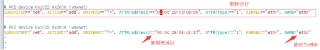
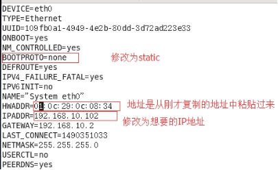
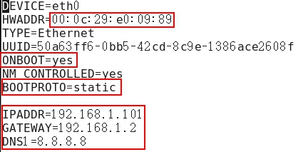

##  IP地址修改为静态ip(root用户)

#### 1）在终端命令窗口中输入

```shell
vim /etc/udev/rules.d/70-persistent-net.rules
```

进入如下页面，删除eth0该行；将eth1修改为eth0，同时复制物理ip地址



#### 2）修改IP地址

```shell
vim /etc/sysconfig/network-scripts/ifcfg-eth0

##需要修改的内容有5项：

IPADDR=192.168.1.101

GATEWAY=192.168.1.2

ONBOOT=yes

BOOTPROTO=static

DNS1=192.168.1.2

：wq  ##保存退出
```

（1）修改前



​	（2）修改后




#### 3）执行service network restart

```shell
service network restart
```

#### 4）如果报错，**reboot**，重启虚拟机

```shell
reboot
```

