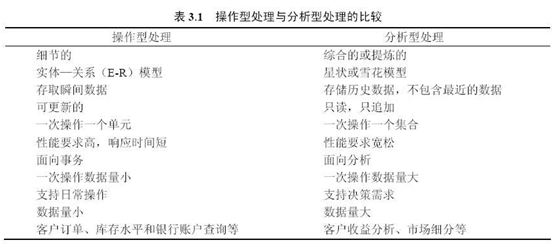
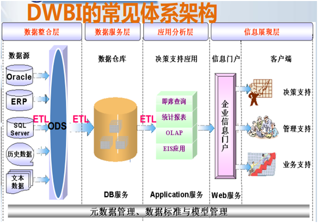
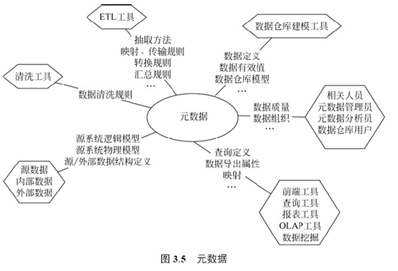
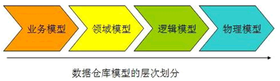
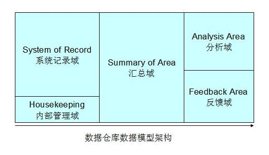
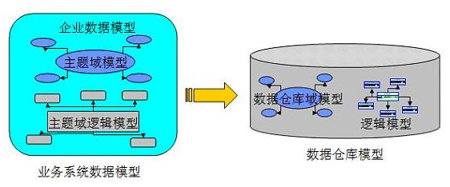
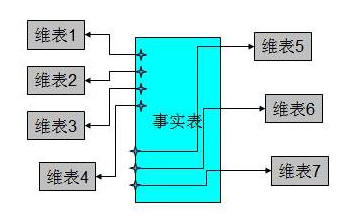
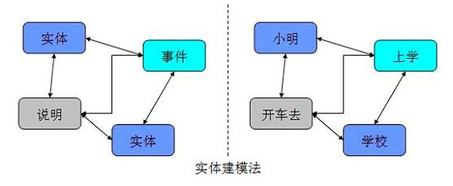
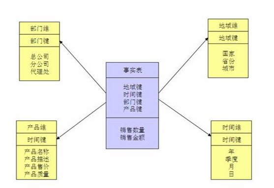
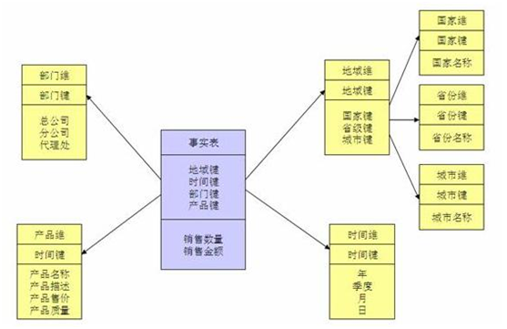

##  第一章 数据仓库简介

### 1.1 什么是数据仓库

数据仓库，简写为DW或DWH。
数据仓库，是为企业决策提供数据支持的战略集合。它出于分析性报告和决策支持目的而创建。 为需要业务智能的企业，提供指导业务流程改进、监视时间、成本、质量以及控制。

### 2       数据仓库的特点

**1.**数据仓库的数据是面向主题的

数据仓库中的数据是对应企业中某一宏观分析领域所涉及的分析对象。

**2.**数据仓库的数据是集成的

数据仓库的数据是从原有的分散的数据库数据抽取来的。要经过统一与综合

**3.**库的数据是不可更新的

数据仓库的数据主要主要是数据查询，一般情况下并不进行修改操作。

**4.**库的数据是随时间不断变化的

### 3 数据仓库发展历程

**数据仓库的发展大致经历了这样的三个过程：**
**简单报表阶段：**这个阶段的大部分表现形式为数据库和前端报表工具。
**数据集市阶段：**这个阶段进行多维报表的展现，能够提供对特定业务指导的数据，能够提供特定的领导决策数据。
**数据仓库阶段：**这个阶段，主要是按照一定的**数据模型**，对整个企业的数据进行采集，整理，并且能够按照各个业务部门的需要，提供跨部门的，完全一致的业务报表数据

### 4  数据库与数据仓库的区别

首先掌握三个概念。数据库软件、数据库、数据仓库。

**数据库软件**：是一种软件，可以看得见，可以操作。用来实现数据库逻辑功能。属于物理层。

**数据库**：是一种逻辑概念，用来存放数据的仓库。通过数据库软件来实现。数据库由很多表组成，表是二维的，一张表里可以有很多字段。

**数据仓库**：是数据库概念的升级。数据仓库主要用于数据挖掘和数据分析，辅助领导做决策。

数据仓库则是BI下的其中一种技术。对于数据分析和数据挖掘，我们引入数据仓库概念。数据仓库的表结构是依照分析需求，分析维度，分析指标进行设计的。

**数据库与数据仓库的区别实际讲的是OLTP与OLAP的区别。**

操作型处理，叫联机事务处理OLTP（On-Line Transaction Processing）它是针对具体业务在数据库联机的日常操作，通常对少数记录进行查询、修改。

分析型处理，叫联机分析处理OLAP（On-Line Analytical Processing）一般针对某些主题的历史数据进行分析，支持管理决策。

### 5	数据仓库架构分层
数据仓库标准上可以分为四层：
ODS（临时存储层）、
PDW（数据仓库层）、
DM（数据集市层）、
APP（应用层）。

 **ODS层：**
为临时存储层，是接口数据的临时存储区域，为后一步的数据处理做准备。一般来说ODS层的数据和源系统的数据是同构的，主要目的是简化后续数据加工处理的工作。

**PDW层：**
为数据仓库层，即对源系统数据进行了清洗（去除了杂质）后的数据。

**DM层：**
为数据集市层，这层数据是面向主题来组织数据的，通常是星形或雪花结构的数据。

**APP层：**
为应用层，这层数据是完全为了满足具体的分析需求而构建的数据，也是星形或雪花结构的数据。

**为什么要对数据仓库分层：**
1 用空间换时间
2 如果不分层的话，如果源业务系统的业务规则发生变化将会影响整个数据清洗过程，工作量巨大
3 通过数据分层管理可以简化数据清洗的过程

### 6	元数据介绍
元数据（Metadata）类似于电话黄页。

**1．元数据的定义**
数据仓库的元数据是关于数据仓库中数据的数据。
它的作用类似于数据库管理系统的数据字典，保存了逻辑数据结构、文件、地址和索引等信息。

元数据是数据仓库管理系统的重要组成部分，元数据管理器是企业级数据仓库中的关键组件。
（1）构建数据仓库的主要步骤之一是ETL。
（2）用户在使用数据仓库时，通过元数据访问数据，明确数据项的含义以及定制报表。
（3）数据仓库的规模及其复杂性离不开正确的元数据管理

**元数据可分为技术元数据和业务元数据。**
技术元数据为开发和管理数据仓库的IT人员使用
业务元数据为管理层和业务分析人员服务

**2．元数据的存储方式**
元数据有两种常见存储方式：
一种是以数据集为基础，每一个数据集有对应的元数据文件
一种存储方式是以数据库为基础，即元数据库。

其中元数据文件由若干项组成，每一项表示元数据的一个要素，每条记录为数据集的元数据内容。上述存储方式各有优缺点，
第一种存储方式的优点是调用数据时相应的元数据也作为一个独立的文件被传输，相对数据库有较强的独立性
第二种存储方式下，元数据库中只有一个元数据文件，管理比较方便，添加或删除数据集

建立元数据库的主要好处是提供统一的数据结构和业务规则，易于把企业内部的多个数据集市有机地集成起来。

**3．元数据的作用**
在数据仓库中，元数据的主要作用如下。
（1）描述哪些数据在数据仓库中，帮助决策分析者对数据仓库的内容定位。
（2）定义数据进入数据仓库的方式，作为数据汇总、映射和清洗的指南。
（3）记录业务事件发生而随之进行的数据抽取工作时间安排。
（4）记录并检测系统数据一致性的要求和执行情况。
（5）评估数据质量。

------------

## 第二章 数据仓库建模

### 2.1	什么是数据模型
数据模型是是通过抽象的实体及实体之间联系的形式，来表示现实世界中事务的相互关系的一种映射。
数据仓库模型分为几下几个层次

整个数据仓库得建模过程中，我们需要经历一般四个过程:
- 业务建模，生成业务模型，主要解决业务层面的分解和程序化。
- 领域建模，生成领域模型，主要是对业务模型进行抽象处理，生成领域概念模型。
- 逻辑建模，生成逻辑模型，主要是将概念实体以及实体之间的关系进行数据库层次的逻辑化。
- 物理建模，生成物理模型，主要是逻辑模型针对关系型数据库的物理化以及性能等技术问题。

### 2.2 为什么需要数据仓库模型

数据仓库的发展大致经历了这样的三个过程:

- 简单报表阶段:数据库和前端报表工具。
- 数据集市阶段:进行多维报表的展现
- 数据仓库阶段:按照一定的数据模型，完全一致的业务报表数据

数据仓库的建设和数据集市的建设的重要区别就在于数据模型的支持。

一般来说，数据模型的建设主要能够帮助我们解决以下的一些问题:
- 进行全面的业务梳理，改进业务流程。
- 建立全方位的数据视角，消灭信息孤岛和数据差异。
- 解决业务的变动和数据仓库的灵活性。
- 帮助数据仓库系统本身的建设。

### 2.3	如何建设数据仓库模型
这里我们将要详细介绍如何创建适合自己的数据模型。
#### 2.3.1  数据仓库数据模型架构
数据仓库的数据模型的架构和数据仓库的整体架构是紧密关联在一起的，我们首先来了解一下整个数据仓库的数据模型应该包含的几个部分。

整个数据仓库的数据模型可以分为大概 5 大部分:
-  系统记录域 :这部分是主要的数据仓库业务数据存储区，保证数据的一致性。

- 内部管理域 :这部分主要存储数据仓库用于内部管理的元数据，统一的元数据的管理。

- 汇总域 :这部分数据来自于系统记录域的汇总，保证分析域的主题分析的性能，满足了报表查询。

- 分析域 :这部分数据模型主要具体的主题业务分析。单独存储在相应的数据集市中。

- 反馈域（Feedback Area）:可选项，主要用于相应前端的反馈数据，可视化业务

  通过对整个数据仓库模型的数据区域的划分，我们可以了解到，一个好的数据模型，不仅仅是对业务进行抽象划分，而且对实现技术也进行具体的指导，它应该涵盖了从业务到实现技术的各个部分。

  
#### 2.3.2  数据仓库建模阶段划分
我们前面介绍了数据仓库模型的几个层次，下面我们讲一下，针对这几个层次的不同阶段的数据建模的工作的主要内容:
图 4. 数据仓库建模阶段划分

从上图我们可以清楚地看出，数据仓库的数据建模大致分为四个阶段:

1.   业务建模，这部分建模工作，主要包含以下几个部分:
- 划分整个单位的业务，一般按照业务部门的划分，理清各业务部门之间的关系。
- 深入了解各个业务部门的内具体业务流程并将其程序化。
- 提出修改和改进业务部门工作流程的方法并程序化。
- 数据建模的范围界定，整个数据仓库项目的目标和阶段划分。

2.   领域概念建模，这部分得建模工作，主要包含以下几个部分:
- 抽取关键业务概念，并将之抽象化。
- 将业务概念分组，按照业务主线聚合类似的分组概念。
- 细化分组概念，理清分组概念内的业务流程并抽象化。
- 理清分组概念之间的关联，形成完整的领域概念模型。

3.   逻辑建模，这部分的建模工作，主要包含以下几个部分:
- 业务概念实体化，并考虑其具体的属性
- 事件实体化，并考虑其属性内容
- 说明实体化，并考虑其属性内容

4.   物理建模，这部分得建模工作，主要包含以下几个部分:
- 针对特定物理化平台，做出相应的技术调整
- 针对模型的性能考虑，对特定平台作出相应的调整
- 针对管理的需要，结合特定的平台，做出相应的调整
- 生成最后的执行脚本，并完善之。

从我们上面对数据仓库的数据建模阶段的各个阶段的划分，我们能够了解到整个数据仓库建模的主要工作和工作量，希望能够对我们在实际的项目建设能够有所帮助。

### 2.3.4 数据仓库建模方法

1. 范式建模法（Third Normal Form，3NF）
我们在关系型数据库中的建模方法，大部分采用的是三范式建模法。
一个符合第三范式的关系必须具有以下三个条件 :
- 每个属性值唯一，不具有多义性 ;
- 每个非主属性必须完全依赖于整个主键，而非主键的一部分 ;
- 每个非主属性不能依赖于其他关系中的属性，因为这样的话，这种属性应该归到其他关系中去。

2. 维度建模法 按照事实表，维表来构建数据仓库，数据集市。星型模式之所以广泛被使用，在于针对各个维作了大量的预处理，能够极大的提升数据仓库的处理能力。特别是针对 3NF 的建模方法，星型模式在性能上占据明显的优势。

3. 实体建模法
    实体建模法并不是数据仓库建模中常见的一个方法，它来源于哲学的一个流派。
    我们使用的抽象归纳方法其实很简单，任何业务可以看成 3 个部分:
- 实体，主要指领域模型中特定的概念主体，指发生业务关系的对象。
- 事件，主要指概念主体之间完成一次业务流程的过程，特指特定的业务过程。
- 说明，主要是针对实体和事件的特殊说明。

## 第三章 星型模型与雪花模型

### 3.1 概述

当所有维表都直接连接到“ 事实表”上时，整个图解就像星星一样，故将该模型称为星型模型,**数据有一定的冗余**

当有一个或多个维表没有直接连接到事实表上，而是通过其他维表连接到事实表上时，其图解就像多个雪花连接在一起，故称雪花模型,**改善查询性能**

**因此在冗余可以接受的前提下，实际运用中星型模型使用更多，也更有效率**

### 3.2 使用选择

1.数据优化

雪花模型使用的是规范化数据，它能够有效地减少数据量。
星形模型实用的是反规范化数据。在星形模型中，维度直接指的是事实表

2.业务模型

在雪花模型中，数据模型的业务层级是由一个不同维度表主键-外键的关系来代表的。而
在星形模型中，所有必要的维度表在事实表中都只拥有外键。

3.性能

雪花模型在维度表、事实表之间的连接很多，因此性能方面会比较低
星形模型的连接就少的多

4.ETL
雪花模型加载数据集市，因此ETL操作在设计上更加复杂，不能并行化。
星形模型加载维度表，因此ETL就相对简单，而且可以实现高度的并行化。

总结
雪花模型使得维度分析更加容易
星形模型用来做指标分析更适合