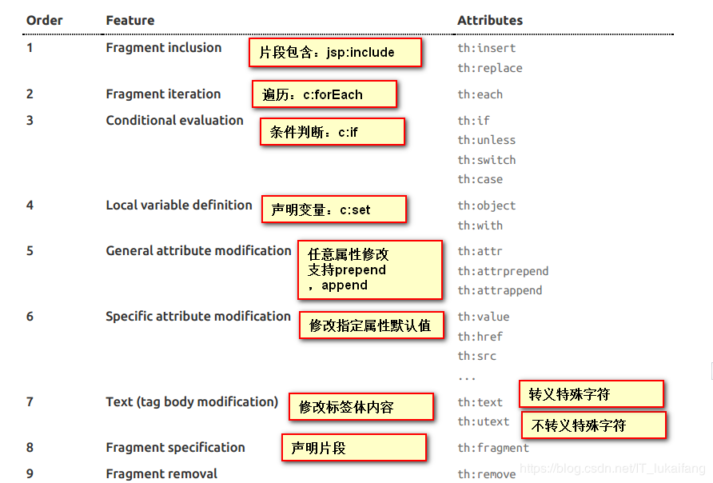

### 1
#### 28、SpringBoot_web开发-简介

#### 29、SpringBoot_web开发-webjars&静态资源映射规则

```xml
<!--引入jquery-webjar 在访问的时候只需要写webjars下面资源的名称即可 -->

<dependency>
	<groupId>org.webjars</groupId>
	<artifactId>jquery</artifactId>
	<version>3.3.1</version>
</dependency>

```

```java
/**
1）、所有 /webjars/** ，都去classpath:/META-INF/resources/webjars/ 找资源；

​ webjars：以jar包的方式引入静态资源；

2）、"/**" 访问当前项目的任何资源，都去（静态资源的文件夹）找映射

3）、欢迎页； 静态资源文件夹下的所有index.html页面；被"/**"映射；

​ localhost:8080/ 找index页面

4）、所有的 **\/favicon.ico 都是在静态资源文件下找；

**/
```
#### 30、SpringBoot_web开发-引入thymeleaf
```xml
<dependency>
		<groupId>org.springframework.boot</groupId>
		<artifactId>spring-boot-starter-thymeleaf</artifactId>
</dependency>
<properties>
		<project.build.sourceEncoding>UTF-8</project.build.sourceEncoding>
		<project.reporting.outputEncoding>UTF-8</project.reporting.outputEncoding>
		<java.version>1.8</java.version>
		<thymeleaf.version>3.0.9.RELEASE</thymeleaf.version>
		<!-- 布局功能的支持程序  thymeleaf3主程序  layout2以上版本 -->
		<!-- thymeleaf2   layout1-->
		<thymeleaf-layout-dialect.version>2.2.2</thymeleaf-layout-dialect.version>
</properties>

```
```html
<!DOCTYPE html>
<!--1、导入thymeleaf的名称空间-->
<html lang="en" xmlns:th="http://www.thymeleaf.org">
<head>
    <meta charset="UTF-8">
    <title>Title</title>
</head>
<body>
    <h1>成功！</h1>
    <!--th:text 将div里面的文本内容设置为 -->
    <div th:text="${hello}">这是显示欢迎信息</div>
</body>
</html>

```


#### 31、SpringBoot_web开发-thymeleaf语法




#### 32、SpringBoot_web开发-SpringMVC自动配置原理
##### 1. Spring MVC auto-configuration

Spring Boot 自动配置好了SpringMVC

##### 2、扩展SpringMVC

```java
@Configuration
// WebMvcConfigurerAdapter过时,使用WebMvcConfigurer接口
public class MyMvcConfig implements WebMvcConfigurer {
    @Override
    public void addViewControllers(ViewControllerRegistry registry) {
        // 浏览器发送 /cuzz 请求来到 success
        registry.addViewController("/cuzz").setViewName("success");
    }
}
```

原理：

 1）、WebMvcAutoConfiguration是SpringMVC的自动配置类

 2）、在做其他自动配置时会导入；@Import(**EnableWebMvcConfiguration**.class)

 3）、容器中所有的WebMvcConfigurer都会一起起作用；

 4）、我们的配置类也会被调用；

 效果：SpringMVC的自动配置和我们的扩展配置都会起作用；

#### 33、SpringBoot_web开发-扩展与全面接管SpringMVC

##### 3、全面接管SpringMVC；

SpringBoot对SpringMVC的自动配置不需要了，所有都是我们自己配置；所有的SpringMVC的自动配置都失效了

**我们需要在配置类中添加@EnableWebMvc即可；**

##### 5、如何修改SpringBoot的默认配置

模式：

 1）、SpringBoot在自动配置很多组件的时候，先看容器中有没有用户自己配置的（@Bean、@Component）如果有就用用户配置的，如果没有，才自动配置；如果有些组件可以有多个（ViewResolver）将用户配置的和自己默认的组合起来；

 2）、在SpringBoot中会有非常多的xxxConfigurer帮助我们进行扩展配置

 3）、在SpringBoot中会有很多的xxxCustomizer帮助我们进行定制配置

#### 34、SpringBoot_web开发-【实验】-引入资源
```java
@Configuration
// WebMvcConfigurerAdapter过时,使用WebMvcConfigurer接口
public class MyMvcConfig implements WebMvcConfigurer {
    @Override
    public void addViewControllers(ViewControllerRegistry registry) {
        registry.addViewController("/cuzz").setViewName("success");
    }
    // 所有的WebMvcConfigurerAdapter组件都会一起起作用
    @Bean
    public WebMvcConfigurer webMvcConfigurer() {
        WebMvcConfigurer webMvcConfigurer = new WebMvcConfigurer() {
            @Override
            public void addViewControllers(ViewControllerRegistry registry) {
                registry.addViewController("/").setViewName("login");
                registry.addViewController("/index.html").setViewName("login");
            }
        };
        return webMvcConfigurer;
    }
}
```
#### 35、SpringBoot_web开发-【实验】-国际化

1）、编写国际化配置文件，抽取页面需要显示的国际化消息。

```properties
login.btn=Sign In
login.password=Password
login.remember=Remember Me
login.tip=Please sign in
login.username=UserName
```

2）、SpringBoot自动配置好了管理国际化资源文件的组件,直接配置文件的路径；

```properties
spring.messages.basename=i18n.login
```

3）、去页面获取国际化的值；==根据浏览器的默认语言配置实现国际化==

```html
<div class="checkbox mb-3">
		<label>
          		<input type="checkbox" value="remember-me"/> [[#{login.remember}]]
        </label>
</div>
```

**点击链接实现区域切换**

```java
public class MyLocaleResolver implements LocaleResolver {
    
    @Override
    public Locale resolveLocale(HttpServletRequest request) {
        String l = request.getParameter("l");
        Locale locale = Locale.getDefault();
        if(!StringUtils.isEmpty(l)){
            String[] split = l.split("_");
            locale = new Locale(split[0],split[1]);
        }
        return locale;
    }

    @Override
    public void setLocale(HttpServletRequest request, 
                          HttpServletResponse response,
                          Locale locale) {

    }


	// 国际化注入
 	@Bean
    public LocaleResolver localeResolver(){
        return new MyLocaleResolver();
    }
}

```

#### 36、SpringBoot_web开发-【实验】-登陆&拦截器

开发期间模板引擎页面修改以后，要实时生效

1）、禁用模板引擎的缓存 spring.thymeleaf.cache=false 

2）、页面修改完成以后ctrl+f9：重新编译；

```java

/**
 * 登陆检查拦截处理器
 */
public class LoginHandlerInterceptor implements HandlerInterceptor {
    //目标方法执行之前
    @Override
    public boolean preHandle(HttpServletRequest request, HttpServletResponse response, Object handler) throws Exception {
        Object user = request.getSession().getAttribute("loginUser");
        if(user == null){
            //未登陆，返回登陆页面
            request.setAttribute("msg","没有权限请先登陆");
            request.getRequestDispatcher("/index.html").forward(request,response);
            return false;
        }else{
            //已登陆，放行请求
            return true;
        }

    }

    @Override
    public void postHandle(HttpServletRequest request, HttpServletResponse response, Object handler, ModelAndView modelAndView) throws Exception {

    }

    @Override
    public void afterCompletion(HttpServletRequest request, HttpServletResponse response, Object handler, Exception ex) throws Exception {

    }
}

//注册一个配置类
@Configuration
// WebMvcConfigurerAdapter过时,使用WebMvcConfigurer接口
public class MyMvcConfig implements WebMvcConfigurer {
    @Override
    public void addViewControllers(ViewControllerRegistry registry) {
        registry.addViewController("/cuzz").setViewName("success");
    }
    //注册拦截器
    @Override
    public void addInterceptors(InterceptorRegistry registry) {
        //super.addInterceptors(registry);
        //静态资源；  *.css , *.js
        //SpringBoot已经做好了静态资源映射
        registry.addInterceptor(new LoginHandlerInterceptor()).addPathPatterns("/**")
                .excludePathPatterns("/index.html","/","/user/login");
    }

    // 所有的WebMvcConfigurerAdapter组件都会一起起作用
    @Bean
    public WebMvcConfigurer webMvcConfigurer() {
        WebMvcConfigurer webMvcConfigurer = new WebMvcConfigurer() {
            @Override
            public void addViewControllers(ViewControllerRegistry registry) {
                registry.addViewController("/").setViewName("login");
                registry.addViewController("/index.html").setViewName("login");
                registry.addViewController("/main.html").setViewName("dashboard");
            }
        };
        return webMvcConfigurer;
    }

    @Bean
    public LocaleResolver localeResolver() {
        return new MyLocaleResolver();
    }
}
```
#### 37、SpringBoot_web开发-【实验】-Restful实验要求

实验的请求架构;

| 实验功能                             | 请求URI | 请求方式 |
| ------------------------------------ | ------- | -------- |
| 查询所有员工                         | emps    | GET      |
| 查询某个员工(来到修改页面)           | emp/1   | GET      |
| 来到添加页面                         | emp     | GET      |
| 添加员工                             | emp     | POST     |
| 来到修改页面（查出员工进行信息回显） | emp/1   | GET      |
| 修改员工                             | emp     | PUT      |
| 删除员工                             | emp/1   | DELETE   |


#### 38、SpringBoot_web开发-【实验】-员工列表-公共页抽取
```html
1、抽取公共片段
<div th:fragment="copy">
&copy; 2011 The Good Thymes Virtual Grocery
</div>

2、引入公共片段
<div th:insert="~{footer :: copy}"></div>
~{templatename::selector}：模板名::选择器
~{templatename::fragmentname}:模板名::片段名

3、默认效果：
insert的公共片段在div标签中
如果使用th:insert等属性进行引入，可以不用写~{}：
行内写法可以加上：[[~{}]];[(~{})]；

三种引入公共片段的th属性：

th:insert：将公共片段整个插入到声明引入的元素中

th:replace：将声明引入的元素替换为公共片段

th:include：将被引入的片段的内容包含进这个标签中

4.传递参数
<div th:replace="commons/bar::#sidebar(activeUri='emps')"></div>

```
#### 39、SpringBoot_web开发-【实验】-员工列表-链接高亮&列表完成

#### 40、SpringBoot_web开发-【实验】-员工添加-来到添加页面

#### 41、SpringBoot_web开发-【实验】-员工添加-添加完成

#### 42、SpringBoot_web开发-【实验】-员工修改-重用页面&修改完成

#### 43、SpringBoot_web开发-【实验】-员工删除-删除完成

#### 44、SpringBoot_web开发-错误处理原理&定制错误页面

 1）、浏览器，返回一个默认的错误页面

 2）、如果是其他客户端，默认响应一个json数据

 一但系统出现4xx或者5xx之类的错误；ErrorPageCustomizer就会生效（定制错误的响应规则）；就会来到/error请求；就会被**BasicErrorController**处理；

 1）响应页面；去哪个页面是由**DefaultErrorViewResolver**解析得到的；

#### **1）、如何定制错误的页面；**

 **1）、有模板引擎的情况下；error/状态码;** 【将错误页面命名为 错误状态码.html 放在模板引擎文件夹里面的 error文件夹下】，发生此状态码的错误就会来到 对应的页面；

 我们可以使用4xx和5xx作为错误页面的文件名来匹配这种类型的所有错误，精确优先（优先寻找精确的状态码.html）；

 页面能获取的信息；

 timestamp：时间戳

 status：状态码

 error：错误提示

 exception：异常对象

 message：异常消息

 errors：JSR303数据校验的错误都在这里

#### 2）、如何定制错误的json数据；

 1）、自定义异常处理&返回定制json数据；

 2）、转发到/error进行自适应响应效果处理

 3）、将我们的定制数据携带出去；

```
@ControllerAdvice
public class MyExceptionHandler {

    @ResponseBody
    @ExceptionHandler(UserNotExistException.class)
    public Map<String,Object> handleException(Exception e){
        Map<String,Object> map = new HashMap<>();
        map.put("code","user.notexist");
        map.put("message",e.getMessage());
        return map;
    }
}
//没有自适应效果...

```

#### 45、SpringBoot_web开发-定制错误数据
```java
@ControllerAdvice
public class MyExceptionHandler {

    @ResponseBody
    @ExceptionHandler(UserNotExistException.class)
    public Map<String,Object> handleException(Exception e){
        Map<String,Object> map = new HashMap<>();
        map.put("code","user.notexist");
        map.put("message",e.getMessage());
        return map;
    }
}
//没有自适应效果...
 @ExceptionHandler(UserNotExistException.class)
    public String handleException(Exception e, HttpServletRequest request){
        Map<String,Object> map = new HashMap<>();
        //传入我们自己的错误状态码  4xx 5xx，否则就不会进入定制错误页面的解析流程
        /**
         * Integer statusCode = (Integer) request
         .getAttribute("javax.servlet.error.status_code");
         */
        request.setAttribute("javax.servlet.error.status_code",500);
        map.put("code","user.notexist");
        map.put("message",e.getMessage());
        //转发到/error
        return "forward:/error";
    }
//给容器中加入我们自己定义的ErrorAttributes
@Component
public class MyErrorAttributes extends DefaultErrorAttributes {

    @Override
    public Map<String, Object> getErrorAttributes(RequestAttributes requestAttributes, boolean includeStackTrace) {
        Map<String, Object> map = super.getErrorAttributes(requestAttributes, includeStackTrace);
        map.put("company","atguigu");
        return map;
    }
}
```
#### 46、SpringBoot_web开发-嵌入式Servlet容器配置修改

1）、如何定制和修改Servlet容器的相关配置；

1、修改和server有关的配置（ServerProperties

```properties
server.port=8081
server.context-path=/crud

server.tomcat.uri-encoding=UTF-8

//通用的Servlet容器设置
server.xxx
//Tomcat的设置
server.tomcat.xxx
```

2、编写一个**EmbeddedServletContainerCustomizer**：嵌入式的Servlet容器的定制器；来修改Servlet容器的配置

```java
@Bean  //一定要将这个定制器加入到容器中
public EmbeddedServletContainerCustomizer embeddedServletContainerCustomizer(){
    return new EmbeddedServletContainerCustomizer() {

        //定制嵌入式的Servlet容器相关的规则
        @Override
        public void customize(ConfigurableEmbeddedServletContainer container) {
            container.setPort(8083);
        }
    };
}
```
#### 47、SpringBoot_web开发-注册servlet三大组件

SpringBoot帮我们自动SpringMVC的时候，自动的注册SpringMVC的前端控制器；DIspatcherServlet；

```java
//注册三大组件
@Bean
public ServletRegistrationBean myServlet(){
    ServletRegistrationBean registrationBean = new ServletRegistrationBean(new MyServlet(),"/myServlet");
    return registrationBean;
}
@Bean
public FilterRegistrationBean myFilter(){
    FilterRegistrationBean registrationBean = new FilterRegistrationBean();
    registrationBean.setFilter(new MyFilter());
    registrationBean.setUrlPatterns(Arrays.asList("/hello","/myServlet"));
    return registrationBean;
}
@Bean
public ServletListenerRegistrationBean myListener(){
    ServletListenerRegistrationBean<MyListener> registrationBean = new ServletListenerRegistrationBean<>(new MyListener());
    return registrationBean;
}

```
#### 48、SpringBoot_web开发-切换其他嵌入式Servlet容器

Tomcat（默认使用）

```xml
<dependency>
   <groupId>org.springframework.boot</groupId>
   <artifactId>spring-boot-starter-web</artifactId>
   引入web模块默认就是使用嵌入式的Tomcat作为Servlet容器；
</dependency>

```

Jetty

```xml
<!-- 引入web模块 -->
<dependency>
   <groupId>org.springframework.boot</groupId>
   <artifactId>spring-boot-starter-web</artifactId>
   <exclusions>
      <exclusion>
         <artifactId>spring-boot-starter-tomcat</artifactId>
         <groupId>org.springframework.boot</groupId>
      </exclusion>
   </exclusions>
</dependency>

<!--引入其他的Servlet容器-->
<dependency>
   <artifactId>spring-boot-starter-jetty</artifactId>
   <groupId>org.springframework.boot</groupId>
</dependency>

```

Undertow

```xml
<!-- 引入web模块 -->
<dependency>
   <groupId>org.springframework.boot</groupId>
   <artifactId>spring-boot-starter-web</artifactId>
   <exclusions>
      <exclusion>
         <artifactId>spring-boot-starter-tomcat</artifactId>
         <groupId>org.springframework.boot</groupId>
      </exclusion>
   </exclusions>
</dependency>

<!--引入其他的Servlet容器-->
<dependency>
   <artifactId>spring-boot-starter-undertow</artifactId>
   <groupId>org.springframework.boot</groupId>
</dependency>
```

#### 49、SpringBoot_web开发-嵌入式Servlet容器自动配置原理

步骤：

1）、SpringBoot根据导入的依赖情况，给容器中添加相应的EmbeddedServletContainerFactory【TomcatEmbeddedServletContainerFactory】

2）、容器中某个组件要创建对象就会惊动后置处理器；EmbeddedServletContainerCustomizerBeanPostProcessor；

只要是嵌入式的Servlet容器工厂，后置处理器就工作；

3）、后置处理器，从容器中获取所有的**EmbeddedServletContainerCustomizer**，调用定制器的定制方法


#### 50、SpringBoot_web开发-嵌入式Servlet容器启动原理

什么时候创建嵌入式的Servlet容器工厂？什么时候获取嵌入式的Servlet容器并启动Tomcat；

获取嵌入式的Servlet容器工厂：

1）、SpringBoot应用启动运行run方法

2）、refreshContext(context);SpringBoot刷新IOC容器【创建IOC容器对象，并初始化容器，创建容器中的每一个组件】；如果是web应用创建**AnnotationConfigEmbeddedWebApplicationContext**，否则：**AnnotationConfigApplicationContext**

3）、refresh(context);**刷新刚才创建好的ioc容器；**

4）、 onRefresh(); web的ioc容器重写了onRefresh方法

5）、webioc容器会创建嵌入式的Servlet容器；**createEmbeddedServletContainer**();

**6）、获取嵌入式的Servlet容器工厂：**

EmbeddedServletContainerFactory containerFactory = getEmbeddedServletContainerFactory();

 从ioc容器中获取EmbeddedServletContainerFactory 组件；**TomcatEmbeddedServletContainerFactory**创建对象，后置处理器一看是这个对象，就获取所有的定制器来先定制Servlet容器的相关配置；

7）、**使用容器工厂获取嵌入式的Servlet容器**：this.embeddedServletContainer = containerFactory .getEmbeddedServletContainer(getSelfInitializer());

8）、嵌入式的Servlet容器创建对象并启动Servlet容器；

**先启动嵌入式的Servlet容器，再将ioc容器中剩下没有创建出的对象获取出来；**

**IOC容器启动创建嵌入式的Servlet容器**

#### 51、SpringBoot_web开发-使用外部Servlet容器&JSP支持

1）、必须创建一个war项目；（利用idea创建好目录结构）

2）、将嵌入式的Tomcat指定为provided；

```xml
<dependency>
   <groupId>org.springframework.boot</groupId>
   <artifactId>spring-boot-starter-tomcat</artifactId>
   <scope>provided</scope>
</dependency>
```

3）、必须编写一个**SpringBootServletInitializer**的子类，并调用configure方法

```java
public class ServletInitializer extends SpringBootServletInitializer {

   @Override
   protected SpringApplicationBuilder configure(SpringApplicationBuilder application) {
       //传入SpringBoot应用的主程序
      return application.sources(SpringBoot04WebJspApplication.class);
   }

}
```

4）、启动服务器就可以使用；

#### 52、SpringBoot_web开发-外部Servlet容器启动SpringBoot应用原理

### 原理

jar包：执行SpringBoot主类的main方法，启动ioc容器，创建嵌入式的Servlet容器；

war包：启动服务器，**服务器启动SpringBoot应用**【SpringBootServletInitializer】，启动ioc容器；

------------------------------

1）、启动Tomcat

2）、Spring的web模块里面有这个文件：**org.springframework.web.SpringServletContainerInitializer**

3）、SpringServletContainerInitializer将@HandlesTypes(WebApplicationInitializer.class)标注的所有这个类型的类都传入到onStartup方法的Set<Class<?>>；为这些WebApplicationInitializer类型的类创建实例；

4）、每一个WebApplicationInitializer都调用自己的onStartup；

5）、相当于我们的SpringBootServletInitializer的类会被创建对象，并执行onStartup方法

6）、SpringBootServletInitializer实例执行onStartup的时候会createRootApplicationContext；创建容器

7）、Spring的应用就启动并且创建IOC容器

**启动Servlet容器，再启动SpringBoot应用**
