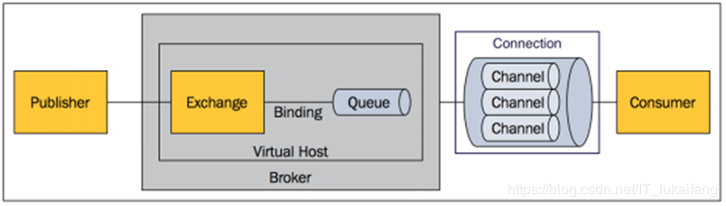
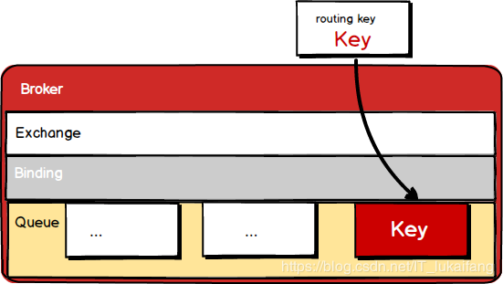
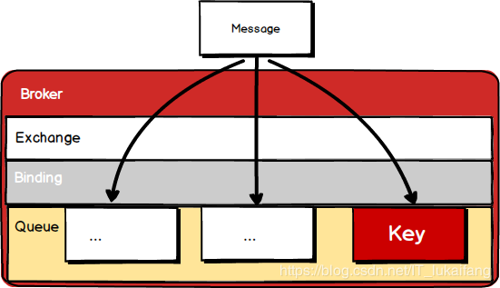
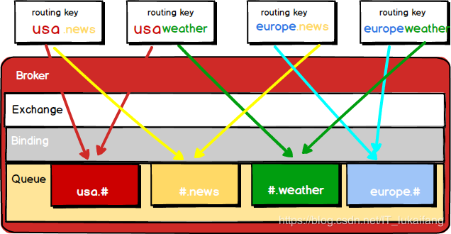

### 1
#### 13、消息-JMS&AMQP简介

1、异步处理

2、应用解耦

3、流量削锋

概述
1、大多数应用，可以通过消息服务中间件来提升系统的异步通信、拓展解耦能力

2、消息服务中的两个重要概念：

消息代理（message broker）和目的地（destination），当消息发送者发送消息以后，将由消息代理接管，消息代理保证消息传递到指定的目的地。

3、消息队列主要的两种形式的目的地

1）、队列（queue）：点对点消息通信【point-to-point】，取出一个没一个，一个发布，多个消费

2）、主题（topic）:发布（publish）/订阅（subscribe）消息通信，多人【订阅者】可以同时接到消息

4、JMS(Java Message Service) Java消息服务：

基于JVM消息规范的代理。ActiveMQ/HornetMQ是JMS的实现

5、AMQP(Advanced Message Queuing Protocol)

高级消息队列协议，也是一个消息代理的规范，兼容JMSRabbitMQ是AMQP的实现

###### 6、SpringBoot的支持

spring-jms提供了对JMS的支持

spring-rabbit提供了对AMQP的支持

需要创建ConnectionFactory的实现来连接消息代理

提供JmsTemplate,RabbitTemplate来发送消息

@JmsListener(JMS).@RabbitListener(AMQP)注解在方法上的监听消息代理发布的消息

@EnableJms,@EnableRabbit开启支持

7、SpringBoot的自动配置

- JmsAutoConfiguration
- RabbitAutoConfiguration

```java

```
#### 14、消息-RabbitMQ基本概念简介

#### 1、核心概念

**Message**:消息头和消息体组成，消息体是不透明的，而消息头上则是由一系列的可选属性组成，属性：路由键【routing-key】,优先级【priority】,指出消息可能需要持久性存储【delivery-mode】

**Publisher**:消息的生产者，也是一个向交换器发布消息的客户端应用程序

**Exchange**:交换器，用来接收生产者发送的消息并将这些消息路由给服务器中的队列

Exchange的4中类型：direct【默认】点对点，fanout,topic和headers, 发布订阅，不同类型的Exchange转发消息的策略有所区别

**Queue**:消息队列，用来保存消息直到发送给消费者，它是消息的容器，也是消息的终点，一个消息可投入一个或多个队列，消息一直在队列里面，等待消费者连接到这个队列将数据取走。

**Binding**:绑定，队列和交换机之间的关联，多对多关系

**Connection**:网络连接，例如TCP连接

**Channel**:信道，多路复用连接中的一条独立的双向数据流通道，信道是建立在真是的TCP链接之内的虚拟连接AMQP命令都是通过信道发送出去的。不管是发布消息，订阅队列还是接受消息，都是信道，减少TCP的开销，复用一条TCP连接。

**Consumer**:消息的消费者，表示一个从消息队列中取得消息的客户端的 应用程序

**VirtualHost**:虚拟主机，表示一批交换器、消息队列和相关对象。虚拟主机是共享相同的身份认证和加密环境的独立服务器域。每个 vhost 本质上就是一个 mini 版的 RabbitMQ 服务器，拥有自己的队列、交换器、绑定和权限机制。vhost 是 AMQP 概念的基础，必须在连接时指定，RabbitMQ 默认的 vhost 是 / 。

**Broker**:表示消息队列 服务实体




#### 15、消息-RabbitMQ运行机制

#### 2、RabbitMQ的运行机制

Exchange分发消息时根据类型的不同分发策略有区别，目前共四种类型：direct、fanout、topic、headers 。headers 匹配 AMQP 消息的 header 而不是路由键， headers 交换器和 direct 交换器完全一致，但性能差很多，目前几乎用不到了，所以直接看另外三种类型：

**direct**：根据路由键直接匹配，一对一



**fanout**：不经过路由键，直接发送到每一个队列



**topic**：类似模糊匹配的根据路由键，来分配绑定的队列




#### 16、消息-RabbitMQ安装测试
1、打开虚拟机，在docker中安装RabbitMQ
```properties
#1.安装rabbitmq，使用镜像加速
docker pull registry.docker-cn.com/library/rabbitmq:3-management
# docker images

#2.运行rabbitmq
##### 端口：5672 客户端和rabbitmq通信 15672：管理界面的web页面

docker run -d -p 5672:5672 -p 15672:15672 --name myrabbitmq e1a73233e3be

#3.查看运行
docker ps
```
2、打开网页客户端并登陆，账号【guest】,密码【guest】，登陆
3、添加 【direct】【faout】【topic】的绑定关系等
#### 17、消息-RabbitTemplate发送接受消息&序列化机制

1.添加项目的依赖

```xml
<dependencies>
	<dependency>
		<groupId>org.springframework.boot</groupId>
		<artifactId>spring-boot-starter-amqp</artifactId>
	</dependency>
	<dependency>
		<groupId>org.springframework.boot</groupId>
		<artifactId>spring-boot-starter-web</artifactId>
	</dependency>

	<dependency>
		<groupId>org.springframework.boot</groupId>
		<artifactId>spring-boot-starter-test</artifactId>
		<scope>test</scope>
	</dependency>
</dependencies>

```
2、编写配置文件application.yml

```yaml
spring:
  rabbitmq:
    host: 10.138.223.126
    port: 5672
    username: guest
    password: guest
```

```java
/**
 * 自动配置
 *  1、RabbitAutoConfiguration
 *  2、有自动配置了连接工厂ConnectionFactory；
 *  3、RabbitProperties 封装了 RabbitMQ的配置
 *  4、 RabbitTemplate ：给RabbitMQ发送和接受消息；
 *  5、 AmqpAdmin ： RabbitMQ系统管理功能组件;
 *  	AmqpAdmin：创建和删除 Queue，Exchange，Binding
 *  6、@EnableRabbit +  @RabbitListener 监听消息队列的内容
 *
 */
@EnableRabbit  //开启基于注解的RabbitMQ模式
@SpringBootApplication
public class Springboot02AmqpApplication {

	public static void main(String[] args) {
		SpringApplication.run(Springboot02AmqpApplication.class, args);
	}
}
```

3、把消息写入到Queue，取出队列的值。消息广播，消息点播**

```java
	@Autowired
	RabbitTemplate rabbitTemplate;

	
	/**
	 * 1、单播（点对点）
	 */
	@Test
	public void contextLoads() {
		//Message需要自己构造一个;定义消息体内容和消息头
		//rabbitTemplate.send(exchage,routeKey,message);

		//object默认当成消息体，只需要传入要发送的对象，自动序列化发送给rabbitmq；
		//rabbitTemplate.convertAndSend(exchage,routeKey,object);
		Map<String,Object> map = new HashMap<>();
		map.put("msg","这是第一个消息");
		map.put("data", Arrays.asList("helloworld",123,true));
		//对象被默认序列化以后发送出去
		rabbitTemplate.convertAndSend("exchange.direct","atguigu.news",new Book("西游记","吴承恩"));

	}

	//接受数据,如何将数据自动的转为json发送出去
	@Test
	public void receive(){
		Object o = rabbitTemplate.receiveAndConvert("atguigu.news");
		System.out.println(o.getClass());
		System.out.println(o);
	}

	/**
	 * 广播
	 */
	@Test
	public void sendMsg(){
		rabbitTemplate.convertAndSend("exchange.fanout","",new Book("红楼梦","曹雪芹"));
	}
```

5、使用Json方式传递消息

1）、MyAMQPConfig，自定义一个MessageConverter返回Jackson2JsonMessageConverter

```java
@Configuration
public class MyAMQPConfig {

    @Bean
    public MessageConverter messageConverter() {
        return new Jackson2JsonMessageConverter();
    }
}
```

#### 18、消息-@RabbitListener&@EnableRabbit 监听消息队列的内容

```java
@Service
public class BookService {
    //@EnableRabbit 主启动类上面开启
	//监听指定队列的消息
    @RabbitListener(queues = "atguigu.news")
    public void receive(Book book){
        System.out.println("收到消息："+book);
    }
	//获取消息头消息体
    @RabbitListener(queues = "atguigu")
    public void receive02(Message message){
        System.out.println(message.getBody());
        System.out.println(message.getMessageProperties());
    }
}
```
#### 19、消息-AmqpAdmin管理组件的使用
```java
	@Autowired
	AmqpAdmin amqpAdmin;

	@Test
	public void createExchange(){

//		amqpAdmin.declareExchange(new DirectExchange("amqpadmin.exchange"));
//		System.out.println("创建完成");

//		amqpAdmin.declareQueue(new Queue("amqpadmin.queue",true));
		//创建绑定规则

//		amqpAdmin.declareBinding(new Binding("amqpadmin.queue", Binding.DestinationType.QUEUE,"amqpadmin.exchange","amqp.haha",null));

		//amqpAdmin.de
	}
```
