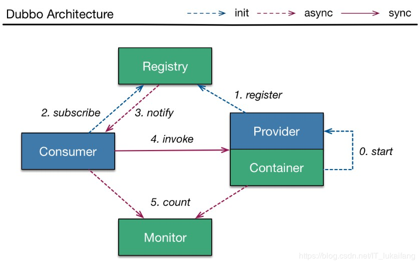

#### 31、分布式-dubbo简介.avi

**1. Dubbo是什么？**

dubbo就是个服务框架

**2、docker的原理**



#### 调用关系说明：

1. 服务容器负责启动，加载，运行服务提供者。
2. 服务提供者在启动时，向注册中心注册自己提供的服务。
3. 服务消费者在启动时，向注册中心订阅自己所需的服务。
4. 注册中心返回服务提供者地址列表给消费者，如果有变更，注册中心将基于长连接推送变更数据给消费者。
5. 服务消费者，从提供者地址列表中，基于软负载均衡算法，选一台提供者进行调用，如果调用失败，再选另一台调用。
6. 服务消费者和提供者，在内存中累计调用次数和调用时间，定时每分钟发送一次统计数据到监控中心。

#### 32、分布式-docker安装zookeeper.avi
```shell
#安装zookeeper镜像
docker pull registry.docker-cn.com/library/zookeeper
#运行zookeeper
 docker run --name zk01  --restart always -d -p 2181:2181 bf5cbc9d5cac
```
#### 33、分布式-SpringBoot、Dubbo、Zookeeper整合.avi

==1.Dubbo服务端的开发流程如下==

```xml
<dependency>
    <groupId>com.alibaba.boot</groupId>
    <artifactId>dubbo-spring-boot-starter</artifactId>
    <version>0.1.0</version>
</dependency>

<dependency>
    <groupId>com.github.sgroschupf</groupId>
    <artifactId>zkclient</artifactId>
    <version>0.1</version>
</dependency>
```
```properties
# 名称
dubbo.application.name=provider-ticket
# 地址
dubbo.registry.address=zookeeper://10.138.223.126:2181
# 扫描哪些包
dubbo.scan.base-packages=com.cuzz.ticket.service

```

```java
//定义生产者服务接口
public interface TicketService {
    public String getTicket();
}
//定义生产者服务接口实现类
@Component
@Service // 这个是dubbo @Service
public class TicketServiceImpl implements TicketService{

    @Override
    public String getTicket() {
        return "《大话西游》";
    }
}
```

==2.Dubbo服务消费者开发流程如下==

```xml
<dependency>
    <groupId>com.alibaba.boot</groupId>
    <artifactId>dubbo-spring-boot-starter</artifactId>
    <version>0.1.0</version>
</dependency>

<dependency>
    <groupId>com.github.sgroschupf</groupId>
    <artifactId>zkclient</artifactId>
    <version>0.1</version>
</dependency>
```

```properties
# 名称
dubbo.application.name=consumer-user
# 地址
dubbo.registry.address=zookeeper://10.138.223.126:2181

```

```java
//定义生产者服务接口
@Service
public class UserService {
	//远程调用服务端
    @Reference
    TicketService ticketService;//复制一份生产者全路径接口到消费者中来，类名，包名必须一致

    public void hello(){
        String ticket = ticketService.getTicket();
        System.out.println("您已经成功买票："+ticket);
    }
}

//测试流程如下1先启动生产者 2再启动消费者
//编写测试类测试
@Autowired
UserService userService;
@Test
public void contextLoads() {
    userService.hello();
}
```

#### 34、分布式-SpringCloud-Eureka注册中心.avi

```xml
		<dependency>
			<groupId>org.springframework.cloud</groupId>
			<artifactId>spring-cloud-starter-eureka-server</artifactId>
		</dependency>

```
```yaml
server:
  port: 8761
eureka:
  instance:
    hostname: eureka-server  # eureka实例的主机名
  client:
    register-with-eureka: false #不把自己注册到eureka上
    fetch-registry: false #不从eureka上来获取服务的注册信息
    service-url:
      defaultZone: http://localhost:8761/eureka/


```

```java
/**
 * 注册中心
 * 1、配置Eureka信息
 * 2、@EnableEurekaServer
 */
@EnableEurekaServer
@SpringBootApplication
public class EurekaServerApplication {

	public static void main(String[] args) {
		SpringApplication.run(EurekaServerApplication.class, args);
	}
}

```

启动EurekaServerApplication，浏览器访问http://localhost:8761 可以看到没有任何的注册实例

#### 35、分布式-服务注册.avi

```xml
		<dependency>
			<groupId>org.springframework.cloud</groupId>
			<artifactId>spring-cloud-starter-eureka</artifactId>
		</dependency>

```
```yaml
server:
  port: 8002
spring:
  application:
    name: provider-ticket


eureka:
  instance:
    prefer-ip-address: true # 注册服务的时候使用服务的ip地址
  client:
    service-url:
      defaultZone: http://localhost:8761/eureka/
```

```java
@Service
public class TicketService {

    public String getTicket(){
        System.out.println("8002");
        return "《厉害了，我的国》";
    }
}

@RestController
public class TicketController {


    @Autowired
    TicketService ticketService;

    @GetMapping("/ticket")
    public String getTicket(){
        return ticketService.getTicket();
    }
}

@SpringBootApplication
public class ProviderTicketApplication {

	public static void main(String[] args) {
		SpringApplication.run(ProviderTicketApplication.class, args);
	}
}

```

启动ProviderTicketApplication，浏览器访问http://localhost:8002/ticket 可以实现成功访问

#### 36、分布式-服务发现&消费.avi

```xml
		<dependency>
			<groupId>org.springframework.cloud</groupId>
			<artifactId>spring-cloud-starter-eureka</artifactId>
		</dependency>

```

```yaml
spring:
  application:
    name: consumer-user
server:
  port: 8200

eureka:
  instance:
    prefer-ip-address: true # 注册服务的时候使用服务的ip地址
  client:
    service-url:
      defaultZone: http://localhost:8761/eureka/

```

```java
@RestController
public class UserController {

    @Autowired
    RestTemplate restTemplate;

    @GetMapping("/buy")
    public String buyTicket(String name){
        String s = restTemplate.getForObject("http://PROVIDER-TICKET/ticket", String.class);
        return name+"购买了"+s;
    }
}


@EnableDiscoveryClient //开启发现服务功能
@SpringBootApplication
public class ConsumerUserApplication {

	public static void main(String[] args) {
		SpringApplication.run(ConsumerUserApplication.class, args);
	}

	@LoadBalanced //使用负载均衡机制
	@Bean
	public RestTemplate restTemplate(){
		return new RestTemplate();
	}
}

```

