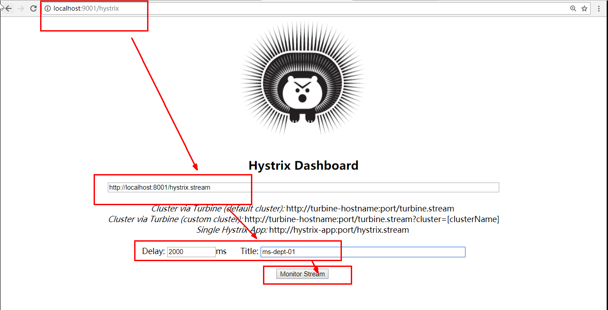
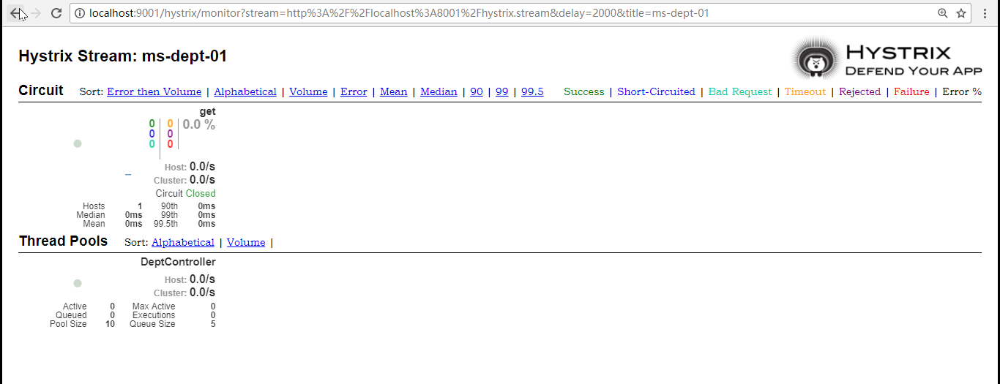

### Hystrix Dashboard

Spring Cloud也提供了Hystrix Dashboard的整合，对监控内容转化成可视化界面。

#### 1. 新增一个Dashboard项目 添加如下的依赖

```xml
<!-- hystrix和 hystrix-dashboard相关-->
   <dependency>
       <groupId>org.springframework.cloud</groupId>
       <artifactId>spring-cloud-starter-hystrix</artifactId>
   </dependency>
   <dependency>
       <groupId>org.springframework.cloud</groupId>
       <artifactId>spring-cloud-starter-hystrix-dashboard</artifactId>
   </dependency> 
<!--启动类-->
   <dependency>
     <groupId>org.springframework.boot</groupId>
     <artifactId>spring-boot-starter-web</artifactId>
   </dependency>

```

#### 2.修改yaml文件

```yaml
server:
  port: 9001
```

#### 3.主启动类添加如下的注解

```java
@SpringBootApplication
@EnableHystrixDashboard
public class DeptConsumer_DashBoard_App
{
  public static void main(String[] args)
  {
   SpringApplication.run(DeptConsumer_DashBoard_App.class,args);
  }
}
```

#### 4.检查被监控的provider是否包含如下的依赖

```xml
   <!-- actuator监控信息完善 -->
   <dependency>
     <groupId>org.springframework.boot</groupId>
     <artifactId>spring-boot-starter-actuator</artifactId>
   </dependency>
```

#### 5.测试

1.先启动 Dashboard项目 开启监控

http://localhost:9001/hystrix

2.启动eureka server注册中心

3.启动provider 被监控的对象

http://localhost:8001/hystrix.stream （监控访问的明细信息 不支持可视化）


#### 6.Hystrix Dashboard监控窗口





